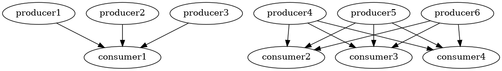
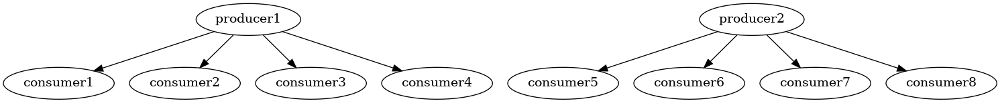
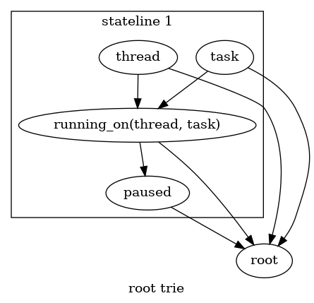

# Additional 100+ Ideas for Computing

Welcome to the forth page of my Ideas for Computing. This is a stream of my thoughts while working on computers with the theme of integration and improvement of how computers work.

This issue is more focused on parallelism, data structures and algorithms so you might need to be familiar with algorithms and programming to understand these ideas.

This is a long document but each section is a few paragraphs. There is probably a project idea in here somewhere but I hope you can be patient and bear with me, this document is a stream of thoughts so you might not like or see the originality of every idea. I see the state of the technology world as being impoverished or poor, many good ideas are not adopted or in the mainstream. You might think an idea is obvious but I might not have seen it or seen it in the manner I want to see it. I am still trying to express my vision of computing but it is different to how computing works today. I think the computer industry is in its infancy and unevenly distributed; the goodness and lessons of industry and research are yet to percolate everywhere. In my limited experience of the computer industry, most environments are impoverished and don't realise how poor they are and how much better they could be. I don't underestimate how much work is needed to get to where we could be.

 * See [100 Ideas for Computing](HTTPS://GitHub.com/samsquire/ideas), the first issue of this series.
 * See [ideas2, Another 85+ Ideas For Computing](HTTPS://GitHub.com/samsquire/ideas2)
 * See [ideas3, An Extra 100 Ideas for Computing](HTTPS://GitHub.com/samsquire/ideas3)
 * [Follow me on Twitter](HTTPS://twitter.com/mrsamuelsquire)
 * Looking for business ideas? Checkout my [startups repository](https://github.com/samsquire/startups) where I list business ideas.

<a rel="license" href="http://creativecommons.org/licenses/by-sa/4.0/"></a><br />This work is licensed under a <a rel="license" href="http://creativecommons.org/licenses/by-sa/4.0/">Creative Commons Attribution-ShareAlike 4.0 International License</a>.

If you're accessing this from [the GitHub repository](https://github.com/samsquire/ideas4), there's a table of contents if you click the icon at the top left:


Thank you to all the contributors who have been sending in examples and corrections!


# 1. Automatic Personal file archives

My personal files inevitably leads to lots of small files which take forever to copy and are transferred very slowly by my hardware when copied. I propose a personal file manager which handles archiving for our files by letting us "log into" our files by unpacking them to fast media and lets us "repack" the files back up when we logout of the file manager.

It should be extracted on desktop environment login and repacked asychronously in the background. Then you can copy the file to your NAS or cloud backup solution as one fast contiguous file transfer. You could also layer encryption and deduplication ontop of this.

# 2. Idea management software

Society is composed of ideas, let's let everyone track the ideas they like. Ideas are informally collected throughout life, there's no central knowledgebase for an individual. There's Wikipedia which represents society's knowledge but there are few systems for collecting ideas you agree with and want to see more of. This document is actually an example of what I want to see: people aggregating ideas they like and want to invest time and resources in.

# 3. Pick up and drop

Drag and drop is too hard, especially on laptop trackpads or trackpoints. What if instead we visually pick up an item up and then drop it. There would be no need to click and hold the mouse. Copy and paste APIs are usually separate from drag and drop APIs, but they don't need to be.

I would have a secondary bar, above the task bar or dock for content that is copied or cross referenced. Things that are grabbed for use.

# 4. Chronological news

Each news topic should be tracked separately, I should be able to follow a news stream from beginning to end on a topic.

# 5. Permanent software/platform/language / Software subscriptions and outsourceable stack

At the cost of innovation we can solve swathes of computer problems with common parts of a stack. The BSD networking stack is standardised and solved the communication problem, it seems BSD sockets are in most software products today. But there is a lot of work needed to standardise the rest of the technology stack. See [ideas4 on 135. Recursive Coordination and decision portfolios](https://github.com/samsquire/ideas4/blob/main/README.md#135-recursive-coordinations-and-decision-portfolios-and-time-allocation-portfolio-and-recursive-dividends) for how we could implement social and technical leverage to solve this problem of standardisation without the effort of standardisation.

Unfortunately the ground is shifting beneath us at all times. There is no stable space on which to build. Upgrading RHEL 6 to RHEL 7 and to RHEL 8 is a pain and you need to reharden everything again.

To build an app things you need to worry of and solve:
 * Packaging your app
 * Writing a platform abstraction layer for Windows, Mac and Linux compatibility. Packaging for over 200 Linux distributions. Flatpak, Snap or AppImage
 * Twelve factor app
 * Need to decide on how to configure machines so you need configuration management.
 * Need to decide how to deploy your software
 * Need logging need log storage and search
 * Need Application Performance Monitoring
 * Need tracing
 * Need database
 * Need security updates, patching and testing
 * Need multiple environments and repeatable way to deploy environments
 * Need containers
 * Need to orchestrate containers so you need Kubernetes
 * Need to manage Kubernetes manifests 
 * Need a container registry
 * Need backups of databases and container registry and sourcecode and keys
 * Need secret management
 * Need encryption at rest and in transit
 * Need to check returncode every syscall or API call
 * Need rollback deploys
 * Need zero downtime deployment
 * Need feature flags and feature flag toggles
 * Need app configuration and service discovery
 * Need separate release and deploy
 * Need to migrate database
 * Need to harden your app and servers
 * Need to scale application database and support services.
 * Need continuous integration
 * Need dependency security scanning
 * Need a buildserver
 * Need storage for buildserver
 * Need reliable builds
 * Need end to end testing
 * Need a package repository server or cache or mirror
 * Need a development virtual machine for all the platforms you develop on
 * Need due diligence to use an open source library and to be a maintainer of a open source library. Need to do a lot of unpaid work.

Each if these areas is changing all the time. There is nothing permanent to develop against that won't be obsolete soon. But some technologies seem to avoid going obsolete. Let's subscribe to those!

I would like to see some permanent foundations on which to build. Moving towards profoundly stable software and away from the existence of an impoverished software engineering world:

 * I feel a very large problem in the computing industry is that everybody is reinventing the wheel repeatedly and software ends development within a company and has only one deployment. People are working on the wrong problems. What you see on Hacker News as people's personal projects are not solutions to these common problems. People are working on the wrong things.
 * People do not necessarily share their solutions to problems.
 * Maintenance costs of software are very expensive. Everything is constantly changing underneath our feet. The only stable platform is maybe the amd64 instruction set.
 * APIs and abstractions are changing all the time. Every Linux distribution required its own packaging.
 * Each Linux distribution is duplicating effort and repackaging the same set of software for multiple systems.

I should be capable of outsourcing these decisions to experts.

When you pick a stack you inherit all the problems of the stack and you benefit from expertise in one direction: the written code to solve a problem.

But you don't benefit from the executional skills of deploying and using that software. This needs to change.

This idea is so we subscribe to a practice. If you want to use code to drive your configuration that's a decision and something you can build against. Or you want to use YAML.

```
require('system-upgrades') as upgrades;
require('backup') as backups;
schedule(backups.backup, '00 00 * * *')
schedule(upgrades.security_update, '00 05 * * *')

```

# 6. Contiguous disk layouter

A program that reads your startup configuration and then lays out files on disk so everything is contiguous. So a simple program can be written to read all the files into the disk cache on startup and every read afterwards is instant.

# 7. Automated API traversal

Imagine an API as a graph and define a traversal of the API to get what you want. In other words, the types between API methods should be inferred. Imagine I want to backup my files and I want to deduplicate them, compress them and encrypt them and upload them. Each of these steps takes a type. The formation of the circuit can be automatic if the types are well defined, it's a search through a graph.

# 8. Server server and multi stream parsing

Creating a performant server is difficult. The lessons from Nginx and Apache and pretty much every REST framework or mail server or IRC server or server runner such as gunicorn could be taken and combined into a generic server. This server would be super performant.

The server should be defined a bit like Backus-Naur format but defines a protocol instead. Parsing could be generalised and raised a level in terms of abstraction and applied to protocol communication of arbitrary number of simultaneously communicating processes. It's a state machine and parsing problem.

What would IRC or HTTP look like at a high level?

I want a server to handle as much traffic as it can, concurrently and parallel with low latency, jitter and errors. Nothing should block its IO loop. And other long running computations/CPU usage shouldn't slow down other users.

# 9. Query for data structure

If you're writing a compiler or programming language or business software you have a stored shape of data and relationships at every stage of processing.  This is called marshalling or an intermediate representation in compiler technology.

Sometimes to solve particular problems you need data in a particular shape. That is, a problem becomes simpler to write an algorithm for if the data is in the right shape.

What if you had a query language where you could retrieve a data structure?

In compiled languages we have pointers and in interpreted languages such as Python and Java we have references between objects which are similar to pointers.

We also have indexing Data structures such as hashmaps and btrees. What if we could built up data structures by a query?

We want a btree indexing these columns and these relations. As a result, we get a data structure with these indexing structures.

GraphQL is nearest to this idea. I want a linked list of this data or an object graph that looks like this.

Place source structure on the left, target on the right. Can define an algebra that works with nested collections and has a primitive called associate which associates data of left with data on the right.

# 10. Access pattern serialization

A format or data structure that represents an access pattern for data.

For example, if you're going to be scanning items in sorted order, if you need to get data by a composite or single key, these are part of your access patterns.

If you always fetch the children relations of a piece of data, you should serialise that and represent it.

Our data access patterns determine how efficient our queries shall be.

 * Can be used to generate data structures.
 * Would be useful for designing NoSQL and Dynamodb keyspaces. 
 * Can generate SQL tables.
 * Can be used for generating sharding.
 * Can be used to parallelize queries.
 * Can be used for query planning.
 * Can be used to denormalise queries.

This could be used for implementing [ideas3 17. Query database](https://github.com/samsquire/ideas3#17-query-database) and [9. Query for data structure](https://github.com/samsquire/ideas4/blob/main/README.md#9-query-for-data-structure).

# 11. Dream desktop

My computer should try benefit my life as much as possible. Modern desktops don’t even try. They don’t learn about me or give me advice. I want to give my demographics to my computer, my location, my salary and have the computer calculate things about me. We have all this untapped computer resource but most people only idle their computers.
Here are some ideas that desktop computers could do.

 * **Many remote indexes** – We’ve got spare resources on an average desktop. Synchronize my files with a remote server, then do some crazy indexes on the files for all sorts of combinations. Index my files contents for content based searches. It doesn’t matter if the indexing is expensive, because it’s on a different server.

 * **Arbitrary Correlations** It’s easy to arbitrarily correlate behaviours of humans on a computer. We can track what times the user opens certain programs and then open them automatically at the correlated time.

 * **Information age worker** Download various data sets to the desktop and allow users to run queries against the data. Would be nice if you could import Wikidata data this way.

 * **Digital Shop** Provide tools to view or start an online shop, including a product search engine.

 * **Overlay network** My desktop should form an overlay network with all my phones and servers so that I can share services privately. It should connect as part of login to the computer. Should be like Zerotier, but with automatic login and connection.

 * **Social P2P network** My desktop should connect to a federated social network, a bit like twitter where you can share things. I can create mockups for an app in my desktop environment and share it.

 * **Program cross-referencer** We often run multiple applications in parallel and even arrange them, so we can see both of them at the same time. What if you could write queries sent to open applications to combine data across two applications? Or write simple loops over Spreadsheet data and interact with the browser with an API? I should be able to write joins across programs visually.

 * **Display Cone** It would be nice if one could control the window manager and compositing with a text API. So one could create convert a window into a custom geometry and display that. So one could create dashboards of existing programs. This would be useful for information radiators without having to run Xmonad or other tiling window manager.

 * **Payments integration** Support payments and the listing of digital services in an online marketplace. We need to democratize the act of taking money and exchanging it. It shouldn’t be the purview of large corporations only taking payments. Anybody should be able to take a payment.

 * **Website management** Run a web site with your desktop computer. Desktop acts like a VPS, with dynamic IP hosting, web server and database.

 * **Object maker** Describe the properties an object should have and have them stored in a collection. Write queries to retrieve them, sort them. Drag and drop text boxes, sliders etc to create a GUI. This is similar to Access but even more accessible, should be similar to a point and click diagram What You See iS What You Get editor

 * **Live tree and rich GUI editor** Every window, widget, dialogue, GUI on the screen forms part of a global tree data structure which can be used to interrogate what is on the screen and automate behaviour. Think of it as a global document object model (DOM) for the desktop but is actually a scenegraph. So every widget is accounted for. Someone can copy and paste a tree branch an create an identical but separated GUI from the root and modify it with drag and drop.

 * **Life strategy quiz** Ask where you’re sleeping tonight. What you doing for food. With the ability to order food via the system or acquire accommodation with a search. When the user answers they have no food or no where to sleep, dispense information to counteract homelessness and other social problems.

 * **CPU manuals** The desktop should come with documentation about CPU instructions, a compiler, and documentation about the desktop environment. It should be possible to create apps from an installation with minimal expertise.

 * **API suite** The desktop should have an installable set of pluggable APIs that are really easy to use from different places: from programming languages, over the network and from an executor GUI. I should be able to create an API invocation and chain them together with a GUI. This is a bit like Swagger, Jupiter Notebook/Ipython and Postman and SOAPUI.

 * **Event maker** The ability to view events that get fired by the desktop environment, from the network stack, from arbitrary applications and add behaviour to events. A way to hook into events over the network, so you can ‘subscribe’ to events on another machine.

 * **Log aggregation** Log errors and error dialogs to be automatically synced to the cloud where other they turn into community issues. Issues can be commented by other users.

 * **Errors become things** Errors become a thing in my desktop. They appear in the system tray and don’t go away so easily and they can be re-tried easily. They appear in an error viewer. You can then try solutions against the error to see if it works, it it works, the error will go away. You can see comments about the error and try known solutions to the error. Known solutions are gathered online.

 * **Shared desktop sessions** It should be possible for multiple users to join a desktop session. The session is not single player, reserved for one person but possible for multiple people to join the same session.

 * **Cloud designer** Advertise cloud features to me and let me use cloud features in my home network such as S3.

 * **Advertising features to me** My desktop computer has installed various services and APIs. My desktop should advertise what features are available to me

# 12. Work merging

When a user does something on a computer their patterns of work often match other people's patterns with the same general data structure. We can match trees or data structures that are visible on the screen with actions that were similar for other users and allow users to benefit from work that other people did.

For example, if you want to change your address with a company, this request looks the same to everyone. Everyone's address can be changed with one operation to change multiple individuals addresses in one operation.

If someone is looping manually down a spreadsheet pasting into an intranet webpage, we can represent the operations that the user is doing as events and pattern match the events to look for +1 or -1 operations on data. The computer can detect the repetition and carry out the action on the user's behalf: a smart macro recorder and replayer.

# 13. Window walk optimisation

Imagine you want to find a job that is near your home transport wise, near a supermarket, near a doctors and that pays the most and has the cheapest house to buy or rent.

You could open a browser for each of these queries but it's difficult to optimise these multiple queries manually.

Or you want to book a holiday or organise the purchasing for an office. Or equip a datacentre with hardware.

We can walk different web sites in an iterative hill climbing algorithm.

 * Enumerate list of towns, cities and villages

 * Enumerate houses to rent and to buy at lowest cost sorted first.

 * Enumerate list of supermarkets near said houses and near job, sort by smallest range.

 * Enumerate public transport options

 * Enumerate jobs, sorted by most pay first

Now walk all these datasets as an optimisation problem to find a list of efficient combinations of jobs, supermarkets, transport and housing.

This is far better than manually cross referencing data in separate tabs.

I think the walking of data can be distributed for efficiency. It doesn't make sense to walk each record one at a time. It's a lot of data to download.

I think a continuation style can be used so that the provider of the data walks each sub iteration.

So the walking of data is continuations between collaborating servers.

# 14. Data scheduling I and infinite tape abstraction

This is the first idea for data scheduling. There is another later in this document.

I read somewhere that instruction selection is less of a cause of total performance of code compared with data layout. With data driven architecture we can use arrays of structures or structures of arrays for performance.

Much of modern programming is managing different buckets of data and scheduling them into memory for example we have heap, the stack, S3, file system's disk files and network available storage such as NFS or Ceph. We need some method of paging this data and scheduling data to and from each area efficiently.

Databases such as Postgres have heap managers. Virtual memory are managed by kernels. Some software use arenas for memory management. Memory management is too complicated so browsers such as Chromium just use arenas and free it when the tab is closed. There is all sorts of clever things that can be done with readahead and prefetching and amortization. The problems of chunking has wide ranging impacts to do with caching and decision to load in parallel.

Surely these problems could be solved once in a profoundly effective way and exposed as a library.

I also want to write my code the same way that scales for a 100 kilobyte file as a 10000 petabyte datastore. The approach I use should be scalable. The system can act as if memory is infinite but it's not, it's simply paged in efficiently from S3 or disk efficiently 

I imagine this being implemented as a Policy that defines the relationship hierarchy and speeds of each kind of media and the policy of when to page between them.

You could have a common API for storage that works across all levels of storage.

This could be combined with [ideas4 10. Access pattern serialization](https://github.com/samsquire/ideas4/blob/main/README.md#10-access-pattern-serialization) and [ideas4 9. Query for data structure](https://github.com/samsquire/ideas4/blob/main/README.md#9-query-for-data-structure).

# 15. Mega tree

I want a mega tree data structure which has the combination of these properties:

 * Can be merged as a Conflict free Replicated Data Type (CRDT)
 * Uses the Left Right concurrency pattern for each leaf and internal node
 * Can be used as a merkle tree
 * Can be a persistent tree
 * Can act as a TreeMap
 * Can act as a prefix trie.
 * [Can be append only](http://www.bzero.se/ldapd/btree.html)

I started work on this. I've implemented a radix tree, a Left right HashMap, prefix tree and a merkle tree. I need to combine them together.

# 16. Use A* for data query generation

If I put some data into a data structure - is the computer clever enough to generate solutions that get nearer to accessing it?

If I train a computer on binary search, btree and hashing functions and create graph traversals that represent the algorithms.

If I have a keyspace that is lexicographically sorted or a HashMap or btree can a computer study an algorithm and turn it into a graph traversal and generalise the approach?

Could I generate sequences of instructions as graph traversals that become generalised algorithms that fetch data?

We know where the target data is in the data structure.

There is a sequence of steps and iteration to get the query to fetch the data we want.

For a tree we know which nodes we have to traverse in order to get to the data, so we can generate code that knows how to fetch children recursively and do a binary search on an array.

If we want to fetch data that matches a predicate, we could create a graph traversal of the indexing functions, we can in effect trial indexing functions to see if they cheapen the retrieval process.

The pattern to iterating down a tree could be inferred.

The distance function is fairly straightforward if there is a path from the current data item being evaluated or searched then the system is nearer to the goal data.

# 17. Core algorithms should be written in a simple-to-understand language

The algorithms we depend on day-to-day should be written in a simple programming language with very little barrier to entry. I suggest things like the cost based optimiser, browser internals, virtual machines, databases, query optimisers and the operating system scheduler be written in languages like Python and lowered to C programming language.

Why? Memory management and low level implementation details in impoverished environments matter less than the overall "what gets done and why".

If compilers and optimisers were written in Python you would have more people be capable of supporting your project.

As it stands to add code to these projects you need to be seriously skilled in low level programming.

Sometimes the problem is understood by the "what" rather than the "how". If developers could look at systems from a high level, they might still be capable of contributing ideas to where the "how" distracts from the "what to do". You can always describe a more efficient, more scalable more performant system by defining what is to be done differently to how the system works at the moment. We don't benefit from this property of communication when writing low level projects, as there is so much detail at the "how" level that it's hard to see the forest rather than the individual trees. You obviously need to know about both, but abstractions mean we care less about trees most of the time we use computers. For example, the proportion of assembly programmers to Javascrip developers.

Pypy and Rpython is probably similar to this approach.

# 18. Data structure synchronization

Data structures often leads to denormalisation for performance. We need to keep data synchronized for performance and parallelism.

If I use [Rockset Converged Indexing](https://rockset.com/blog/converged-indexing-the-secret-sauce-behind-rocksets-fast-queries/) and index by column, value and row I need to store data three times which is storage costly but efficient in terms of retrieval. I need some process to keep the data synchronized.

I propose a simple system that tracks all instances of data and keeps them integrated. This would be used between systems and keep then in sync. It would also be used within an application server or database architecture. It would also have the feature to delay updating items before returning success. So indexes can be updated passively or even asynchronously.

Denormalisation solves performance including parallelism problems as in Left Right concurrency control. We need an industry standard way to keep data in synchronisation, in memory.

This needs to be combined with [# 292. Multiway references problem](https://github.com/samsquire/ideas4#292-multiway-references-problem)

# 19. Merge database

A distributed database that uses CRDTs to replicate and resolves concurrent edits with Myers algorithm for String Edit Sequence edit scripts.

Essentially combine CRDT technology with diff technology so merges are always seamless.

Assume there are two edits to the database and they both have previous versions A and B, find the common ancestor version of A and B which is S. Then diff3 can be used in a three way merge repeatedly between all versions from S to A and B.

You can see my implementation of diff3 and three way merge in my [text-diff repository](https://github.com/samsquire/text-diff). I implemented MerkleClocks in [merkle-crdt repository](https://github.com/samsquire/merkle-crdt). I would like to implement seamless merge in my applications.

```
def diff3(a, b):
  a_history = get_history(a)
  print(a_history)
  b_history = get_history(b)
  print(b_history)
  S = common_ancestor(a_history, b_history)
  print("common ancestor", S)
  left_sequence = versions_from(S, a_history)
  right_sequence = versions_from(S, b_history)
  last_left = S
  last_right = S
  for left, right in zip_longest(left_sequence, right_sequence):
    if left:
      
      last_left = merge_diffs(last_left, left.text, right.text)
    if right:
      
      last_right = merge_diffs(last_right, left.text, right.text)
      
  merged = merge_diffs(last_left, last_left.text, last_right.text)

  
  return merged

```

# 20. Lazy arrange or invariant maintenance

Many computer problems and algorithms can be solved with a division and sorting function and a set of statements or invariants that should be maintained over collections of objects.

Unfortunately to maintain invariants requires custom code when data is changed or modified. Such as recalculating the hash of an object.

If I want to arrange objects to maintain some complicated relationship or sorted relation or grouped by relation I need to write lots of custom code or use reactive features.

This idea I thought of while writing the conflict detection of my diff algorithm. I thought maybe we could use the Rete algorithm to handle many invariants of many different objects at the same time efficiently.

We often need to compare objects to sort them or group them.

It's often useful to keep sorted views and grouped views of data in memory for efficient algorithms.

If you could maintain lazily arranged data in memory this would be really powerful.

Essentially I want materialised views over objects in memory.

This comes under the idea of truth maintenance.

Once you define the arrangements you could calculate what is the most efficient source of truth based on the view generation steps.

The invariants that need to be maintained over the data have an ordering. You might find one view is cheaper to prepare from the other than the other way around.

It comes under the same theory as query optimisation and cost based planning and Object Relational Mapping.

This could be combined with [ideas # 90. Data Views](https://github.com/samsquire/ideas#90-views-of-data).

This could be combined with [ideas4 # 9. Query for data structure](https://github.com/samsquire/ideas4/blob/main/README.md#9-query-for-data-structure)

# 21. Sort group tree

It is often useful to have a single relation that is sorted with a complicated ordering function that maintains the order according to various properties 

It is common to sort on multiple columns of a record.

What is also very useful is the ability to group records together based on these sort groups and iterate on groups separately while still being aware of the overall collection.

A sort group is a relation arranged into a tree where each group is a column and is separately queryable. Traversal of the entire tree gives you the overall sorted list but there is efficient retrieval of individual columns members. I can loop over items of a status and user identifier know the index within the group or the overall collection. I can have a doubly linked list between records between items for fast retrieval.

# 22. Flat map refer

When we flat map it's often useful to refer to the group that the data came from. So I would abstract flat map to incorporate contextual information.

[My algrebralang programming language design](HTTPS://GitHub.com/samsquire/algebralang) has features to do refer to methods in previous stages of the pipeline.

# 23. Time travelling pipelines

Imagine a recursive pipeline. You can visualize it as an ordered tree.

When I write a clojure threading it's often useful to refer to the history lineage of the object that came before in the pipeline.

You have an object that is going through a stream and you want each stage of the pipeline to be associated or collected with future values of that data's children.

We can enrich the data structure of a record travelling through the pipeline to refer to futures or promises to the preceding records have references to the outputs of early pipeline steps.

I can also refer to the future and lazily calculate stuff based on the future.

```
(defn people-calorific-requirements []
(future-thread people-and-weights
 (-> person
 :stone-to-kilograms stone-to-kilograms (:kilograms-weight (* (:weight person) 6.3503)) (person :person requirements :calorific-requirements))
 :calorific-requirements (:requirements fat-sugar-protein (:kilograms-weight item) (item :item))
)
```

# 24. List of lists as graph

We often have a list of list of items with columns and references between lists.

This list of lists with columns can be represented as a graph.

This is what ORM software does for us. It maintains object graphs 

I would like my ORM to be explicit in its workings and literally accept lists of lists to populate objects, not do magic with annotations or decorators.

# 25. Imperative graph traversal to query

I like to change between a graph traversal with imperative code to a query and vice versa 

It's quite complicated. But I think it can be done.

If you turn a graph traversal into a set of reasons, you could generate a query.

Existing
 * [Chiselstrike, my other database is a compiler](https://blog.chiselstrike.com/my-other-database-is-a-compiler-10fd527a4d78)

# 26. Sort method calls of pipeline and sort reject

Sometimes to change the behaviour of code we want to sort the data. Rather than be explicit of sorting of the data, we can treat the pipeline as data and sort the method calls of a pipeline.


```
(defn sort-function [data-item function-a function-b
 (if (in :pounds data-item
  (if (= function-a :pounds-to-kilograms -1 1)
  (if (= function-b :pounds-to-kilograms 1 -1))
 (if (in :lbs data-item)
  (if (= function-a :lbs-to-kilogams -1 1)
  (if (= function-b :lbs-to-kilogams 1 -1)
)
(defn people-calorific-requirements []
 (sort (sort-function (future-thread people-and-weights
 (-> person
 :stone-to-kilograms stone-to-kilograms (:kilograms-weight (* (:weight person) 6.3503)) (person :person requirements :calorific-requirements))
 :stone-to-pounds stone-to-pounds (:stone-weight (* (:weight person) 14)) (person :person requirements :calorific-requirements))
 :calorific-requirements (:requirements fat-sugar-protein (:kilograms-weight item) (item :item)))
)
```

Sort reject is to decide not to place the object at all.

# 27. Reverse pipeline and lineage finder

This would be useful for machine learning. Imagine you have a complicated pipeline. What if you could feed in data at any stage and reverse the pipeline to find input objects by their output objects?

# 28. Static garbage collection

But not how rust does it. What if you analysed the call stacks of a program and decide in between calls where to garbage collect. A bit like RAII.

We want to restrain garbage collection until after the critical path. We can track what we need to free if we look at the relationships between passed around data.

So a lifetime is defined as an overlapping callstacks of code and not necessarily at the end of a method.

# 29. Align data

When I wrote my conflict handling of my diff algorithm it might hast been easier if I could align the data accordingly to groups.

We can take two lists and align them into sections where they differ and where they are the same.

# 30. Extending code without changing it efficiently

Usually to extend code we need to change it. Or add parameters everywhere. We write methods to abstract ideas, but those methods cause code to become too complicated to change if we want to create a far-reaching change.

I think there's a better thing we can do with compilers.


A piece of code represents data flow from data items to output, it also represents changes in states.

To extend a piece of code without changing it we need to interleave our extension code around the code being extended. We might need to mutate inputs or introduce divergence of types.

What does divergence of types mean? There is an operation called associate which associates a set of lines of code with a variable or type at a place in the callstack history. Wherever the original variable appears we can also refer to the diverged type.

We can also assign changes to the type when the original type changes.

The callstack (all the methods being called and their parameters) and code structure represents the inputs or context of what is being extended against, we can use any local variable or parameter to write code that uses them. We can interleave code anywhere in the callstack. We can topologically sort these relationships to work out where the code needs to be inserted and automatically add parameters between methods.

This is the basis of [my programming language design algebralang](HTTPS://GitHub.com/samsquire/algebralang)

To implement this we need an efficient representation of loops and loop merging.

The following is an implementation of travelling salesman problem in algebralang.

```
tsp cities = {
(array(name=pairs)=cities
.permutations(name=pair, 2))
.permutations(name=solution, previous=s[i][1], size=len(cities), value+=(solution[-1][1], solution[0][0]))
thread(solution, rule(index, item)=(if item[i][0]==item[i-1][1] then item[i][0] else reject, item[i][1]))
euclidean_distance(name=distance, pair[0], pair[1])
euclidean_distance(name=solution_distance, solution)
sort(name=per_order, distance, order=ascending)
sort(name=solution_order, solution_distance, order=ascending)
pairs = first(per_order, solution_order)
= pairs
}
```

A naive implementation of algebralang would do this algorithm slowly, there is a number of optimisations that can cause this algorithm to be faster. The computer should allow us to create additional relationships of the algebraic variables that allow the computer to optimise when to do which work.

For example, we might want to include nearest neighbours. Rather than brute force.

We can add the following.

```
pair_recursively(name=city_to_every_other, pair.source, pair.source) # returns [city, [every other city]]
pair_recursively(name=distance_to_every_other_city, euclidean_distance($item[0], *$item[1]), output=$item[0], $item.value, input=city_to_every_other, $item[1][0]) # returns [city, [city, distance]]
sort(name=neighbours, distance_to_every_other_city, input=$item[1] output=$item[0])
replace(pair, neighbours)
```

I am yet to decide on the syntax for expanding a method n times but I used the * syntax go indicate this.

# 31. Algebraic materialised view edits and whole program optimisation

This is an extension to the [9. Query for data structure](https://github.com/samsquire/ideas4/blob/main/README.md#9-query-for-data-structure) and [20. Lazy arrange or invariant maintenance](https://github.com/samsquire/ideas4/blob/main/README.md#20-lazy-arrange-or-invariant-maintenance)

If I have a materialised view based on another materialised view, I can use algebra to decide which view to update first and which to map to what

We can change computer programs into queries and therefore algebra then optimising queries the same way a database optimises the algebra of a query using a cost based optimiser. if we represent programs as algebra they can be optimised.

I also want materialised views layered ontop of eachother and the computer decide which one to use for source of truth.

I can also decide where to insert records based on the views that are used.


# 32. Schedule within/networked fork+join

The chain of code I am using to deploy cloud resources should have the capability to send code to execute as if it is running in the same thread.

Essentially I can use cloud resources as a fork/join.

This idea requires a common opcode to be sent over the network.

# 33. A generalised paging/chunking solution

Many performance problems go away when you chunk something and manage it at a chunk level. Such as pagination or Chrome Blink browser page painting tiles.

But then you have two problems. You have a cache of chunks and schedule the chunks coming in.

I was reading the PolarDb paper and it talks of the database pages used by the disaggregated database.

I recognise that many problems are simpler when broken into pages of data. For example, memory management.

We need to solve all these problems with an approach that works the same for every case. Advanced paging.

# 34. Graph to query generation and sort

Render a data structure as a visual graph and allow selections of different objects and fields and references/pointers.

Work out the rule that caused everything to be selected based on user input such as an if statement like as a debugger condition or relation or mapping, then generate a query that matches that part of the data structure.

For example if I have a complicated hierarchy of objects, I can select subitems of collections but retain references to the path that I used to get those items

Rather than writing the code that iterates and gathers the requested objects in the object graph, I can simply select what I want to get access to.

Allow highlighted items to be sorted overall or independently.

# 35. Nearest operator

A high level functional function for composing queries over complicated nested data structures where you ask for the nearest object near this value via object graph traversal or nearest XY coordinates.

# 36. Adjust with respect to operator

Imagine you are merging two documents and have an ordered list of changes and there are character indexes of each change in the source document and a character to insert.

If you insert a run of characters that run of characters could run into another run of characters by the other document. So you need to group the inserts into ranges.

If the range overlaps with another range that is a merge that must be resolved by a person.

You want to cross-reference and update the coordinates as they impact eachother. 

If you merge one document in then all the offsets need to be updated to accommodate the new changes.

# 37. Query over in memory data structure

I want to query a data structure as I might a SQL database or a graph database.

If I know the field I want, I can specify the structures I want and the traversals through the code to get to them canb be generated.

# 38. Dense btree

Combine a binary search with a btree and have multiple keys per node.

This would sacrifice CPU for memory latency as you fetch N keys from the btree at a time.

I think it's related to a fractal tree.

# 39. Data structure and mapping studio

I read the Rpython documentation and it talks about the compiler's internal data structures to lower code into something the computer could understand.

There's a website called Godbolt Compiler Explorer which shows you the assembly output of code produced by each selected compiler. This is awesome.

I want to go a step further. The compiler or software should expose every pipeline step in processing as seen in [ideas # 42 Context as an explorable web: What can I use?](https://github.com/samsquire/ideas#42-context-as-an-explorable-web-what-can-i-use)

Compilers, browsers and database servers should be publishing their internal data models and showing what the data graph looks like inside themselves at all stages of processing. So like compiler explorer I can see the internal model of the application.

I also work with many devops tools that use YAML.

There should be a website or office suite software that offers views of data structures from one to another and the operations that can be done on them. These can be implemented as mappings.

For example, each DevOps tool has some JSON or YAML that means something significant. An Nginx file can be parsed and turned into a graph data structure. Kubernetes YAML means something

All these representations should be built on top of eachother. I should be capable of interacting with mapping as if it the real thing. In other words, each mapping field corresponds to the real thing.


People could then learn how complicated programs work and even compose new behaviour on these data models.

By defining Equivalencies we can create really powerful programs. This is materialised views on steroids.

# 40. One for many

If you know how to do something for one item, do you know by inferences know how to do it for all items at once?

Could database indexes be generated from a method to calculate something?

You write a nested loop to find or collect together data from multiple sources, if you index each loop separately you can handle any number of items as a materialized view.

# 41. Happens before concurrency, Partial order maintenance and intrathread callbacks

Assume you have lots of threads, threads for IO and threads for CPU usage. And maybe a GUI thread.

IO event loops are fairly complicated to use properly - see C's libuv as used by Nodejs, Rust's tokio. You need some way of dispatching events to the IO loop and retrieving them in the context of a CPU event loop. So you need some communication mechanism and therefore synchronization.

For two threads to communicate in a thread safe way, they both need to wait separately, before each write and before each read. Each enqueuing thread needs to wait for space available to write to and the dequeuing thread needs to wait before there is an item to dequeue. If there are no items in the queue, the thread blocks and can do no useful work.

The coordination is complicated. The Rust async runtime is complicated and hard to understand. Tokio is good for IO scheduling but not parallel CPU scheduling.

I think we can use the happens before relation to autoparallelize. We can use the "happens before" relation with an argument of where something should run. The system can arrange the thread safe communication between threads.

We can sort variable use and automatically insert CountDownLatch at points we need our memory to be visible to other processes. These joins before a shared variable is used represent synchronization points.

I wrote a compare and swap sort algorithm to maintain order between an arbitrary number of readers and writers. [I partly implemented this in my compare and swap sort repo. I need to add support for any number of readers and writers.](HTTPS://GitHub.com/samsquire/compare-and-swap-sort)

We need a scalable equivalent of Java's synchronized.

I should be capable of writing code like this:

```
Def Happens_before(self.head, self.head.previous) update_linked_list(new_head)
  old_head = self.head
  Self.head.previous = new_head
  Self.head = new_head
  New_head.next = old_head
```

This should be rewritten to:

```
Def update_linked_list(new_head)
  Trying = true
  checkpoint = 0
  While trying:
    old_head = self.head
    if checkpoint == 0:
      Trying = !Self.head.compareAndSet(self.head.previous, new_head)
      if not Trying:
        continue
      checkpoint = 1  
    Self.head.previous = new_head
    
    Trying = !Self.head.compareAndSet(old_head, new_head)
    if not Trying:
      continue
    New_head.next = old_head
```


Now all calls to update_linked_list are partially ordered.

But would this might be more efficient as an explicit queue, that threads try process.

All threads enqueue their operations and if there is someone already modifying the same value, we don't block but we are dequeued by the committing thread.

Then you need a callback when the work is done. Or you block until the work is done.

The whitepaper Wait-Free Queues With Multiple Enqueuers and Dequeuers algorithm could be used to queue up work.

It could be changed not to block, and callbacks could be checked for by the committing thread 


# 42. Direct concurrency and static scheduling

It's easier to schedule code in advance of its execution. Imagine the CPU and the clock of a CPU. The CPU internals have lifecycles on the die and the clock synchronizes the parallelism of each part.

The traditional software development approach to control flow of asynchronous systems is callbacks, async/await, events, SEDA or event loops.

The problem with event loops is that work blocks the main thread, and you don't have parallelism unless you start multiple event loops.

If we batch up work to the rhythm of a clock, we can schedule directly and avoid data race conditions and race conditions to the same data.

 * Direct concurrency means scheduling in advance and driving ordering explicitly.
 * Chaining together callbacks causes complexity.
 * Rely on simple task sorting to decide the control flow.
 * The locus of execution is the tip of execution.
 * Essentially the kernel scheduler and the program itself decide what to do next. This is scheduling in userspace.
 * When you have asynchronous code, you don't know when you shall return, you need to decide what to do when the asynchronous program finishes.
 * I want `async`/`await` to work on a thread pool for true parallelism.

```

```

If we accumulate events into a batch then process them on a tick, is the latency acceptable? Each concurrent task has its own rate.

# 43. When language

Use join calculus to be the interface of rete

# 43. Generalized transactions

We often want the semantics of all or none at all. One of the problems with midori is that the world is not transactional, but why not?

# 44. Duplicate everything - store everything at least twice

Store data in both arrays of structures and structures of arrays. Use the left right concurrency control pattern with each side so you get benefits of each.

When there's contention for the wrong data structure (ie it would be more efficient to use structures of arrays), wait for the other data structure to drain or use the less efficient mechanism.

# 45. Rendering engine reflow diff and pregenerated positions for each resolution

Relayout and reflow is slow. Rendering a catalogue of items is really slow, even though the positions and sizes of everything is the same each time.

We can obviously cache the numbers before reflowing.

We can identify patterns in the numbers across rows and columns.

For example if I am rendering 5 columns by 16 rows and do a load for 16 more items, if the items go above the existing items, we can push the bitmap down, we don't need to reflow all those old items.


# 46. Snapshot isolation and duplicate everything

We want snapshot isolation in addition to the benefits of duplicate everything.

I should only see what was last committed and changed but I don't want to lower parallelism or introduce locks that lower scalability. I also don't want to clone objects and reduce scalability.

One approach is we can combine the use of persistent data structures with this idea to implement snapshot isolation.

When I change a field, I should regenerate up to root a new record and append to the log for the data structure. This can be combined with mega tree. We need a global Log object that everyone uses to access the root of the data structure.

When there is a change, the root object is changed. The problem is parallel updates to the root object, anyone who changes before the root is changed would be overwritten.

We need to avoid last write wins as Left Right is not enough to protect the root. So we need multiversion conconcurrency control.

**Alternatively** we can treat the MegaTree as being threadsafe and not regenerate the tree each time there is a change, so we have internode parallelism. The MegaTree would have a commit method.

For append only illusion we can generate events walked up to the root and when we serialize we serialize new nodes but while in memory it can mutate.

To extend merkle support we can change the hash atomically when children change.

Can use postgres mintransaction maxttransaction to decide on key visibility and check active transactions to see if they are finished.

# 47. Loop selection and autoparallelization

When I create a thread for parallel work and I spend most of my time in my program in loops I need to partition the loops.

How do we partition the loops efficiently?

 * When we create the threads we specify named collections and partition them by thread index.
 * For Java lists we can use sublists. For linked lists we can cut them in half recursively

# 48. Loop rewriter - Avoid resource starvation by chunking loops

Most of the processing goes on in loops. But loops occupy the CPU and don't give any other process CPU time.

It's slow to call Thread.yield in every loop iteration. And it's slow to put an if statement in your loop.

What we need is a loop rewriter

We can rewrite the following

```
StringBuilder sb = new StringBuilder();
for (int i = 0; i < items.length; i++) {
  sb.append(String.valueOf(i));
  sb.append(items[i])
}
```

To:

```
int chunkSize = items.length / 10000;
int chunkStart = 0;
int chunkEnd = chunkSize;

while (chunkEnd < items.length) {
  
  for (int i = chunkStart; i < chunkEnd; i++) {
    sb.append(String.valueOf(i));
    sb.append(items[i]);
  }
  Thread.yield();
  chunkEnd = min(chunkEnd + chunkSize, items.length);
  chunkStart += chunkSize;
}
```

We can adjust the chunk size dynamically at run time to see how long it takes for a chunk to run.

We can exponentially grow the chunk size if it doesn't take long to run a chunk.

# 49. Independent data layout from structure

The layout of memory can be independent of the data structure.

# 50. Context anywhere

I should be capable of reaching anything from any position in my code.

Imagine you could dictate the processing or tip of execution of another computer or server from the context of your current program. This would lead somewhat to spaghetti code if not handled properly.

Everything is available to me.

The runtime should schedule things for me and know the relationships between what runs when.

This requires synchronization of timestamps for operations.

# 51. Rewrite synchronous code into LMAX disruptor thread pools - event loops that don't block on CPU usage

I want my CPU intensive code to be isolated from other CPU intensive code and my IO code to be isolated too.

The problem with NodeJS is that the Javascript event loop is single threaded and your callbacks cannot execute in parallel. Another problem is that heavy CPU usage blocks the IO handling and other CPU usage. This idea is a solution to this problem. Browsers also have this problem.

We can use the LMAX disruptor pattern and dynamic thread pools for efficient processing.

We want to handle multiple consumers and multiple producers. And scale by adding more of each. We can also scale each stage of a pipeline.

As LMAX does, we break up each IO request into two halves: the request itself and its response, each enqueing a new event. We map the synchronous code of what we want to do into to a tree of disruptors each independently monitoring an event queue ring buffer. This is similar to a topology in Kafka.

When an IO event or CPU completion event comes in, we generate an event that needs to be processed. This is written to the ring buffer for events down the chain of that destination type.

```
OnRequest(request):
Error = False
Unmarshalled=Unmarshal(request)
Parallel {
 addressCheck = CheckAddress(Unmarshalled.address)
 creditDetailsCheck = CheckCreditCardDetails(Unmarshallled.creditCardDetails)
 StockAvailabilityCheck = CheckStockAvailability(Unmarshalled.basket)
}
If not addressCheck.success:
 User.addError("Address not valid")
 Error = True
If not creditCardDetailsCheck.success:
 User.addError("Credit details wrong")
 Error = True
If not stockAvailabilityCheck.success:
 User.addError("stock", Items not in stock", StockAvailabilityCheck)
 Error = True
If Error:
 Return ErrorPage(User)
Parallel {
 InsertReserve = insertReserve(Unmarshalled.basket)
}
If not InsertReserve.success:
 User.addError("Could not reserve stock")
 Error = True
If Error:
 Return ErrorPage(User)
Parallel {
 TakeMoneyRequest=TakeMoney(Unmarshalled)
}
If not TakeMoneyRequest.success:
 User.addError("Could not take money")
 Error = True
If Error
 Return ErrorPage(User)
Parallel {
 CreateOrderRequest = CreateOrder(InsertReserve, Unmarshalled)
}
If not CreateOrderRequest.success:
 User.addError("Could not create order")
 Error = True
If Error
 Return ErrorPage(User)
Parallel {
 CPUTask1 = CPUTask1(Unmarshalled)
 CPUTask2 = CPUTask2(Unmarshalled)
 CreateProfile = CreateProfile(Unmarshalled)
}
If not CPUTask1.success:
 User.addError("could not do CPUTask1")
 Error = True
If not CPUTask2.success:
 User.addError("could not do CPUTask2")
 Error = True
If not CreateProfile.success:
 User.addError("could not create profile")
 Error = True
If Error:
 Return ErrorPage(User)
Parallel {
 SendSuccessEmail = SendSuccessEmail(Unmarshalled)
}
If not SendSuccessEmail.success:
 User.addError("Could not send success email")
 Error = True
If Error:
 Return ErrorPage(User)
Return OrderConfirmationPage(CreateOrderRequest)
```

This is turned into a state machine tree, like async await does behind the scenes. And there are join nodes inserted which wait for a collection of events.

If I have 32 cores and there are 27 pipeline steps so I need 27 × 32 = 864 threads this lets me pipeline every stage of the handler code!

I shall have still have disruptors for each line arranged in a tree that looks like this. The code above is rewritten into this style, each line goes inside the previous block. When a Parallel section is encountered, a Join is created at the same level and the parallel pipeline steps are linked to the join. Each pipeline step triggers its children by posting an event to all of them.

```
Unmarshall
 AddressCheck
  If not addressCheck.success
 CheckCreditCardDetails
  If not creditCardDetailsCheck.success
 CheckStockAvailability
  If not stockAvailabilityCheck.success
 Join(If not addressCheck.success, If not creditCardDetailsCheck.success, If not stockAvailabilityCheck.success)
  If Error
   insertReserve
    If not InsertReserve.success
     If Error
      TakeMoney
       If not TakeMoneyRequest.success
      Join(If not TakeMoneyRequest.success)
       If Error
        CreateOrder
         If not CreateOrderRequest.success
        Join(If not CreateOrderRequest.success)
         If Error
          CPUTask1
           If not CPUTask1.success
          CPUTask2
           If not CPUTask1.success
          CreateProfile
           If not CPUTask1.success
          Join(If not CPUTask1.success, If not CPUTask2.success, If not CreateProfile.success)
           
         
````

This generates over 27 while true threads which handle a disruptor events of that type.

When a task finished, it runs the scheduler and decided what queues to place the callback event onto.

I can scale the CPUTask1 and CPUTask2 independently and dynamically. If the capacity for any pipeline stage is 0 then we spin up a new thread to autoscale so CPU usage never affects other CPU cores or IO.

If there is a failure, the scheduler reschedules the event and tries again.

Join nodes require synchronization with a database to capture join states but it can be in memory for performance. This can be asynchronous at the risk of a erroneously restarted process. If tasks are idempotent this is perfect.

This can be implemented by the scheduler by injecting a message to a join thread. This thread has a simple stateful observer with atomic booleans for each join task. If the join fires it raises another event in all nodes that are inside it.

Load balancing occurs between threads by the scheduler moduloing the request sequence number with the count of threads available for that task.

For redundancy and failover we could run in multiple servers and only process one event of each disruptor.

We can front the entry point of the disruptor pipeline with a message queue. Immediately after Netty or your web server handles and parses the request, it is posted onto the ring buffer which is being serviced by Unmarshall. The connection or response object should also be passed into the pipeline, this lets us respond at the end of processing. We can technically process after a return statement. This would be useful to do background processing after replying to the user.

To run multiple processes works too.

How to avoid the overhead of thread context switching?

We can coordinate busy waits so that when the system is busy, busy waits are used but when the systems capacity is low, we use Thread.yield()

Can be combined with event sourcing and CQRS and scaling upwards endlessly and temporal.io event playback and event tracing.

I plan to write this without depending on LMAX disruptor itself. I [started writing the Ringbuffer](https://github.com/samsquire/multiversion-concurrency-control/blob/main/src/main/java/main/MultipleProducerConsumerRingBufferRunner.java), which I ported from [Lock-Free Multi-Producer Multi-Consumer Queue on Ring Buffer](https://www.linuxjournal.com/content/lock-free-multi-producer-multi-consumer-queue-ring-buffer) by Alexander Krizhanovsky.

For event playback, when something goes wrong, the server can be restarted and the requests replayed the same state can be recreated if all events are written to disk. We only need to fsync the first request that comes in, everything fans out from there.


# 52. Rust compiler symbol trialler

In Rust with async and lifetimes it's sometimes difficult to know what you need to do to get the code working.

I propose a random generator of symbols and combinations of lifetimes and some heuristics to cause your code to compile.

# 53. Loop indexing/algebra - data structure loops generalisation/loops to data structure

This idea is not intuitive but this idea has wide ranging impacts on efficiency and query planning.

Each problem has an ideal data structure. We should define the data access pattern we want and let the computer determine the best course to get there.

Imagine a special object called a relation that supports all operations that are possible with all algorithms and data structures. What data structure gets ultimately used depends on what operations are executed against the relation.

So in other words, we implement binary search, hash join, hashmaps, vectors, linked list, splice, filtering, mapping, flat map, insert operations and other operations on this relation. Think of relation being an imaginary data structure that implements all data structure operations.

Some operations for some data structures are more efficient than others. But if the user requests two access patterns that conflict, you might either need to accept a degradation for one or duplication of data for performance. You could run a simulation to see the proportion of each data structure operation and use this to decide which data structure to use.

Think of the data structures for a text editor. I would define lots of loops for my access patterns for inserting text between regions, creating lines between lines, being line aware and jumping to particular lines. I would also have view recycling and cannot render large files without efficient handling of rendering.

A linked list is cheap to splice between items. Whereas a vector is cheap to copy and loop over.

This idea is based on using loops to define data access patterns, the loop itself as a tree or graph represents the relationships between one relation and another.

For example, the following loop represents membership or association of relation("b") to relation("a").

```
For a in relation("a"):
  For b in item.relation("b"):
    Do_something(a, b)
```

This represents the following data structure:

```
class A {
 B b;
}
```

We should arrange our data that is easiest for the human to understand and let the computer optimise actual data storage, layout and data structure.

Define all your loops and let the computer decide how to structure data so the loop is efficient.


Each stage of iteration represents a new intermediary data structure. For example, if we're modifying a data structure we might want to use a HashMap or a vector, or linked list.


```
For a in relation("a"):
  For left, right in zip(a.relation("b"), a.relation("b")[1:]):
    Insert_between(left, right, relation("b").newitem(a.value+b.value)
```


We should always be looping over a data access pattern, that way the computer can work out what the loop corresponds to.

Rather than
```
Document.onkeypress = function (event) {
  Document.insert(cursor.position, event.character);
}
```
We replace the event handler with an algebraic loop.
```
For letters in user.typing:
  Document.text.insert(cursor.position, letters)
  
```

If we parse this loops as an AST and to an algebra that it maps keypresses to a data structure modification.

This data structure modification could be efficiently handled by a rope data structure as the document is large.


Each field access or pointer deference represents a column in the looped dataset.

A nested loop is therefore a new relation with all the columns of the previous iterations included.

Indexing could mean use btree or hashmap for O(1) lookup.

```
class Category {
  public List<Forum> forums;
}
class Forum {
 public List<Thread> threads;
 public Category category;
}
class Thread {
 public List<Post> posts;
 public Forum forum;
}
class Post {
 public Thread thread;
}
// A query to find all post's categories
List<QueryContext> contexts = new ArrayList<>();
QueryContext context = new QueryContext();
QueryContext post_context = context.newLoop();
for (Post post : posts) {
 
 Query context child_context = post_context.yield(post, "post_to_category", "post", post, "category", post.thread.forum.category)
 contexts.add(post_context)
}
context.query_all("post_to_category")

```
This loop can now be queried but not efficiently. It associates a category with a post.

We need some way of matching equivalent loops and deciding which loop to index. And depending on your processing problem, decide which data source to use to solve the query.


We can also generate all variations of data structures storage approach from the looped data structure. Each shall be useful depending on circumstance.

We might infer that you could store the category directly on the post for efficiency.

Reparenting a loop is to do a tree rotation on the loop so that intermediary data structures are the root. This could be used to optimise certain queries.

# 54. Two way placeholder binding data structure and for compiler design

Compilers are complicated pieces of software and they are often written as pipelines 

Changing the behaviour of a compiler would be easier if there was two way binding on each stage of the pipeline.

For example, I can inject new behaviour by deciding how this stage of the pipeline appears to this stage of the pipeline.

I need full contextual information to decide on things.

For example, I want to introduce a change to reorder code. I would need to find the right insertion points relative to each other.

# 55. Dynamic and static and zero cost abstractions

You can do something at compile time or at runtime.

Rust prefers to do things at compile time. As a result it's more complicated.

Dynamic features are easier to write as you put in an if statement and you're done. Problem is this if statement is usually on a hot path. Such as dynamic dispatch.

We can rewrite dynamic features into static features by inserting code and transformations at the right place.

# 56. Tree aware Sorting to implement data hoisting, code motion on the hot path

To compile queries into sourcecode and compile it at run time we can use Futamura projection of taking an interpreter and generating code that is then compiled. This is similar to Java's template interpreter.

We can create a sort function that hoists data to earlier positions by being a tree aware sort.

# 57. Zero cost abstraction movement via interpreter instrumentation

This is an idea on how to implement zero cost abstractions.

You need a program that takes a compiler code (lexer, AST generation, bytecode generation), has an interpreter (of bytecode) and a source program and a special program that weaves the three together. It generates the combination of three and is then used by a traditional compiler to turn into a program for runtime.

We split the problem of "compile time" and "runtime" as being the same problem to solve with respect to a source program. You insert interpreter code or compiled code at every AST node.

We can move things from one side to the other.

We need to virtually execute the program to get callstack histories. We need to understand loops.

This is useful for moving things around as in code motion for efficiency.


We move things from the source program to compile time. Such as allocations, inefficient data structure usage, instantiations, free.

In other words, the compilation pipeline stages are being extended with information of the context of the where things are going on in the source program as if it was being executed in parallel by the compiler.

There is a point in the compiler's AST that corresponds to a point in in the interpreter and in the source program.

We can write naive code and it be optimised away.

```
class Server {
 @Endpoint("/query", Method.GET)
 public Response handleQuery(Request request) {
  DoSomethingExpensive(request);
  for (Item item : db.find(request.parameters.get("query"))) {
   if (expensiveOperation(item) {

   }
   thirdPartySystem.lookup(request.parameters.get("something"));

   ...
   
  }
}
```

# 58. Scheduler alongside code

When you write a complicated program you also write an accompanying scheduler.

This lets you schedule memory and asynchronousity and parallelism.

# 59. Automatic semver

If we had library mesh, we could have automatic semver as you're building your dependents you know when they break.

# 60. Impossibility detection

You know the states that a client can get into that are seeded by your network communication.

So by simulating your client you know when they do something that is not possible such as an attack.

It's a state machine.

# 61. Data structure and algorithm merging

If you have two algorithms and the callhistory of those algorithms with the same data you can merge the algorithms together.

It's a matter of matching up lines of the callstacks of each algorithm. And generating code by walking the matched callstacks.

Why is this idea important? If the tip of execution is not centralised and is distributed across a system, as it typically (microservices spread decision across the system) deciding what to do next is decided by the code. We can detect inconsistencies with two services on different machines undermining eachother with their logic.

# 62. Call history pattern matching

We can recognise patterns in call histories and move code around to generate data in advance of where it shall be used.

# 63. Call history to data structure

Write inefficient code that uses any data structure and turn it into an efficient data structure.

```
for outer in db.fetch(request["query"]):
 for inner in db.fetch(outer.id):
  do_something_expensive(outer, inner);
```

We want automatic indexing (see loop indexing) and view maintenance.

We can also merge SQL statements together.

Call histories are essentially guaranteed data access patterns.

From the call histories you can interpret a value that is passed to a method as a read or a store.

You can track the flow of a variable to a method invocation to see how it ended up at that callsite.

In the above examples they came from two tables which are inefficiently kept in memory from the database. The outer table is kept in memory while the inner table is kept in memory. This is also the N+1 problem.

But only one item is being processed at a time. How do we optimise this?

The call history looks like this -

```
do_domething_expensive(outer1, outer1.inner1)
do_domething_expensive(outer1, outer1.inner2)
do_domething_expensive(outer1, outer1.inner3)
do_domething_expensive(outer2, outer2.inner1)
do_domething_expensive(outer2, outer2.inner2)
```

From this information we can work on reducing the journey of the value to the method. We can also try keep the data adjacent in memory for performance.

For example, if we call a function on each item in a nested loop or do a database call in a loop, we can infer that there is a tree data structure based on the nested loop, the loop corresponds to a graph traversal.

So we can convert the data structure to one that is a graph.

```
class Outer {
 public int id;
 public Inner inner;
}
class Inner {
 public int id;
}
```

Remember the perfect data structure for nested loops is one that arranged the data according to the natural progression of the loop as all the data is adjacent.

The ideal data structure looks like this:
```
Outer1 inner1
Outer1 inner2
Outer1 inner3
Outer2 inner1
Outer2 inner2
Outer3 inner3
for outer, inner in items:
  do_domething_expensive(outer, inner)

```
Since we're talking to a database and fetching the items for a record, it would obviously be more efficient to the join in the database.

We could write a function that knows how to merge SQL statements for efficiency.

```
select outer, inner from outer join inner on inner.outer_id = outer.id;
```

We also need to page this data in chunks to avoid it being in memory wastefully.

```
outer_cursor = db.query("select from outer where outer.Id > :last_outer limit 100")
While outer_cursor.has_more():
 Outer_items = outer_cursor.next()
 Last_inner = -1
 For outer in outer_items:
 Inner_cursor = dB.query("select from inner where inner.outer_id = outer_id inner.id > :last_inner limit 100", outer_id=outer.id, last_inner=last_inner)
 while inner_cursor.has_more():
  inner_items = inner_cursor.next()
  For item in inner_items:
  do_domething_expensive(outer, inner)
```

Even this is inefficient as we can process every inner item in parallel. So now we need a thread pool or parallel for.

How do we generate a tree data structure from loop access patterns?

```
class Work {
 public Work(Db db, ExecutorService pool) {
  this.pool = pool;
  this.db = db;
 }


 public Map<Outer, Map<Inner, Result>> results() {
  Last_outer = -1;
  outer_cursor = db.query("select from outer where outer.Id > :last_outer limit 100")
  While (outer_cursor.has_more()) {
    Outer_items = outer_cursor.next()
    Last_inner = -1
    For outer in outer_items:
      Inner_cursor = db.query("select from inner where inner.outer_id = outer_id inner.id > :last_inner limit 100", outer_id=outer.id, last_inner=last_inner)
      while (inner_cursor.has_more()) {
        inner_items = inner_cursor.next()
         List<Callable<Result>> tasks = new ArrayList<Callable<Result>>();
         for (final Object object: objects) {
           Callable<Result> c = new Callable<Result>() {
             @Override
             public Result call() throws Exception {
              return expensiveTask(outer, inner);
             }
           };
           tasks.add(c);
         }
         List<Future<Result>> results = pool.invokeAll(tasks);
 }
}

new Work(Executors.newCachedThreadPool()).results()
```

Btree can efficiently retrieve items by key.

If we store Outer in a tree and Inner in a tree, we can do a hash join where outer refers to an inner.

# 64. Parallel linked iterators


# 65. High zipper

A special zipper across graph data structures that remembers the traversals from each value to every other value and allows you to refer to them.

# 66. Program equivalence or merging code together

Track the callhistory of every method, history of every variable,

Write some code that does something similar with the same data, duplicating all the looping.

Track common elements in callhistories for each code, work out where to insert one algorithm into another.

How do you wrap something in an if statement for security?


# 67. RPC to stream

Writing code as RPC is powerful and works for many large corporations.

But it does not necessarily look like a stream.

# 68. Hot path scheduler aware matching - eliminate polling and scheduler hooks

When you're waiting for a case to be true such as in a multithreaded system you use the CPU repeatedly in a busy wait or one with yields to the scheduler.

```
While (root.isDirty()) {
 // Busy wait
}


While (root.isDirty()) {
 Thread.yield();
}
```

The obvious problem with this while you are busy waiting or yielding, you are not informed of state changes. Work stealing algorithms typically do work for other threads to help them.

This idea is for the scheduler to be aware of substates and act as a communication mechanism by providing a matching function that should be intercepted.

When we thread yield we should provide a tree of evaluation that should be true when we are to run. When that tree is changed, we evaluate the function to see if we can run.

For example:

```
While (root.isDirty() {
  Thread.yield(root.setClean);
}
```

Rete algorithm can be used if the object is complicated.

 
# 68. Atomic blocks

Since writing this idea I learned of software transactional mem which is very similar to this idea. I even used the same scenario for updating a doubly linked list as I did in [compare and swap sort algorithm](HTTPS://GitHub.com/samsquire/compare-and-swap-sort)

In my code I should be capable of specifying atomic sections of code.

For example:

```
Atomic {
  Previous = node.next;
  Node.next = newNode;
  Previous.previous = newNode;
}
```

If this code is not atomic, you introduce bugs when iterating forward or backwards over this data structure in a multithreaded environment.

This should be extended to network and database calls, for example:

```
Atomic {
 db.query("update users set last_order_time = :last_order_time;", datetime.now())
 db.query("insert into orders (user_id, total_cost) values (:user_id, :cost);", user_id, cost);
 db.execute_values("insert into order_items (product_id, quantity) values %s", basket);
}
```

I expect all three commands to work and if any fail, the others rollback. How to implement this?

When we begin an atomic block, we ` insert into versions (start, finished, id) values (true, false :transaction_id);`

We keep a log of what we did do, and how to reverse each process. Ideally the database is designed so that new items are inserts. We can delete inserted items. 

We also store a version number. We also have a commit timestamp. This is a system wide timestamp.

If all the subtransactions successfully complete, we `insert into versions (Id, false, true, :transaction_id)`.

Versions without matching finished entries are failed rolled back transactions.

We join on versions that are complete.

```
Select product_id, quantity
from order_items
inner join on versions
where order_items.version_id = versions.transaction_id
And versions.transaction_id = max(transaction_id)
and versions finished = true


```

# 69. Societal truth maintenance for business and person welfare

Any personal decision or business has a set of supporting statements that must be true for success.

We can track these backing statements and depend on them

For example, if you depend on the fact you know Python to get a good paying job, you might want to know when this is no longer true.

Companies and individuals are expected to adapt with the changing world.

Let's track all the clauses that people depend on and inform them when things are no longer true.

# 70. Depoll

Polling is the slow and poor use of resources way of reacting to change.

I propose that applications register interceptors on data structures and they are executed when data changes.

There should be a standard network protocol for registering or hooking into data changes for reactivity.

This way we can solve all polling issues with a single websocket implementation.

# 71. Partial order re-scheduling

Clearly we want to run multiple threads in parallel, the problem occurs when they both want to write and read to the same data structure.

I propose a scheduler that deschedules threads that want to read or write to values that are being written to.
This idea is based on the whitepaper Wait-Free Queues With Multiple Enqueuers and Dequeuers.

When we go to write or read from X we set our thread's state to read or write X and we set our phase number to the maximum phase number of all threads + 1.

When someone goes to read write X, they check the phase number of all threads and if there is one less than itself, it unschedules this thread. Then when that other thread is finished it reschedules threads that are the lowest phase number excluding the thread that was finished.

# 72. Loop expansion and live iterators

Index some code for loops and expand loops outside their enclosing method.

Compose a single source of truth for loops that is maintained across the whole system.

In other words, I can define behaviour across multiple loops over records and declaratively define relations for those things being looped over.

For example, to define all the pages a user can see on a website, I might write the following loops:

If any items change in any of the underlying queries, that loop iteration gets reexecuted. This can be mapped to a web framework.

```
For user in db.query("select user_id from user"):
  
  For user_product in db.query("select * from products where user_id = :user_id", user_id=user_id):
    For permission in db.query("select allowed, resource_id in security where resource_id = :user_product_id and type = 'product'", user_product.id):
     If permission.allowed:
       Yield_page("/:user_id/:product_id/", user_id,user_product.id, "user_product.html")
     Else:
       Yield_page("/:user_id/:product_id/", user_id,user_product.id, "permission_denied.html")    
     Yield_method(POST, "/add_to_cart", add_to_cart)
```


# 73. Loop to schema

Rather than define relations between things with special classes as in Django and Hibernate, define them as loops.

```
for category in categories:
  for thread in category:
   assign(category, thread)

for thread in category.threads:
 for post in thread:
  for like in post:
   assign(thread, post, like)
  for thank in post:
   assign(thread, post, thank)
  for inlink in post:
   assign(thread, post, inlink)
  for attachment in post:
   assign(thread, post, attachment)
  
```

# 74. Code equivalence

How do you detect if two pieces of code have the same outcome?

You need to provide the same inputs to both pieces of code. And the expected output.

Turn each piece of code into an AST.

Turn every variable name into a relation.

Turn loops into multi relations.

How do you detect common algorithms?

Remove all methods and inline everything.

What is the outcome after each statement of code? How does it get nearer to the same output as another piece of code. 

Does the relations of one program match with the relations of the other program?

The output data matches if the same relationship matches, for example, 

```
{
  "Name": "item1",
  "Tags": [{"name": "tag1"}, {"name":"tag2"}]
}
```

Is equivalent to

```
{
 "Name": "item1",
 "Tags": ["tag1", "tag2"]
}
```

Why is this idea so important? If we can compare implementations for equivalence we can also compare their relative costs.

We can think of programs or code as queries. And we can tweak queries to be more efficient.

If programs are algebraic relations we can reorder them!

If we can reorder programs we can optimise them. This is what relational algebra allows us to do.

So we can have whole program optimisation.

If we model programs with pi calculus or lambda calculus or process calculus we can optimise programs automatically 

We can convert variable based programs into these calculuses and algebraic transformations.


# 75. Internet Creator-advertiser-searcher utopia

The problem on the internet is a funding and a collective action problem. Search engines want to earn the most money so they show adverts. Websites and news websites and content producers want to earn money and views so they place adverts. Advertisers want to earn money by showing people things. Advertisers want to target people who shall action (buy something, believe or change their mind or awareness of something) what they see.

I want to normalise paying for content and advertiser's paying for viewer's time.

Content producers need to pay the server costs and bandwidth.

Users want evergreen high quality content.

So I propose a community where a utopian scenario is created.

* Users decide how much money they want to spend and they decide what they want and answer questions of it.
* Users decide how much they want to be paid to see an advert that is targeted to them. The price of an advert is calculated by market forces.
* Searches are non private and available to everyone on the community. Users and advertiser's can see people's searches.
* Advertisers who want attention can fill out a profile of who they want to target.
* Everyone can comment on a search term and talk of it, each search term is an open forum thread for open talking of the relevance of each result.
* Content creators can accept commissions in return for money. The created content is then publicly available for purchase.

# 76. Asychronous community - the app you don't uninstall

Network effects means sites don't get used unless they have things on them or other users.

There should be a website that aggregates websites that are new and don't have many users. You can then register on all of them and be pinged when new things appear on them.

# 77. Code between

Most of the time monolithic and microservices have deep callstacks.

I would like to see the shape of the data between calls and run the code inside a hot loop.

So I propose a debugging system that records all arguments and allows replay of arbitrary lines of code.

I want it to be less difficult to test real code with real data.

Software should come with traces of data that can be used with the program. And I can decide which methods to run between with the data.

# 78. Scale to zero and cost saving apps

Serverless is essentially scale to zero. I feel we need scale to zero for regular software in virtual machines.

The problem with scale to zero is that you need a coordinator that coordinates the bringing up of services. For servless cloud services this is the cloud provider's own service.

I propose a mobile application that has a front-end that is designed to queue actions while the backend is unreachable.

When the user does things on the app, the actions are queued up. It takes around 10-30 seconds to deploy from cold and startup and be ready to serve requests.

So when you're not using the service, the service scales down to zero.

# 79. Interface search

If we have 74. Code equivalence can we transform one interface to another?

If I refactor the objects needed to enter into a request but largely the code relations is the same inside, can we search the code for a path that leads to the same output?

The options to invoke a request are limited to what the API provides.

We have types! We can look at what relations were used in the original code and diff them with options in the new code.

So if someone refactors an interface, can we automatically port our code to use the new interface based on context that is available in the original request.


# 80. Implicit sort or sort percolation and sort invalidation

In a multithreaded system, you cannot have overlapping reads and writes to the same data.

I want to define a sort function that detects if a transaction is invalid.

This causes multiversion concurrency control to be easy.

But I want my sort function to detect invalid states.

It's not efficient to sort repeatedly, so we need some way of lowering a sort into code and percolate the if statements of the sort.

How do you percolate a sort function?

Sort percolation takes a sort function and tries to weave the if statements into a wider program. Whenever objects of the kind being sorted are in scope, the if statements are inserted to prioritise which comes first.

Sort functions also have a grouping property, such as when the group changes. We also want to detect this and returning 1, 0 or -1 is not enough, we also want a sort reason from a sort function.

# 81. Reordering IO at runtime - a crash safe language

I want a programming language that can crash at any point and recover when restarted. It should update the disk data structures in an order that is recoverable.

The recovery process can be very similar to the code path used for handling requests.

It should schedule writes and network calls to be robust by ordering writes so that the database is always consistent. The approach that ShardStore takes could be generalized.

For example, in ShardStore which is used by S3 there is an append only log and 4 things need to be updated on disk when a PUT is received. The data of the PUT needs to be written to a free extent (that's a contiguous block of space), an LSM index node needs to be written, the LSM metadata and the superblock which refers to the extents start position needs to be updated.

Every extent is prefixed with the request metadata. On recovery, every extent can be walked and checked if the other data has been updated and the data is accurate.

This also needs to be written in parallel to every other transaction going on concurrently - so you need to merge writes to the same data structure such as two writes to the superblock.

Write a forward progress function and the recovery function is written.

# 82. Symmetric reflection of software layers

With how traditional software is broken up into layers and layers go in one direction it requires invasive changes to support features that have mutually recursive interactions between layers.

We can solve this problem! We can introduce mutual recursion across layers which adapt behaviour in two places simultaneously.

For example, you have a desktop environment and a display server. Some features need to cross the boundary and manipulate both. And vice versa.

It requires a drastic rethinking of cause and effect and atomic behaviours.


# 83. Multiversion concurrency control as part of a language

It should be mark up code as being concurrent.

For example 

```
concurrent (X) {
 do_thing1_with(X);
 do_thing2_with(X);
}
```

Can be combined with parallel blocks

```
parallel {
 concurrent (X) {
   Y = do_thing1(X)
   Z = do_thing2(Y)
 }
}
```

This would abort the concurrent block and restart it if another process interacts with X.

# 84. Adaptive acceptability social network

Inevitably on any group chat or community there is behaviour by a minority that the rest finds to be not pleasurable or acceptable. But there is a split in the community in who agrees what is fine and what isn't.

So to avoid the community splintering we can do something else. Users can tag comments with what the message is an example of. When enough people tag something as exhibiting something, we filter out messages that are tagged enough times. You rely on web of trust and mark which tags you don't want to see.

So we can have one large community but everyone sees different subsets of posts.

# 85. Multiple direction code

Most code executes from top to bottom.

What if every line was an entry point relative to every other?

This is the basis of [algebralang](HTTPS://GitHub.com/samsquire/algebralang).

So every line of code affects every other line of code.

Mutual recursion, with one preferred path.

We can optimise with this approach.

# 86. Dream browser

Similar to my idea for an [Instanceable Wiki](https://github.com/samsquire/ideas2#36-instanceable-wiki) I like how browsers allow you to surf into an app without an install.

Features I think browsers should have:
 
 * **SQL** browser engines should provide SQL APIs. SQL is industry standard approach for querying data and it can be optimised.
 * **Distributed storage** Sync should be built into the browser and any offline data should be backupable to the cloud.
 * **Seamless merge with CRDTs** Browsers should implement CRDTs ala Automerge and Yjs and Braid protocol.
 * **Desktop widgets** Should be possible to browse into a slide editor, image editor, video editor, music editor and so on.


# 87. The unwritten program and overspecified systems

When you've written a system such as PostgreSQL or the Linux kernel you have a lot of code that does something and does it well. Or you're Google with millions of lines of code.

The problem you have now is that you need to understand and read this code to see how the system works as it is at this time. To change the system you have a lot of work to do as you need to gradually transform how things are done to the new approach.

This is very complicated. Changing running software is very difficult and maintenance is a huge cost of software engineering.

When we look at code from a high level there is a large limitation of what code you shall write next, it's not random. Github Copilot proves this.

There are patterns that are true of every software such as book keeping functions and constants such as - 1 or + 1. 

We should be capable of writing what should be true rather than how to do it. I think this is the next step for programming languages.

We should be specifying what we want to be true. And let the computer decide how to do it.

How do we implement this? We overspecify the system.

If we overspecify the system and say what should be true, we can solve algorithmic problems with pattern matching.

Overspecification is to define all the states and invariants of the program.

So we should be using set syntax to refer to recursive sets. Or we should be directly using algebra to specify invariants.

# 88. Stacks to code

We spend most of our time writing code to generate stacks.

What if we wanted to achieve something complicated instead and wrote the stack callhistory we want to see and generate code from it?

# 89. Rewrite Performance and refactoring problems translated into problems that can be solved as intellectual puzzles

AI has not surpassed the capability to automatically refactor to human understanding or rewrite problems to be efficient to solve performance problems.

But We have 7 billion people in the world. Each is capable of solving puzzles. If we strip technical nature of performance problems and code understandability into high level problems.

Could quizzes be used to lead to nearer answers that solve technical problems?

Could the average person refactor and solve performance problems?

Humans are good at pattern recognition. With enough data humans could solve algorithmic problems.

The functions of a computer could be rewritten as a people problem or road problem and people puzzles. For example, this group of people represent the kernel, this group of people represent user space and these people represent packets and these people represent the CPU.

IDEs should automatically profile your code and generate flamegraphs. The user is asked why are these people taking so long.

Refactoring is introducing new people to represent or handle certain things. Some people represent an interface (types matching).

I imagine a website that lets people solve technical problems with these metaphors. In aggregate the wisdom of crowds shall find out answers to problems. 

Let's map programs to what they're actually doing in English terms and use intuition to reason what should solve the problem or how we want to think of the problem.

# 90. Dream IDE


 * **Continuous integration** CI that runs locally and standardised.
 * **Standardised deployment** automatically deploy to Kubernetes

# 91. Methods, classes are local optimum of computer science

What gets executed on a CPU is instructions that manipulate registers and memory.

Classes and methods only exist in the compiler. Even a stackframe is virtual.

I kind of feel these are local Optimums that we learned throughout history in computer science.

There must be a better approach to structuring code, maximising interoperability and maintainability of code and minimising complexity. Code communicates how something is done but not what it is trying to do.

I think types are useful but they are not a panacea or silver bullet.

When I look at what needs to be implemented to implement a text editor in Apple MacOs or Kubernetes I think we're reaching the limits of understandability in computer engineering.

# 92. Indexed code execution and code generation

When you parse Quicksort, mergesort and insertion sort the algorithms have very little variation from a tree perspective.

I wonder if code can be indexed to identify patterns.

And trialled on data to see if generates the right answer.

# 93. Type collections

What does the type:

```
Upload<Servers[]>Encrypted<PublicKey>ZippedDeduplicatedWithReferenceTo<ReferenceData>
```

Represent? It represents a deduplicated data that has been compressed, encrypted and uploaded.

Or is it a monad? It takes an operation and wraps it with an operation.

# 94. Oplog concurrency control

This is an idea of a granular lockfree algorithm that doesn't block, that is it should be wait free.

There is a tree or complicated data structure that needs to be updated and visible to multiple threads. Multiple threads want to read and update this data structure.

All threads serve a shared FIFO buffer for enqueing modifications potentially a ringbuffer.

When a thread wants to modify the complicated data structure it creates an Op event with the parameters for the change.

The op event has a granularity setting which corresponds to the field being modified.

Two pointers or indexes to the oplog are kept. One is the current position and one is the scanahead.

Each thread scans the oplog from the current position and then from the scanahead pointer and handles requests

Another HashMap is kept per thread that marks what is blocked based on the oplog.

As they are scanning the oplog if they encounter a read or write event they mark the blocked HashMap with the key that is blocked and the granularity that is blocked. They skip these items and let the thread whose responsibility is to handle that request, then they handle requests that aren't blocked.

When a thread successfully reads or modifies, it inserts an oplog finish event, this advances the current pointer by one and resets the scanahead to current.

The idea is that all threads can successfully read and write the same data structure if the granularities do not match. But threads can always progress even when their own work is blocked.

To do an operation a thread must enqueue all its operations it wants to do to the oplog

```
NewNode = new Node(value=6)
NewNext = new NewNext(previous=complicated.next,
  field=complicated.next, 
  new=NewNode,
  granularity=(complicated), id=500)
NewPrevious = new NewPrevious(previous=complicated.next,
  field=complicated.next.previous,
  new=NewNode, granularity=(complicated.next, complicated.next.previous),
  id=500)
NewNodeNext = new SetNext(previous=null, field=NewNode.next, granularity=(NewNode))
NewOps = [NewNext, NewPrevious, NewNodeNext]
FinishOp = new FinishOp(granularity=[NewNext.granularity, NewPrevious.granularity, NewNodeNext.granularity])
For op in NewOps:
  Oplog.add(op)
Pending = true
While pending:
  AllWorked = True
  For op In NewOps:
    If op.pending and !TryCAS(op):
      Op.reset() # resets previous and granularity
      AllWorked = False
  If AllWorked:
    pending = false
    Oplog.add(FinishOp) # unblocks all the data structures
   
    
```

This scheme needs multiversion concurrency control or persistent structures due to the fact that arbitrary fields can be changed by other threads.

This could be implemented as simply as this:

```
class DoublyLinkedList {
 int version;
 RingBuffer<DoublyLinkedList> root;
 RingBuffer<DoublyLinkedList> next;
 RingBuffer<DoublyLinkedList> previous;
}
```

When you read from the DoublyLinkedList you always receive fields highest of less than or equal to root.version. That way you have data sharing as in a persistent data structure.

# 95. Visual data structure and program synthesis

This idea relies on the graph isomorphism problem and the ability to match graph morphisms.

Represent algorithms and data structures as graphs.

Define two data structures one before an operation and one after operation and the operations parameters.

Calculate a diff between the graphs. Allow the user to provide sub operation steps for more complicated data structures.

The diff can then be changed into a DFS/BFS/dynamic programming/graph Search algorithm to transform the input into the output.

We can represent algorithms as graphs and use a morphism search to find algorithms that implement the transformation We need to define sorts and partial orders explicitly.

Merging data structures should be possible with a hint to merge and what to merge and the reason for merging.

The computer can work out how to take the arguments and the source input and the end input and create an series of steps to transform the input graph to the output graph.

For example if you were implementing garbage collection you need to do some wide reaching graph transformations over the stack and track alive pointers. What if you could see that memory list in memory and then define what should go on to it with rules and an input to output mapping. As long as you provide the reasoning for a change to the input structure you can generalise the activity with objects that look different.

This could be combined with [34. Graph to query generation and sort]() and Object manager and [20. Lazy arrange or invariant maintenance](https://github.com/samsquire/ideas4/blob/main/README.md#20-lazy-arrange-or-invariant-maintenance)

# 96. Core developers and opaque projects

Some technologies are built by few people and very few people understand the technologies they build upon intimately.

Similar to Non leaf framework I feel this leads to technological mountains where very few people understand the code they rely on.

How many people realistically understand the Postgresql, Chromium, Firefox, Linux kernel, Kubernetes?

Why aren't these projects documented to the level I want? Why don't they explain their algorithms?

# 97. Multiplexing as a computer primitive, API and Visual Multiplexing 

Treating one thing as if it's multiple things is extremely powerful.

 * Multiplex N goroutines/green threads over M threads and processes. [See my preemptible-thread repository for my implementation of this.](https://github.com/samsquire/preemptible-thread) See my [multiplexing repository](HTTPS://GitHub.com/samsquire/multiplexing) for a highly parallel event architecture
 * Multiplex traffic over a connection.
 * Multiplex memory in an memory allocator (different pages sizes)
 * Multiplex DOM operations over time (React)
 * Multiplex parts of queries in a database engine (query parallelization)
 * Multiplex lines and characters in a document (Rope data structure)
 * Union types in a data struct
 * Monads
 * IO multiplexing as in epoll and kqeueue or IO ports
 * Syscall multiplexing: doing syscalls in a thread to avoid blocking
 * Event loops
 * Batch processing systems that use windows
 * Locking, semaphores, mutexes multiplex the CPU
 * Scheduling over time, assignment problem
 * Containerisation
 * Concurrency
 * Bit torrent
 * Continuations
 * Currying
 * Layout engines multiplex what is on the screen
 * Multiplex Turing machine tape memory over tip of execution
 * Multiplex virtual memory paging
 * Load balancing
 * Compilers multiplex instructions over time
 * Compiler registry allocation (there's a limited number of things and they need to be shuffled around)
 * Multiplex loops (see [ideas4 # 133. Concurrent loops](https://github.com/samsquire/ideas4#133-concurrent-loops---loops-as-lightweight-threads-load-balancing-loops))

These problems could be solved in a profoundly effective way with the right abstraction, API and used for all cases.

Imagine the same code being used for scheduling tasks onto threads and green threads as used for bittorrent.

The kernel should provide this abstraction as multiplexing is a higher level of resource sharing.

The same algorithm can be used to schedule all these things.

The key component is time or execution time and scheduling.

The tip of execution is what is being executed at this time to multiplex we need to switch between it and multiple other items.


We want to change the tip of execution between multiple things.

For the Linux kernel this is a hardware interrupt on a timer where each process is ordered in a tree by priority and the highest priority process is cached. The schedule() function in `kernel/sched/core.c` and `switch_to` in `process_64.c`.

Unfortunately it's not really possible to prempt a thread in user space. When a thread is executing it can only be prempted by the kernel scheduler. But if we are an interpreter we can do what Golang does, we can preempt virtual threads/goroutines by having a stack per process and multiplex between processes and inserting scheduler commands when the stack grows. [I actually wrote a userspace scheduler.](https://github.com/samsquire/preemptible-thread) With my original design, it required selfmodifying code to rewrite instructions to point to correct jump locations and branches. My userspace scheduler insteads manipulates loop limit variables to interrupt threads.

```

```
How do we visually multiplex?

# 98. Virtual interrupts

One approach to prempt a hot loop is to insert an if statement in the loop that checks for number of iterations before calling scheduler to see if the hot loop should stop or be cancelled.

This obviously introduces an overhead as the cost of providing interactivity or liveness.

I propose a virtual interrupt statement. The virtual if statement is only ran when another thread interrupts it in user space, by modifying its memory.

In the [asynchronous non cooperative premption proposal for Golang they suggested inserting code into the instruction stream](https://github.com/golang/proposal/blob/master/design/24543-non-cooperative-preemption.md) to cause a scheduler trap. [See this design document on Scalable Go Scheduler Design Doc](https://docs.google.com/document/d/1TTj4T2JO42uD5ID9e89oa0sLKhJYD0Y_kqxDv3I3XMw)

How to do this in a compiler, we generate two loops in assembly. One has the scheduler trap one doesn't.

When another thread, the scheduler, decides that a process has executed for too long it switches the jump address to switch the loop to the one with the scheduler call.

In C we can modify a hot loop by writing to the memory of opcodes of the loop. For example, [see this stackoverflow post](https://stackoverflow.com/questions/7447013/how-to-write-self-modifying-code-in-c) if we add a disassembler and identify the conditional jump of the hot loop, we can modify the jump target to a line that calls the scheduler. It's possible for the cancel button to actually cancel.

# 99. Register loop

One approach to implementing hot loop preemption is to introduce a register loop function.

For example, we register the loop variable as a global variable and register the invariant function 

When we want to prempt the loop, we set the global loop variable to the end of the loop causing the loop to end.

I implemented this as a multithreaded scheduler of lightweight threads multiplexed onto kernel threads in C, Rust and Java, see my [preemptible-thread repo](HTTPS://GitHub.com/samsquire/preemptible-thread) 

# 100. Dream programming language

 * **Highly concurrent and parallel**
 * **Compiler, interpreter and virtual machine based** I want my code to run on multiple systems. So that involves some kind of compilation step or virtual machine. When we want performance, we compile. While developing, we interpret.
 * **JIT compiler** A JIT compiler would be useful.
 * **Rendering engine** A solid approach to rendering data to the screen.
 * **Zero downtime deployments and separation of release and deployment** PHP is easy to deploy - just upload files. But it's not easy to do an atomic deploy of PHP code as there is a risk that someone requests halfway between an FTP copy. We can use virtual dispatch tables to switch between versions of code. The virtual machine runtime can load new code atomically.
 * **Accelerated by GPU**
 * **Very few keywords**
 * **Concurrency control** Locking or serializable snapshot isolation
 * **Statically analysable**
 * **Powerful types**

# 101. Dream browser

 * **SQL APIs**
 * **Distributed storage** 
 * **GUI scalability** Can load trillions of records loaded in the GUI, silently paged behind the scenes.

# 102. Event sourced multiversion concurrency control and database sync and ondisk format

Event sourcing solves so many problems. We can synchronise with other nodes by simply replaying events. We can store data as an immutable log on disk as an append only log. We could overlay a CRDT over the log so that data can be merged at any time, even asychronously. The entries in the log form a CRDT with each record merging seamlessly with every other we can introduce the concept of a tree overlaying the event sourced log.

A hash identifies the lineage of the event sourced log, it represents the hash of the current item plus the hash of all the children that precede it so a hash represents the history as content addressable storage.

When machines diverge, perhaps they go offline and don't communicate, the changes shall be grafted into the log and sorted by causality. For example, if two users go offline and change a data structure the causality shall be set to the causing hash and a number.

If we have two threads that both want to modify the same data structure simultaneously, the traditional multiversion concurrency control approach is to version the lists and abort if one fails to append due to parallel edits to the same data structure then retry with the updated structure.

There's an approach that means that we don't have to abort.

Rather than keeping two versions of the lists, we can use event sourcing.

The concurrent modifications are turned into a series of partial events of appends or deletes.

If you were incrementing a number, you wouldn't store the event of the new number to store but how much to increment by.

Look at this history of events, we have two threads and they can each increment the number

1:I1 2:I1 1:I1

The value is 3. Before raising an event you getAndIncrement an atomic integer, this is your timestamp.

Incrementing a number by a number is a self committing event, if we want cross field snapshot isolation, we need an additional event, imagine we have this history of updating a doubly linked list:

1:head.next=1 2:head.next=3 1:1.previous=head 2:3.previous=head

These changes conflict with one another. As they both try modify the head.

We introduce commit events to introduce atomicity.

1:head.next=1 2:head.next=3 1:1.previous=head 1:commit 2:3.previous=head 2:commit

Then we sort and group by thread Id and operation sequence number.

This interleaving is thread safe.

1:head.next=1 1:1.previous=head 1:commit 2:head.next=3 2:3.previous=head 2:commit


We ignore events that don't have a commit yet.

The tree sort function sorts based on the timestamp, threadId and sequence Id, so items of the same threadId are next to one another in order of sequence number.

```
Sort(left, right):
 If left.cause > right.id:
  Return 1
 If left.cause < right.id:
  Return -1
 If right.cause > left.id:
  Return -1
 If right.cause < left.id:
  Return 1
 If left.threadId > right.threadId:
  Return 1
 If right.threadId > left.threadId:
  Return -1
 If left.timestamp > right.timestamp:
  Return 1
 If right.timestamp > left.timestamp:
  Return -1
 If left.sequence > right.sequence:
  Return 1
 If right.sequence > left.sequence:
  Return -1
 

```

Now the transactions are in right order we need to ignore transactions that don't have a commit.

We regenerate a new version of the linked list if there are mutations so every transaction gets an immutable snapshot of the data.

```
Committed = {}
Transaction_group = defaultdict(list)
Previous = linkedlist_root
Previous.mutable = false
For item in log:
 Transaction.group[item.timestamp].append(item)
 If item.commit:
  Previous = Reduce(apply_linked_list_patch, transaction_group[item.timedtamp], previous)

Def apply_linked_list_patch(previous, patch):
 If patch.type = "head.next":
  Previous.head.next = patch.value
 If patch.type = "value_previous":
  If patch.subtype = "head":
   Patch.value.previous = previous.head
  If patch.subtype = "subvalue":
   Previous_root = previous.value.previous
   Previous_next = patch.subvalue
   Patch.value.previous = patch.subvalue
   While previous_root.previous != None:
    New_previous = Previous_root.clone()
    New_previous.mutable = true
    New_previous.next = previous_next
    Previous_root = new_previous.previous
    Previous_next = new_previous
   Previous_root = previous.root.clone()
   Previous_root.next = previous_next
   Previous = previous_root
    
    

Return Previous
```


So even if events are raised in interleaved order:


All the append events are aggregated minus the remove events and this is the version that is iterated.

We can sort the edits with tree sort so that edits of the same transaction appear after one another this gives us serializability.

For a linked list and if there is an edit in the middle of the linked list at most three items need to be changed so we get persistent data structures.

For a tree we can create new records up to the root to create a new shared persistent data structure.

We can keep a cache of versions of event sourced read trees/linked lists/collections.

For tree we can know the new generated items up to root by keeping a cache of the old identifiers and the new ones while we build up the tree.

# 103. Dream API

 * **Cancellable APIs** 
 * **Responsive APIs**
 * **Flow Control**
 * **Parallelism and concurrency at the same time** 
 * **Multiplexing and scheduling primitives**

# 104. Autothreadpool and code movement parameterization

To use slow features you need to amortize the cost 

We can write code that finds all new Thread() code and turns them into threadpool references.

So from the user perspective the use of threads is simple.

Imagine my new Thread implementation closes over some variables in the scope where I tried to create the thread 

These can be moved to an argument being passed to the threadpool.

# 104. Multistack microservice pattern

IO is slow. RAM is slow. Network calls are slow. Microservices are slow. Linked lists are slow. The CPU is fast.

Rather than group microservices into noun services and keep data of the same kind together on different servers, group up the entire stack into vertical slices and deploy everything on every server. So every server has an order engine on it.

So each server has a database of products (small), orders (small), user events (growing endlessly), email service, 

An end to end flow can happen on one server.

For global properties such as stock levels, implement distributed concurrency control where every server is in communication with every other and does a two phase commit for any stock reservation. If any add to basket operation happens in parallel, one shall be aborted and retry. For stock levels you want strong consistency. 

# 105. Cross codebase flow analysis and Communication reducer

The perfect microservice system doesn't require back and forth with other systems.

We can analyse the code communication patterns to decide where to move each behaviour.

# 106. Expected pattern and type based optimisations

At any point in your code you're in a context. You might have interrupts disabled, or you might be executing in a particular thread. Or you could be reentrant.

This qualities should be captured by the type system but they are contextual environmental types not return types.

This fact can be used for code movement.


# 107. Distributed Continuation Passing

Rather than talk back and forth between two servers, start a server on the client, send a request and then pass the program to that server that is serving the request where the remainder of the program shall be executed this server repeats the process for the remainder of the computation.

# 108. Computing is just additions, multiplications, loops and search

Programs eventually loop over data, add it together or multiply or divide it.

The abstractions of APIs and programming languages get in the way of this simple desire to loop, add, multiply and divide.

Loop over APIs. Imagine writing a loop that says what you want to do and the computer works out the APIs and the order to call based on your loop.

So imagine I have this imaginary software that introspects a piece of software while running and has access to the sourcecode.

I can feed in some data and follow all the functions and APIs the data goes down into, for example, I can execute:

```insert into people values ('Samuel Squire', 32)```

And I can track the `struct`s that Samuel Squire goes into and follow all the method calls and loops that process this information.

I can track where this data reaches disk.

From this trace I know how to use all the APIs internal to the application.

# 109. Direct coding style, direct code style to indirect style and direct style concurrency

Direct coding style is to act on objects and determine their behaviour from a high level of saying what should happen.

For example, if I was writing a load balancer in direct style I could write my load balancer to loop on a connection object, pick a destination and write data to the destination. Then loop on new requests and pick a different destination server.

Unfortunately most programming is done in an indirect style. For example we define the behaviour of an onRequest handler and we store state between requests of our onRequest handler.

We rarely have full authority over the entire stack.

We write a small piece that has visibility of a tiny piece of the system.

We can map direct style into indirect style.

You can think of direct style code as being object oriented and dealing with the whole system at once.

For example within a web framework request handler you are in direct style while inside the request but from the perspective of the web framework it is indirect.

Direct style code is easier to reason about and easier to write concurrent programs in.

Direct style parallelism and concurrency would look like this.

```

```

# 110. Insert between curly brackets

When you have a lot of loops and nested code it's not always obvious what context you're in, when you click you should be given a list of the outer contexts of what you want to place after.

# 111. Autoparallelization and auto network parallelization

The code to parallelize via threads and via network should be the same.

Can we identify when code diverges from the data it uses and use this to parallelize?

For example, the following code diverges at mergesort() lines.

Any method call can be a future.

```
import numpy

def mergesort(items):
  return _mergesort(0, len(items), items, list(items))

def _mergesort(start, end, items, output):
  print("start", start)
  if len(items) <= 1:
    return items
  
  left = 0
  right = len(items)
  mid = int(len(items)/2)

  left_half = _mergesort(start, start + mid, items[left:mid], output[left:mid]) # can parralelize here
  right_half = _mergesort(start + mid - 1, start + right, items[mid:right], output[mid:right]) # and parallelize here
  
  
  
  left_item = None
  right_item = None
  
  
  # use the output of left_half here, so need to join thread
  if len(left_half) > 0:
    left_iter = iter(left_half)
    left_item = next(left_iter)

  # use the output of right_half here, so need to join thread
  if len(right_half) > 0:
    right_iter = iter(right_half)
    right_item = next(right_iter)

  pos = 0
  
  while (left_item != None or right_item != None):
    
    if left_item != None and right_item != None:
      if left_item >= right_item:
        output[pos] = right_item
        
        pos = pos + 1
        
        
        try:
          right_item = next(right_iter)
          
        except StopIteration:
          right_item = None
       

        
      elif right_item >= left_item:
        output[pos] = left_item
        
        pos = pos + 1
        
        try:
          left_item = next(left_iter)
        except StopIteration:
          left_item = None
        
        
    elif right_item == None:
      output[pos] = left_item
      
      pos = pos + 1
      try:
        left_item = next(left_iter)
      except StopIteration:
        left_item = None
      
    elif left_item == None:
      output[pos] = right_item
      
      pos = pos + 1
      try:
        right_item = next(right_iter)
      except StopIteration:
        right_item = None
      
  return output

print(mergesort([8, 7, 5, 4, 2, 1, 6, 10, -1]))
import math
from concurrent.futures import ThreadPoolExecutor
class Context:
  def __init__(self, items):
    self.pool = ThreadPoolExecutor(len(items) - 1)
  

def mergesort_concurrent(items):
  context = Context(items)
  return _mergesort_concurrent(context, 0, len(items), items, list(items))

def _mergesort_concurrent(context, start, end, items, output):
  
  if len(items) <= 1:
    return items
 
  left = 0
  right = len(items)
  mid = int(len(items)/2)

  left_future = context.pool.submit(_mergesort_concurrent, context, start, start + mid, items[left:mid], output[left:mid])
  right_future = context.pool.submit(_mergesort_concurrent, context, start + mid - 1, start + right, items[mid:right], output[mid:right])
  left_half = left_future.result()
  right_half = right_future.result()
  
  
  
  left_item = None
  right_item = None
  
  if len(left_half) > 0:
    left_iter = iter(left_half)
    left_item = next(left_iter)

  if len(right_half) > 0:
    right_iter = iter(right_half)
    right_item = next(right_iter)

  pos = 0
  
  while (left_item != None or right_item != None):
    
    if left_item != None and right_item != None:
      if left_item >= right_item:
        output[pos] = right_item
        
        pos = pos + 1
        
        
        try:
          right_item = next(right_iter)
          
        except StopIteration:
          right_item = None
       

        
      elif right_item >= left_item:
        output[pos] = left_item
        
        pos = pos + 1
        
        try:
          left_item = next(left_iter)
        except StopIteration:
          left_item = None
        
        
    elif right_item == None:
      output[pos] = left_item
      
      pos = pos + 1
      try:
        left_item = next(left_iter)
      except StopIteration:
        left_item = None
      
    elif left_item == None:
      output[pos] = right_item
      
      pos = pos + 1
      try:
        right_item = next(right_iter)
      except StopIteration:
        right_item = None

  return output

print(mergesort_concurrent([101, -4, -3, 8, 50, 7, 5, 4, 2, 1, 6, 10, -1, 60]))  
  
```

The second kind of parallelism I want to autoparallelize is interleavings between subsystems.

We often want to do one thing while doing another.

For example, I want to loop over files, deduplicate, archive, encrypt and upload them.

You can be doing all these tasks in a pipeline in parallel.

We can turn loops into pipelines and run them in parallel. For example:

```
Files = []
File_data_cache = FileDataCache()
For item in Io.listfiles(backup_locations):
 File_data = read(item)
 Deduplicated_data = File_data_cachd.deduplicate(file_data)
 Encrypted = Encrypt(deduplicated_data)
 For upload_destination in destinations:
   Upload(encrypted, upload_destination)
```

This can be turned into the following code.

```
ThreadPool tp = new ThreadPool();
File_list_rbp = RingBufferPool(backup_locations)
File_data_rb = RingBuffer()
DefuplicatedData_rb = RingBuffer()
Encrypted_rb = RingBuffer()
UploadDestination_rbp = File_List_rbp.newRingBufferPool(destinations)
class Pipeline:
  def __init__(self, context, data):
    self.context = context
    self.data = data
  Def set_source(self, source):
    Self.source = source
  Def set_destination(self, destination)
    Self.destination = destination
  Def set_work(self, work):
    Self.work = work
  Def run():
    While (true) {
      While (self.source.sequence > lasttaken) {
        Item = self.source.data.pop()
        Result = Self.work(self.context, item)
        Self.destination.push(Result)
        lasttaken++
      }
    }
  def push(data):
    self.data.push(data)
    
Class PipelinePool:
  Def __init__(self, data):
    self.data = data
    For item in data:
      Self.workers.append(Pipeline({}, RingBuffer())
      Self.downstream = []
      
  Def from(self, fn):
    for data, pipeline in zip(self.data, self.workers):
      fn(pipeline)
      item.push(data)
      
  Def newThreadPool(self, data):
    For item in self.workers:
       DownstreamItem = PipelinePool(data)
    
       Self.downstream.append(DownstreamItem)
  Def fromThreadPool(self, data):
    For item in self.downstream:
      item.newThreadPool(data)
      
  Def push(self, pushed):
    For item in self.workers:
      item.push(pushed)
      

     
Class PipelinePoolWorker:
  Def __init__(self, pipeline_pool, index):
    Self.pipeline_pool = pipeline_pool
    Self.index = index
  Def run():
   lasttaken = 0
   While (true) {
     
     While (self.pipeline_pool.workers[index].sequence > lasttaken) {
        Item = self.pipeline_pool.workers[self.index].pop();
        Result = Self.work(item)
        Self.destination.push(Result)
        For downstream in enumerate(self.pipeline_pool.downstream[self.index]):
          downstream.push(item)
        lasttaken++
      }
   }
Files = []
File_data_cache = FileDataCache()


def read_data(context, file_location):
  return open(item).read()
  
def deduplicate_data(context, data):
  return context.File_data_cache.deduplicate(file_data)

def encrypt_data(context, data):
  return Encrypt(data)

head = PipelinePoolWorker(Io.listfiles(backup_locations)):


def create_pipeline(file_location_pipeline)
 
 
 read_data_pipeline = Pipeline(File_data_rb)
 read_data_pipeline.start()
 file_location_pipeline.set_destination(read_data_pipeline)
 read_data_pipeline.set_work(read_data)
 
 
 Deduplicated_data = Pipeline({"file_data_cache": file_data_cache}, DefuplicatedData_rb)
 read_data_pipeline.set_destination(Deduplicated_data)
 Deduplicated_data.set_work(deduplicate_data)
 Encrypted = Pipeline({}, Encrypted_rb)
 Encrypted.start()
 Deduplicated_data.set_destination(Encrypted)
 uploads = PipelinePoolWorker(UploadDestination_rbp, destinations)
 uploads.start()
 Encrypted.set_destination(uploads)

head.from(create_pipeline)
```

# 112. Compiler as a service (Supercomputer compiler)

There's always a better approach to solving the problem that your code tries to solve.

Writing a compiler optimisation should be as simple as querying a database and inserting records for coordination of layers or introducing facts.

Or match expressions trees against patterns and more efficient patterns as replacements.

The optimisations we write can be really inefficiently described but due to Algebraic view materialisation, they can be optimised away to be fast.

I think everything can be subsumed into a compiler step: microservices, disks, database schema, clientside code, promise pipelining, ondisk/network serialisation

Even your Kubernetes config, database indexes, database queries, communication and data access patterns should be inputs to the compiler.

# 113. Direct view tracing

Render code ran in a direct fashion.

In other words if you are using tracing, you can read the logs as the actual code that executed, rather than plaintext logs.

# 114. Thread from

The compiler can generate code and weave the synchronization queues as talked of in the previous ideas

We often want to run code from the context of a thread.

Assume the thread is in a while true loop. You need to enqueue things on that thread and synchronize work.

So I should be capable of writing:

```
Min(threads.id) {
 For work in queuedWork:
  Do_work(work)
  Work.threadId {
    Work.callback()
  }
}
```

This code serializes working on data structures and would schedule callbacks between them without explicit locking.

```
Class Worker extends Thread {
 private MultiConsumerMultiProducerQueue queue;
 public AtomicInteger threadId;
 private List<Worker> workers;
 private AtomicInteger min_thread = new AtomicInteger(1);
 private AtomicInteger idGenerator;
 public int stableThreadId;
 public Worker(AtomicInteger idGenerator, int stableThreadId) {
  this.idGenerator = idGenerator;
  this.stableThreadId = stableThreadId;
 }
 
 public void run() {
  While (true) {
   threadId.set(idGenerator.getAndIncrement());
   While (queue.isEmpty()) {
     Thread.yield():
   }
   WorkItem workItem = queue.peek();
   If (workItem.stableThreadId == stableThreadId && workItem.type.equals("callback")) {
     workItem.callback();
   }
   while (threadId > min_thread.get()) {
    int min = min_thread.get();
    for (Worker worker : workers) {
      Int workerThreadId = worker.threadId.get();
      if (workerThreadId < min) {
       min = workerThreadId;
      }
    }
    Min_thread.set(min);
   }
   WorkItem workItem = queue.pop();
   If workItem.type.equals("queuedWork") {
     for (WorkItem work : workItem.items) {
       work.work();
       queue.push(new WorkItem("callback", work.callback));
     }
   }
  }
 }
}
```

# 115. While do parallelism and automatic thread pools

We want to achieve perfect use of the processor and handoff between tasks.

In [ideas3 50. Capacity planning tool](https://github.com/samsquire/ideas3#50-capacity-planning-tool) I described a timeline that you can drag work into and binpack work into time. Most web frameworks produce very inefficient binpacking of work into time, due to blocking behaviours and lack of parallelism.

We want to binpack code and tasks to run with maximum freedom of variable and shared memory usage. The computer should work out how to schedule and order the memory parallelism.

Unfortunately writing multithreaded code is clumsy. It is difficult to handoff work between threads and synchronize explicitly.

So I propose a syntax `parallel while { # blocking code } do { # multiplexed code }` for parallelism.

 * Parallel while blocks are hoisted and converted into two-level thread pools.
 * Blocking calls (syscalls and IO) are executed in a new thread. The `parallel while` syntax is a combined (a) while loop and (b) a thread pool submission.
 * The blocking thread hands off to another thread in the `do` part of the loop.
 * The while part blocks and schedules a thread to handle the do when it unblocks.

The while loop can therefore run at very fast speeds without being blocked.

A compiler can statically analyse the code to decide what thread pools to create. In effect each `do` is an independently scheduled threadpool.

The do code runs in parallel do the while. The do can be independently scaled up and down by number of threads and multiplexed over kernel threads.

The following code allows multiplexing connections over multiple threads and independent reading and writing from epoll.

```
Sockets = {}
Socket = bind("127.0.0.1:5006")
Parallel while {
 Socket, Fileno = Socket.accept();
 Metadata = {"fileno": Fileno, "socket": socket, "sendqueue": RingBuffer()}
 Connections.append(metadata)
 sockets[Fileno] = socket
 connections[Fileno] = metadata
} do {
 
 Parallel while {
  Events = Epoll()
 } Do {
  Parallel for fileno, event in events:
   If event & EPOLLIN:
    Parallel while {
     Received = sockets[Fileno].recv(buffer, 1024)
    } Do {
     Parallel for line in Received.split("\n"):
      Dispatch(line)
      connections[Fileno]["sendqueue"].push("OK")
    }
   If event & EPOLlOUT:
   Parallel while {
    Parallel for data in connections[Fileno]["sendqueue"]:
     
     Sockets[Fileno].send(data)
   }
 }
}
```

This idea is based on the philosophy that the tip of execution should never block and when we want to create the illusion of blocking, we use an event loop in a thread, but the progression of the program as a whole is always moving forward and progressing. The frontier of execution is always processing events.

# 116. Empty screens, configuration search

My problem with text editors and IDEs is that they do not really help you build stuff that doesn't exist.

The screen is empty.

What if we could search based on what we have? Based on the structures of what we have?

# 117. Rules for concurrency and parallelism

* Compare and set is enough to build a safe but inefficient concurrent algorithm. Especially if you want to enforce atomicity over multiple fields. You actually want to enforce a partial order. Use nested monitor pattern and signal/condition variables or multiversion concurrency control.
* Don't iterate over a data structure from one thread while it can be modified by another thread. Use persistent data structures and immutability or multiversion concurrency control.

# 118. Cross merge

Cross merge is a construct used with `parallel while { } do { }`

To handoff behaviour when all child tasks are finished.

```
A1 = Parallel while {
 documents = Fetch("http://server/documents);
 Parallel for response in documents:
  Document = fetch(response);
} Do {
 Words = Document.split(" ");
 Set(Words)
}
A2 = Parallel while {
 Posts = Fetch("http://server/userposts")
 Parallel for post in posts:
  Post = Fetch(post)
 } Do {
  Words = Post.split(" ")
  Set(words)
}
document_words, post_words = Crossmerge A1 A2
Document_words.union(posts_words)
```

# 119. Read/write Ticks

You don't need to worry of thread safety is everybody else is reading while you're writing and everybody is writing while you're writing.

This approach uses a RingBuffer to communicate READ/WRITE tick. Threads dequeue from the RingBuffer, when every thread has dequeued from the RingBuffer, a new event is placed on the RingBuffer for the next cycle which is a READ if the last was a WRITE or WRITE if the last cycle was a READ.

Bloomlang uses a similar approach.

See my multiplexing repository for a design of a multiplexing event system that uses read/write Ticks.

# 120. Cancellation trees

IntelliJ is very laggy software. It doesn't execute processes on different threads but in the GUI rendering thread. As a result it lags while creating intellisense suggestions.

I propose a GUI framework that uses register loop to create full cancellation trees of operations, where every tree node is a parent of a child operation. Any node has a validity that can be cancelled when the user does something to invalidate the GUI state. For example, the GUI should show a pending intellisense that can be cancelled. This means you can abort any action on the computer.

# 121. Spreadgrid

Create objects in cells, change the dimensionality of the grid.

# 122. Avenues of research

 * Upgrading a database is very difficult to do without downtime. I feel any new database or general software should try and solve this core problem.
 * Decoupling release and deployment. Zero downtime deployments are easy with PHP but very difficult with software that runs endlessly, as a server. How do you atomically update a system without downtime?
 * Android Google Chrome edit performance on textareas lags the larger the document gets. I edit this document on my phone most of the time.
 * Organisational fraud prevention framework
 * Parallelism generalisation


# 123. Plain English pointer types

C programming pointers and arrays are subtle. And calculating size of a struct or a pointer is subtle.

Sometimes code can be obviously wrong and sometimes it's not.

I propose a plain English syntax for referring to pointers.

Referring to struct structure name** pointers would be written as array of struct pointers.

# 124. Complexity reduction, Re-entrancy, tip of execution hierarchy, blocking

 * Re-entrancy and blocking are often invisible in the programming language syntax with the exception of async/await.
 * You want assurances that nobody can be mutating data at the same time as you. Sometimes it doesn't matter. The computer could work it out.
 * The tip of the execution is what is executed next: it is what what code is next in memory. It is often managed by stackframes. The control flow of programming and tape allows us to be Turing complete.
 * Software is slow due to being trapped by by the complexity of stackframes. To change the behaviour of a program you need to change the algorithm - of what happens when and where and how. To change a program to be fast you need to understand the problem you're trying to solve, and that often requires a completely different stack of stackframes and algorithmic approach.
 * In Haskell the idea of defining the problem as a definition is really powerful and leads to accurate powerful code. But we can implement primitives to a higher level of definition than even Haskell. Containers, methods, functions, processes, Kubernetes, threads, Cron are all approaches to arranging what should be done at the tip of execution and how it should be layed out and arranged.
 * The tip of execution is what goes on next. Many problems can be respecified at a high level of addition, subtraction, division and multiplexing and monads and application and change. The computer should work out the efficient implementation automatically based on the relations you specify.
 * Each of the previous point's categories of the tip of execution can be multiplexed and assigned a type for an idea.
 * Ideas have relations.
 * Looping forever and programs that process all events in one instant are two really powerful primitives for building systems. Bloom Lang and [my multiplexing repository](HTTPS://GitHub.com/samsquire/multiplexing) uses this design.
 * Relations can be ordered and scheduled and the tip of execution can be scheduled efficiently.
 * Relations can form a graph.
 * Graphs are trees
 * Programming syntax is a tree
 * Abstract syntax trees are relations and orderings.
 * Trees can define execution on a computer.
 * CPU Instructions define what should go on.
 * Relations can be recursive.
 * Relations can be logical.
 * Some things are faster than other things. You can define logical statements of what is more efficient. Setting up threads in advance of using them is faster than creating a thread when you need to schedule work in parallel.
 * You can separate things into different classes of things: you can run the tip of execution in a thread or in a container.
 * Things have dependencies.
 * Things can be scheduled.
 * Caches cause things to be faster
 * A process implies a thread. Kubernetes implies a container.
 * The hierarchy of the tip of execution can be generalised to have the same interface, it can be scheduled and multiplexed.
 * Scheduling the tip of execution can be at compile time, ahead of time or at runtime. There are costs are flexibilities of each.
 * Compiling and interpreting are two sides of the same problem: the tip of execution. Compiling decided what to do in relation to a program tree in advance of its execution whereas you can also decide what to do at runtime at cost.
 * We can compile as we go as we learn of our data. This is what a cost based optimiser in a database does.
 * We depend on the abstraction of tape (memory positions) and evaluation of instructions. So we suffer from concurrency and parallelism issues. Mutability and aliasing is important for safe concurrency and parallelism.
 * We can model programs as either reading or writing a location or not if critical section/regions never overlap and are partially ordered we avoid parallelism problems.
 * Parallelism and concurrency should be resolved by the computer (compiler) the autoparallelised solution is defined in the problem specification or the algebra of what you're trying to do.
 * We can overspecify a system. If there are 100 relations that you want to enforce and you know how to write instructions on how to implement each of them, you should be capable of writing an inefficient implementation and overspecify it.
 * When the computer has instructions on how to calculate something, can it merge the relations into one to create a data model that works efficiently for all relations.
 * A depth first search implementation for one thing and a division relation can be merged.
 * In one scenario you need a DFS relation and in another you want a group relation or a some pattern.
 * Instructions are statically analysable.
 * How do you satisfy all relations simultaneously?
 * If every program is a query, you can find the common elements of each query and move the tip of execution to where it is efficient.
 * Data in two different shapes can be marked as equal.
 * Equalities can be maintained with work. Or lazily generated.
 * The algorithm to turn one equality to another is generatable by a computer. As the data shape is defined by relations. Such as an object graph. Usually it shall be resolved by iteration, traversal, or storage.
 * Relations can be transformed.
 * Computers are good at storing data and data has relations. You want to maintain parallel relations: each corresponds to a query.
 * Data can be filtered.

# 125. Whole program optimisation

 * Symbolic algebraic equations can be simplified.
 * If we can represent algorithms as their algebraic foundations, we can create peephole optimisations for subproblems.
 * Malloc does clever things to manage the management of free memory. For example it stores the size of the available free memory after each chunk. This way it can do calculations as it goes. The general pattern to optimisation in this case is laying out things nearest to where you use them.
 * Data layout and data structure and algorithm are all separate problems.
 * Data structure is the relations between data layouts and an algorithm is the instructions for processing that data layout of data structure.
 * Can we represent instructions as nonfungible numbers or symbols?
 * a + b evaluates to the same as b + a. But they are not the same.
 * Factors are multiplications. What does it mean to multiply an instruction? Is it a loop?
 * Instructions execute in relation to time. There is a dimension of time and there is a different instruction being executed at each time interval or cycle and there is a position that the instruction is at in space. There is also the state of every piece of data in memory.
 * We want to optimise the production or application of functions or algebraic equations.
 * There is the mathematics of change. Such as integration and differentiation. There is also change in memory over time.
 *

# 126. Loop Invariant expressions and induction at the tip of execution

If you can refer to anything in your current expression, you have maximum expressivity.

If you can declare behaviour at your current expression and define what something is, you can always create forward progress with your program.

The question is how to optimise this approach.

A loop represents an overconstrained evaluation of a whole set. Sometimes we only want to do partial loops, from the context of an inner expression.

For example a sudoku solver could maintain list of potential numbers for each cell.

It needs to eliminate options through impossibility. It should start with the most overspecified rows and columns first.

You can either do this in one whole step, which is inefficient or do it piecemeal in an ordered fashion when you try out an answer.

I need a when operator. Rather than think of programs as serialised steps to getting to an output, we define expressions and when clauses over them.

For recursive backtracking in a sudoku solver, we can reject and return explicitly to different control paths from a different perspective.

When we detect a solution is impossible we explicitly write a reject statement which aborts control flow.

So we want to order loop subiterations. When does a loop iteration become relevant?

So I propose loops are queries and are specifications of what should be true, but they are lazily evaluated for efficiency.

You can in effect select over a loop. Or provide a when clause to a loop.

Essentially control flow is in and out of a loop at different intervals depending on what triggered the invariant.

An if statement in a loop can be transformed to two separate loops at the cost of memory.

Ahead of time compilation can speed up code if we put decision points in our code.

We want to weave control flow between specifications of expressions or invariants.


# 127. Community Idea: What's it good at: Solved problems

Each programming language, tool, system and software is good at representing and solving particular problems.

But this isn't really documented anywhere.

I can save a lot of resources by picking off the shelf solutions to problems. But it's not always clear what you can use for your problems to go away.

# 128. Loop compilation

I've sometimes wanted to generate code rather than insert a loop with an if statement. It's probably more efficient to partition a loop and generate machine code for it.

# 129. Update/upgrade first software

Updating/upgrading software can lead to two different experiences. If you're using trunk based development, then you might find development and updates go smoothly due to your continuous delivery, deployment and integration pipelines. Usually to upgrade we bump the version number and then fix compilation errors and then run the tests and push for deployment. Unfortunately for systems that store data this is not enough of a fix so you need database migrations too. If you have APIs you also need to version your APIs. But when it comes to system software, upgrades are very painful. Upgrading Kubernetes, ceph, databases, message queues, configuration management code is not easy. Configuration management code for software systems is easy to write but tedious to upgrade (Ansible, Chef, Puppet). Think doing an operating system upgrade or an upgrade of your init system or rehardening due to compliance.

I propose software be designed for upgrading from day 1. Many applications remove code after a intermediary release, so you cannot skip versions. This is really painful operationally. Perhaps I can mark code as being fixed to a release so refactoring tools do not effect it? The code is not dead and cannot be removed or changed because someone could do an upgrade that skips multiple versions. If it doesn't hurt, it's in effect not maintained.

Semantic versioning is a hygiene rule, not every product follows it. And when upgrading software timing is of the essence. I want to decouple updates/upgrade from timing. An application should work while it is being upgraded. You should test your upgrade procedure in environments before production, but the ordering of actions could be removed from consideration by thinking of the nature of upgrades and solving the underlying problem of incompatible change.

Imagine you have 3500 servers and 1000 microservices. You could develop the microservices so that versions are always backward and forward compatible so you can upgrade microservices in either order. You would do a rolling upgrade. Your database data and API requests needs to be processable and valid to both the new microservice and the old microservice during the rolling deployment. This limits what you can change in an individual release. When the rolling deploy of the intermediary release that is compatible with the new change, you release a second version that does the data migration. This means a trivial change spans multiple deploys to do a data migration.

The problem with this approach is that you can only add fields, you cannot replace them or rename them in a single release, as that change would be incompatible. You can only rename them or remove them when the old software is gone. This unfortunately introduces time as a constraint into your system design. You cannot move fast and break things as you really would be breaking things. I don't want to have to worry about this common issue with upgrading API schemas and database data structure. After you've upgraded the database or the API requests, you cannot go back to the old version without a downgrade procedure to convert the data and rollback.

Arbitrary forward and backward compatibily and infinite rollback, is it possible? Imagine not needing to think of upgrades and just change the code and everything works out. Perhaps with the right abstraction and approach to writing software this could be done. Even at a system programming level. Knowing you don't need a downtime window (see the idea downtimeless systems) to do a risky upgrade would save the world so much time, effort and resources.

I break this down into three issues:
* how things are after our change (what we want to do)
* what the code did before
* how things were before (message formats, API request formats, database schema)

Here are my ideas:
* **Multipart request objects** This is harder for databases that aren't record based databases but is possible for API formats. What if you explicitly multipart and version each part of your messages? You have an associative array of version numbers. You write code to upgrade and downgrade between them. Part of the problem is the data grows between releases so your messages shall get larger on every new version. You could have a server configuration flag that says min version and set this at runtime. This would determine what versions are populated in messages. Every server therefore has a min version and max version. If a message requires compatibility with a higher version, the request should be ignored by that server. This is a rudimentary protocol negotiation.
* **Decoupling the front and back of an application**  This takes a lot of effort and coordination between teams. Ideally I want to be capable of releasing any microservice at any time, without any impacts to other services that depend on me. The rolling deploy of this architecture is complicated. **Introduce a request queue** The part of the application that listens and receives requests can be decoupled from the part that handles requests. Whereas a load balancer doesn't store requests, this layer would be static and rarely updated and simply enqueue events for handling later.
* **Upgrade endpoint** software is shipped with a special upgrade endpoint that allows you to register network address of the server you're upgrading to. Then the database is checkpointed at the point the upgrade began and an upgrade is started in the background, data in the database is migrated to the new server. When old data is migrated, the data since the checkpoint is also streamed across. Then from this point the old database forwards requests to the new system. Two sets of load balancer can be used as an alternative to the old version streaming changes across. Timing is essential with any upgrade. I want software to be updateable from day 1 of development. 
* **Server upgrades** Servers that listen on a socket go down when upgraded and then receive traffic when rolling restarted.

Imagine we have a website similar to Repl.it, Jsfiddle and Jsbin. It provides a database or file system and allows migrations to be defined. It should be opinionated regarding handling updates. Creating a release should be a button press. Restoring data at a previous version should also be available easily. We need to migrate our data to the new approach to storing.

Upgrade drain cycle - coding around loops

language in a language loops

# 130. Behaviour trees and configuration as pseudocode

Imagine if the configuration file for a system was an imaginary pseudocode for that software's primary function. The pseudocode arguments can be manipulated and code around the pseudocode can be inserted at any point.

 * For example the pseudocode for Haproxy is a while loop accepting connections and then a while loop handling http requests and forwarding them to chosen backends 
 * You could add logging by adding a log line. Or enrich or conditionally change the value of variables in the pseudocode.

 * You could be restricted from changing the order of the pseudocode but you could place if statements and custom processing anywhere

 * Internally the statements between the fixed behaviour of the program would be turned into hooks at various stages of the application.

 * Kubernetes would look like a while loop that tried to get nearer to the desired state and would pick a pod and pull a container and set up networking.

A modern stack of software is files, processes, loops, threads, network buffers, containers, storage and a sequence of instructions executed by a CPU.

What if you want to overlay behaviour over existing functionality? I want to map computation to computation.

Do another thing while doing the existing computation. Or do the existing computation in a slightly different approach.

For example, you might want to loop over running loops and iterate over them only some of the time. Or load balance them or backpressure them.

Or decide what the behaviour should be.

 * For files it would be what to write to the file, what locations to look for?
 * For containers it would be pull strategy, image name, sidecar, volumes


Take Kubernetes for example, each field in the YAML causes a slightly different behaviour but YAML is arguably the wrong data structure for deciding an imperative operation.

 * What I want to see is the overall loop and customise parts of the loops.

 * Perhaps you could look at a GUI of a behavioural tree of a garbage collector or a web browser. This should look like JMX GUI.

 * You would see all the functions running and a high level perspective of what the software is doing.

 * Perhaps you would visualise it as a grid and a tree. The grid shows the various objects there are and the state's they are in.

 * Most of the state transitions shall be too fast to track by human eye. But we can turn a state transition into a list.


# 131. Concurrency tester

I want to simulate the interleaving and simultaneous execution of N Java programs and see if the program is correct.

I could use TLA+ but I want to think of a low tech solution.

# 132. Revenue scaling plan

Cloud computing changed how we think of scaling and costs in providing IT but we can go further.

Imagine if there was a function that took in a financial amount and number of concurrent users and could map to an infrastructure that scales to that many users. £5, £10, £100, £200, £1,000, £10,000, £1,000,000 all map to different amounts of users and different infrastructure to support them.

# 133. Concurrent loops - loops as lightweight threads, load balancing loops

Loops are NOT first class citizens in code.

They should be passable around similar to functions.

They can even run concurrently.

```
For letter in ["a", "b", "c", "d", "e", "f", "g", "h", "i", "j", "k", "l", "m", "n", "o", "p", "q", "r", "s", "t", "u", "v", "w", "x", "y", "z"]:
 For number in range(0, 10):
  For symbol in ["÷", "×", "(", ")", "&"]:
   print(letter + number + symbol)
```

The problem with this loop is that letters and numberd are starved of resources while the inner loop for symbols is running.

What if we want this effect.
 * The Cartesian product is produced but in an evenly spread out order
 * Any part of the loops can be paused. If I pause the outer loops I get the same behaviour as the naive for loop.
 * If I pause the middle loop, we don't process so many items from that loop.
 * I can start and resume different parts of loops and switch between multiple loops. I can schedule loops

```
A1÷ 1 1 1
B2× 2 2 2
C2( 3 3 3
D3) 4 4 4
A2( 1 2 3
B3( 2 3 4
C4÷ 3 4 1
D0× 4 1 2
C2÷ 3 2 1
B1( 2 1 4
A4( 1 4 3
D3× 4 3 2
```

Here is code that represents a arbitrarily nested number of loops over collections.

It also load balanced the loops and runs them in an evenly spread out Cartesian order.


```
class Tick:
  def __init__(self, collections, func):
    self.collections = collections
    self.n = 0
    self.func = func
    
    self.current = []
    for item in range(len(self.collections)):
      
      self.current.append(0)
   
  def size(self):
    total = len(self.collections[0])
    for collection in self.collections[1:]:
      total = total * len(collection)
    return total

  def tick(self):
    
    items = []
    n = self.n
    self.indexes = []
    
    
    # reversed to match order of itertools.product
    for collection in reversed(self.collections): 
        n, r = divmod(n, len(collection))
        self.indexes.append(r)

    
    for loop in range(len(self.collections)):
      previous = 0
      for mod in range(0, len(self.collections)):
        previous = previous + self.indexes[mod]
      
      self.indexes[loop] = previous % len(self.collections[loop])
      

    for loop, item in enumerate(self.indexes):
      items.append(self.collections[loop][item])
    
    self.n = self.n + 1
    return self.func(items)
  
a = ["a", "b", "c"]      
b  = ["1", "2", "3"]
c = ["÷", "×", "("]

def printer(items):
  output = ""
  for item in items:
    output += item
  return output

ticker = Tick([a, b, c], printer)
print(ticker.size())
for index in range(ticker.size()):
  print(ticker.tick())

print("CORRECT")
for letter in a:
 for number in b:
  for symbol in c:
    print("{}{}{}".format(letter, number, symbol))
```

I propose the following methods be available on loops:

Nested loops can be visualised as a tree, so there are variations to the order we can process the loops. For a tree of 3 nested loops the trees looks like this:

```
A # Ask for As only
 B
  C

B # Ask for B's only, iterating A necessarily
 A

C # ask for C's only, iterating B and a necessarily
 B
  A
 
```

What of loops at the same level, that is, loops at the same level. It causes no difference if the 2nd and 3rd loop are iterated out of order.

```
for letter in letters:
 for number in numbers:
  print(letter + number)
 for symbol in symbols:
  print(letter + symbol)
```

The product of this looks like this:

```
a1
a÷
```

How do we avoid the cost of checking every concurrent loop on every iteration? And minimise the cost of checking for the limit?

# 134. Virtual processes and scheduling

A process is a collection of loops, some nested, some independent and some dependent on eachother.

We can build a tree of loops and run all the loops concurrently. This gives us concurrent processes that can independently progress.

This is similar to Erlang but the practices of Erlang could be generalised and applied to any programming language, even those without native thread support. This is probably similar to continuation passing.

Combined with concurrent loops we can produce virtual processes.

Each process has an inbox, you essentially have two processes linked by a concurrent loop.

```
Input_work = []

A = Process()
B = Process()
C = Process()
J = JoinProcess()
D = Process()
processes = [A, B, C, D, J]
A.link(B)
A.link(C)
B.link(J)
C.link(J)
J.link(D)
s = Supervisor(processes)
```

Supervisor needs to create this nested loop:

```
for item in A:
 A_output = A.process(item)
 B.submit(A_output)
 C.submit(A_output)
 for item in B:
  B_output = B.process(item)
  J.submit(B_output)
 for item in C:
  C_output = C.process(item)
  J.submit(C_output)
for item in J:
 D.submit(item)
```

# 135. Recursive coordinations and decision portfolios and time allocation portfolio and recursive dividends

If 3 people work separately and produce the output value of 3 each time we result in 3+3+3 = 9. If 3 people coordinate and work together, the effect is multiplicative 3×3×3 = 27. Unfortunately coordination is costly. (It is also costly for parallelism performance) Think what W3C, ISO, WHATWG and every consortium and most committees suffer. They suffer from coordination problems. Standardisation efforts suffer and are delayed due to a back and forward over issues and communication. Committees are also slow and complicated. I propose to scale coordination by breaking it down. If two people can coordinate, that is good. If you add people to that coordination, the value of the coordination grows. We can build coordinations separately and isolatededly.

Imagine a system or social network where everyone announces what they are going to do before doing it. Imagine a work management system that was also a constraint solving system and scheduler. At the beginning of everybody's workday, task or project -- within a company, publicly, internationally, within families and within open source products -- people write what they are going to do. Then they do the work, then after they do the work, they check the system for what people suggested would benefit them. People are encouraged to share what would benefit them. The understanding being that this is not a light statement to add what would benefit you, this is a also a commitment for mutually beneficial exchange: you need to offer something in return. You reply to the work that someone is doing with the intention of using it and benefitting from it. You propose how you would benefit from it and how the work's deliverable should be changed to benefit you. You are also required to provide something in return for the change.

When you submit what would benefit you and agree to a commitment, your exchange is added to a portfolio. You track the returns of your portfolio. You can add more investment to the commitment. If a work is public, other people can join the commitment and add more multiplicative effects to it.

You can also add decisions to the system and you have a portfolio of decisions which you can review and analyse. We can add causes and effects to those decisions and track the results over time.

There's 8 billion people on the planet and each of those people has countless problems and potential value to provide in return for solving other people's problems. There's a solution through multidimensional space that provides profit or benefit to as many groups of people through recursive effect and recursive relationships. If you do this for me, I'll do this for you.

There's a win-win state of affairs through co-operation and coordination. Trade and profit raised through work is spent in the overall economy and ripples out to other people, if you limit this to a smaller group, everybody in the group benefits. Trade produces value in excess of its inputs. We should capitalize on all the work we do.


For maximum effect and return, if multiple individuals did not see their work as being isolated, they could coordinate and multiply their effects with other people doing the same thing or people who want to benefit from those things.


People reply with how they could see that work solve their problems.

The author decides to fulfil a coordination, the coordination is added to both of their portfolios.


A slightly different arrangement could benefit multiple parties simultaneously and improve things for everybody.

I think of this problem as numbers that are multiplied in every direction, providing a sum that is greater than all its parts. That's what proper coordination is. If you multiply one number by 1.01 you grow by 1%, if everybody adds to the whole, the multiplied product is much greater than the sum of its parts.

There is an time ordering that is an evenly spread out Cartesian product of everybody's coordinated problems. With this product, everybody gets attention but the business does not fail to operate on it's own responsibilities.

Recursive dividends means you get what you cause. You should return a fraction of that change or scheduling's return. We can use the learning function of a neural network to produce returns to people who cause things.

# 136. The Show, don't tell problem and many failed lineages problem

In every company around the world the company has a technical problem, then someone is employed by the company and that person solves the problem technically. This is repeated ad infinitum throughout time. Very few of these technical solutions escape as a lineage from the company, so the same work gets reinvented again and again.

Think how many Github projects there are and all the wasted effort from projects that go nowhere. I don't accept that technology should work in this manner and that the knowledge of the solutions go with the people that built them and do not percolate through industry or add to the knowledge of society.

Think of operating system, programming language and web browser lineage and genealogical trees, it's forward marching line of progress as each split adds something to the whole. The problem is that things don't get merged back, so we collectively lose so much untapped value in society.

The second problem is the show don't tell problem. To work on one thing is to work on the exclusion of everything else, an opportunity cost. If you tell people what you're going to do, and spend all your time designing a perfect solution you'll never finish, so nothing gets done if you tell. So ideas that people talk of don't get implemented, the people who do the work decide the future. The problem is to get investment, you need to tell others what you're going to do. So this is a stalemate and the reason why most businesses and software projects fail.

# 137. A scalable system design or homegrown GLSB

Imagine a tree of load balancers, one in each availability zone and across multiple regions with GTM being programmed so every load balancer is aware of every other load balancer in every other region and availability zone.

I plan to use PowerDNS with the pipe backend. When a DNS query is resolved, it checks the remote IP address and responds with a round robin IP address of the server that is nearest the region of the requesting IP.

# 138. Code movement API

Think of the different segments or contexts that code can execute in: in a loop, in a method, in a thread, in a process, in a container, in a language virtual machine or on a hypervisor virtual machine.

Imagine you could schedule code into each of these contexts with a MV command.

# 139. Incremental scaling

When designing scalable systems we generally design the end state of how the scaled system should look.

I propose a different much harder problem to solve.

Incrementally scale a system through changes to the running system without much service interruption.

Write code that takes a system from single availability zone to multi availability zone then multi region.

# 140. Survival management

Most ideas fail when a critical person stops doing what they were doing.

If we want things to keep going, we need to invest effort into keeping them going.

Imagine a system that tracks attributes of survival and allows people to add to the whole to keep something surviving.

# 141. Algebra for shape addition

Adding YAML to existing YAML is a validation problem, I wonder if algebra can cause it to be easier?

# 142. Scale game

A virtual cloud environment that simulates problems and has a build button to build different architectures.

Simulates users using the system and simulates failures.

# 142. Dream compiler

 * **Intellisense web** At any given point in a compiler input stream there is a sequence of what is valid. I would like a GUI to show me these things.

# 143. Metaphorical programming - cars

A metaphorical observability of code. Each car is driving around on roads between components.

I can see the flow of data between components

 * I can change the width of roads, the length of roads.
 * I can introduce crossroad junctions, T junctions and roundabouts
 * I can introduce motorways/highways which are fast paths and lanes which are slow paths.

I would have lined represent the tip of execution.

# 144. Memory hierarchy and computation flow analysis

Ideally you want to be processing data while reading it from IO or the network.

We can process data in batches. The batch size needs to be large enough to be worth running in parallel.

# 145. Practices

 * **Idempotency**

# 146. Communication Subsumation

Represent all the communications between functions, move servers to where they are communicating with.

# 147. Intelligent shard routing and data shift or data scheduling

From a very high level we want data that is relevant to be stored together, so accessing it is fast.

We can route data to a shard based on efficiency.

We write web request handlers to handle and route requests.
We can also write handlers that define the destination of data.

These can be dynamic handlers if the output of any changes, we move the data.

Rather than be a system that decides where to store the data and store it, it's a regularly rerunning system that evaluates where data should be.

# 148. Function marketplace

# 149. Communication to shared memory and automated communication analysis

[Scalability but at what cost?](http://www.frankmcsherry.org/assets/COST.pdf)

Communication is extremely expensive from a CPU perspective. We shouldn't need to communicate if we can avoid it. Microservice architecture has very little mechanical sympathy.

We need to have a very good reason to export processing to another computer if the processing can all occur on a single machine. Communication is equivalent to explicit synchronization from a parallel and multithreading perspective, it slows everything down. Enforcing order is expensive from a distributed system perspective, ideally you want every machine in a network processing at maximum speed on its problems or work, when you communicate, you stop work on two machines to pass work between them. Communication represents serialization of causality. The single threaded performance of a computer is extremely fast if all the data for a task is on one computer. The reason to communicate is to scale or provide flexibility of architecture.

If data is too large for one computer, we can distribute the processing and storage for a disaggregated architecture. When data is too large, we need to shard and aggregate results. The work dispatch has a submission roundtrip time and processing time and reply time.

If every server runs every microservice as in [ideas4 # 104. Multistack Microservice Pattern](https://github.com/samsquire/ideas4/blob/main/README.md#104-multistack-microservice-pattern), then we can partition the state of a microservice's datastore across multiple machines and still scale compute and storage.

When we receive a request we can design our system so that all the data is already on the server where the request was received so no further communication is needed to fulfil the request. If the data is too large to store on one server, we could have a convention where clients know of the shards they must relay their requests to to retrieve the full dataset, and each machine fulfils its partition of the data.

If the data is spread over the network, how do you present a cohesive view of all data in one interface?

If every Microservice is on every machine with its own database, we maximize throughout at the expense of independent scalability.

Can we break processing into partitions do that each partition uses a maximum of processing on a single machine. I call this Microservice segued. We split the lifecycle of behaviour across shards and have a sunshade for each stage of the lifecycle.

Event brokers can be on a particular shard or on a separate host for communication and decoupling of microservices communication 

Can we feed in all the interactions to a system and tell us how we should binpack our servers?

 * Place communicating Microservices together on same machine with the same data
 * Load balance microservice to microservice traffic. Ideally we distribute to local machine for efficiency.

We can mapreduce load balance heavy tasks by partitioning the problem and sending them to a work pool.

# 150. System as a program and system difference evolution, overconstrained systems and software defined system, automatic blue green deployment

This idea:

 * extremely complicated refactorings of systems in traditionally implemented code should be trivial but they really aren't
 * I should be capable of mutating a system while it is running from an old design to a new design easily
 * Systems should mutate to change of design and architecture easily
 * We can use a combination of declarativeness and imperativeness to achieve this goal.
 * Statements such as "There is a load balancer in this availability zone, sharded by this user cookie" should be trivially refactorable to a different layout.
 * I want to declare my system design with imperative code and mutate a data structure from one design to another. So this is a mixture of imperative and declarative code. I want to use one language to do this. I want to create Kubernetes resources, Terraform resources, Dockerfiles, application code, CI/CD pipelines with a program. This is similar to Temporal.
 * 

If we raise the level of abstraction for how we define our system, we can create drastic changes to the system with less impacts than changing a system that is active.

The abstraction should be a definition of the system at a high level and a form of mapping from component to new component.

This should allow us to update our system dynamically.

For example, we can define what should go on to requests we can rerun the function to apply to past storage of past requests.

In other words, our system is reactive to its design.

Event handlers, workflow could be defined with a builder of the system as a whole.

This idea is an extension to how Kubernetes has an API for defining resources and Pulimi and Terraform.

The system as a whole should be overconstrained. Everything should be specified and changeable.

# 151. People circuitry

Conway's law means that software ends up looking like the communication patterns of people who create the software. If we think of a person developer as a component of the architecture, each has IO with other people, a memory buffer of recent code, and a mind that is a central processing unit capable of rapid pattern matching and general purpose problem solving. Individual contributor's are capable of mass outputs see Linux Torvalds, Varnish developer, Guido Van Rossum, Rasmus Lerdorf. Let's take individual potential into thought of the layout of software engineering teams.

Some people build software in layers.

The problem with layers is that layers form a rigid agreement of how things are seen by different layers. If you want a far reaching change you might get the expression problem and need to touch every layer for every variation.

This idea is to think of the person on a team as part of the system and to arrange them In such a way to maximise throughout.

If different people are responsible for different layers then you have a communication slowdown as you inevitably need to communicate to have successful integration.

In Google they produce new chat applications every year. There are different solutions to the same problem in Google's codebase as different teams have different problems to solve and they solve the problem slightly differently.

I see no problem with this if it causes maximum velocity. If it slows down development I would be against it.

This idea is to see the individuals developing the software as being part of the systems design and not just a body shop worker who churns out code.

Every developer is different and has solved different problems in their life. They are better at some problems over others. They have different levels of knowledge.

Some developers have machine sympathy others do not.

Let's arrange people in a circuit and optimise for code production and problem solving. Put two people on a problem and ask them to design a solution and integrate that solution everywhere.

# 152. Migratory systems

# 153. Network Stackless HTTP

Imagine writing all your communication between microservices with a HTTP client that actually uses shared memory to communicate with local microservices. You can fan out and communicate locally for performance.

# 154. Hook

Writing code with a blank slate is easier than writing code with an complicated codebase.

Writing assertions or additional facts is easier than modifying existing facts to do what you want.

# 155. Eventually consistent website - Queuing primitive

When I change a record on a website, we can have a notifications area that says your change is queued.

When the change is applied, the content is updated and the notification changes to being that your change has been accepted.

# 155. Downtimeless systems, soft systems, queues everywhere

Imagine a system that never stops accepting requests due to it never going down fully, but might not reply synchronously. In other words, the synchrony of the system is dependent on system health.

Even the global load balancers should be capable of going down and the system should queue up requests on the client such as the mobile app or website. If an `fetch` fails, queue it up in indexed db. Show a "delayed" warning on the frontend.

Every client and server part of the system would have two halves. A queue for replies and the server a queue for incoming requests. Most of the time, the server responds synchronously and the system is fast.

You would need to design your client code to handle this:

* you save the context before you create an API call somewhere
* you do the API call.
** if the API call responds synchronously, you can keep processing
** otherwise wait for incoming event on reply queue and handle and match reply to context, keep processing

This is similar to the request/reply pattern in RabbitMQ for artificial RPC.

You would have a websocket bridge that keeps a connection to the user's machine which itself has a queue for sending replies back to a particular client.

The interesting thing of this design is that it cascades an asynchronous reply means every calling service needs to also be asynchronous. Not everything has to be up for everything to work, eventually.


# 156. Generalise scalability - Properties based scalability

Can scalability be generalized? Most complicated systems need to manage memory usage, storage usage, network usage and communication. Communication and indirection can be used to scale, at a fixed cost.

Systems have a fixed capacity and generally a fixed single threaded performance (4-5ghz) and a fixed number of hardware thread cores. If we have a N objects that is larger than the system can cope with, we need to divide N into segments and assign them to different machines.


# 157. Flow is how you understand programs

Unfortunately control flow in most programs is a mess. You cannot read code like a story in most codebases as the code goes everywhere. 

# 158. CI/CD REPL Editor

A web based editor that monitors files, and runs Docker builds and CI/CD pipelines on every change. So you can test your entire pipeline automatically. Should also deploy to Kubernetes.

# 159. Serverless Upgrade

Upgrade a serverless system to a server, seamlessly, downscale to functions as a service when idle.

# 160. Try before you buy cloud computing

In my experience of building servers and configuring cloud environments is that it takes a lot of attempts to get something working.

# 161. Cloud IDE

# 162. Protocol manager

In big microservice based systems or systems with lots of protocols, you often need to make a change that ripples out through the entire system. If you have X services you send a message between them you have X message schemas. Let's manage the schemas centrally

Adding a field to a message should be a simple change in a central system. The rest of the system should just adapt to the new field.

In traditional microservice architectures there's either a monorepo or a repository per microservice and each service has to be changed to add the new field.

In this design each service retrieves its schema from a central source and every area where messages are constructed there is a context area. This context area contains all known state at that point in time.

Someone can move a piece of context to the protocol schema centrally. So adding a new column to a database or to a protocol  message is as simple as changing it in one place.

# 163. System tree in IDEs and direct system management

In IntelliJ I find packages and class view in Java on the left hand side to be almost useless. In most codebasees, I find the file hierarchy of files of sourcecode to be useless.
 * People **do not** know how to organise code.
 * Not many people organise code by feature but by kind of thing. Such as controllers, views, services, marshallers etc
 * In refactored codebases, each file does very little.
 * Core logic is spread across the codebase, in different packages.
 * Every codebase organises code differently. Learning one codebase means you learn that codebase's idiosyncrasies.
 * To change behaviour, you need to change multiple classes, every call site and the parameters of lots of methods.
 * You need to pass along data to where it is needed.
 * Dependency injection registries files are incredibly useful in working out how software works.
 * The `int main(String[] argv)` file is useful.
 * Request handler methods are useful.
 * The classes where one component is driven by the context of another component is useful. Such as if you were modifying a database system, you would want to find the code that drives the physical data storage from the logical storage.
 * For a compiler, I would want obvious frontend, backend, middle end, optimisation, codegen areas of code.

What I really want is a tree that gives a list of areas of the software and allows their behaviour to be changed, a bit like an elegant GUI that was designed to edit the software.

# 164. Working with, not against the properties of the creation

I've done some reading of [Joe Duffy's retrospective of Software Transactional Memory](http://joeduffyblog.com/2010/01/03/a-brief-retrospective-on-transactional-memory/).

The reason concurrency and parallelism is hard for people to understand is due to a property of the creation that is against the intuition of how our minds **rationally** operate but our minds depend on its properties to operate. Physics tries to uncover these properties. Causality is interesting in itself. Communication, entanglement, observation, synchronization and causality are all linked together. We exist in a cause and effect creation.

Sorting or orderings are really useful from the perspective of something inside the creation. Lexicographic sorting is really useful. Time is also sorted, there's an arrow of time and it moves forward.

What's so simple that nobody explains? How can we wield how the creation works to write performant, efficient, concurrent and parallel code, correctly and everytime? With the minimal effort and resources?

Ideally computers should automatically do what they're meant to do when they're meant to do it, with the minimum communication. Unfortunately the positional 3D nature of the creation means that light and electrons travel at a speed that is not conducive to immediacy unless they are entangled.

Computers require communication to do things. Communication implies synchronization - one party needs to listen for another to send, fortunately we can listen and send at the same time, unlike speech.

Atomicity can be visualised dimensionally. From one dimension, I see this, from another dimension, I see another thing. I change my position and see different things.

# 165. Alternative parallel while

Imagine we could tell the computer to maximise doing one thing while doing another thing.

```
parallel while {
 char buf[1024];
 os.read("/bigfile", 1024, buf)
}
parallel while {
 lines = split(buf, "\n");
}
parallel while {
 do_expensive_calculation(lines);
}
```

While I'm reading files, I should be doing expensive calculations with each line. Buffers could be intelligently scaled between parts, a bit like TCP window sizes.

# 166. Buyer signal - Commit to buy

Things do not get created unless there is a market for something. The problem is that creating a market for something is expensive. There's a self-referential cycle in the creation process - a cross dependency between revenue, workers and funding. Nothing gets created without funding or bootstrapping. Many startups put up a landing page to gather interest in people who are going to build something. I find this risky. You're under pressure to deliver, to a timescale.

So I propose an imaginary market where people specify their requirements and commit to buy a product that meets their requirements.

# 167. Agreement system

The world could be far happier if everybody agreed with how they were treated.

# 168. Explicit scope and escape specification

I want to specify what is in scope and have the computer work out how it can be efficient.

I want to specify what should be visible to where when escaping things.

# 169. SAAS REPL

Create a SAAS by REPL.

# 170. Technical problem abstraction, Computers need to give people incomes

For a given state, there is a state that follows that is valid or good or useful.

If people were presented with the present state and asked what the next state should be from a selection of choices, people could solve technical problems through abstraction.

# 171. Layout engine derivative

The coordinate positions generated by a layout engine must have a pattern. Take advantage of this pattern for repeating rows or columns.

# 172. Hours app

Why is my work arrangements tied to an employer intranet? Why can't I just pick my hours I want to work on my phone calendar?

# 173. True error code

An error message on authentication is usually sanitized to prevent sharing information with attackers, but the information is profoundly useful from a security engineering perspective. We can create deny events to policies for least privilege security.

# 174. Right maps and Investment boundary app

There's a priori cause to why something went on, observable and non-observable. Businesses are exposed to market forces and the interactions of billions of people. Money movement, interest rates and other economic effects.

If I'm investing money, I want some due dilligence or say how things are to be ran. Venture capital and trusts do this.

# 175. Broadcast what you buy

Imagine a website where you are encouraged to post what you buy and you are paid to do so.

People pay a subscription for data.

You pay for access to the site and for each purchase details.

Data for everyone.

# 176. Deliberate full table scan queries

This is a low tech search. We can apply Aho Corasick and brute force a large data set distributed over many machines. 

We centralise full table scan on a timer and queries are queued up to be processed during the scan. Queries that are queued up after the full table scan starts are paused until the next cycle.

This is faster than doing multiple full time scans at the same time, it's better to saturate IO once than multiple times.

If you have 1000PB of data and it is sharded across many computers, you can scan the data set in cycles. An NVM SSD gives at least 3500 MB read performance. And RAM can be pretty large. So we can rely on sequential read performance to apply the scan to multiple records.

1000 petabytes is 1E+12 or 1,000,000,000,000 megabytes at 2800MB on one machine, this would take 357142857 seconds or 11 years just to read the data into memory.

It would require 11 years to service a very large number of queries on one machine with 1000PB.

If you sharded the 1000 PB to 25,000 different machines to give 40TB per machine and search each of them at 2800MB a second it would take 28571 seconds or ~4 hours.

I don't think it's that bad. You can obviously place more storage in each machine and benefit from paralellisation, but you are limited by RAM.

Add the cost of Aho Corasick of iteraring each character in 2800MB is going to be fast. Computers are fast!

# 177. Search absence log

Log what you didn't find in data, so you know for next time.

# 178. Server REPL

Deploy a performant server to a machine and decide what is behind the server, no RPC compilation step.

# 179. Block storage is easier than communicating

The logistical problem of searching the web is that building a Google is a hard technical problem. So here's my solution:

* a central service that registers server addresses to keywords (a simple mapping)
* each web server stores indexes for all its content that stays on that properties' servers for the content they host.
* We send queries to the central server and the server responds with a list of servers to search and we initiate searches in parallel to all those servers.

No crawling and explicit expensive data storage required. The crawling problem becomes a statically generated site problem and keyword extraction for submitting to the central service.

# 180. GUI Thunking for cloud computing


# 181. Live server to template file

Turn a bash_history session into an Ansible file.

# 182. Things Inside Things

Configuring computer systems is largely things inside things.

I would like to be capable of taking a CSV that looks like this.

And configuring load balancers (global server load balancing), multi-cloud multi-availability zone deployments, servicemesh.

```
web1,us-east-1a,docker/lampserver,443
web1,us-east-1b,docker/lampserver,443
web1,us-east-1c,docker/lampserver,443
web1,us-east-1d,docker/lampserver,443
web1,us-east-1e,docker/lampserver,443
web1,us-east-1f,docker/lampserver,443
web1,us-west-2a,docker/lampserver,443
web1,us-west-2b,docker/lampserver,443
web1,us-west-2c,docker/lampserver,443
web1,us-west-1b,docker/lampserver,443
web1,eu-west-1a,docker/lampserver,443
web1,eu-west-1b,docker/lampserver,443
web1,eu-west-1c,docker/lampserver,443
web1,eu-central-1a,docker/lampserver,443
web1,eu-central-1b,docker/lampserver,443
web1,ap-southeast-1a,docker/lampserver,443
web1,ap-southeast-1b,docker/lampserver,443
web1,ap-southeast-2a,docker/lampserver,443
web1,ap-southeast-2b,docker/lampserver,443
web1,ap-southeast-2c,docker/lampserver,443
web1,ap-northeast-1a,docker/lampserver,443
web1,ap-northeast-1c,docker/lampserver,443
web1,sa-east-1a,docker/lampserver,443
web1,sa-east-1b,docker/lampserver,443
web1,sa-east-1c,docker/lampserver,443
web1,ap-south-1a,docker/lampserver,443
web1,ap-south-1b,docker/lampserver,443
Brazil South,docker/lampserver,443
France Central,docker/lampserver,443
Qatar Central,docker/lampserver,443
South Africa,docker/lampserver,443
North	Australia East,docker/lampserver,443
Canada Central,docker/lampserver,443
Germany West,docker/lampserver,443
Central	UAE,docker/lampserver,443
Central India,docker/lampserver,443
Central US,docker/lampserver,443
North Europe,docker/lampserver,443
Japan East,docker/lampserver,443
East US,docker/lampserver,443
Norway East,docker/lampserver,443
Korea Central,docker/lampserver,443
East US,docker/lampserver,443
UK South,docker/lampserver,443
Southeast Asia,docker/lampserver,443
South Central,docker/lampserver,443
US	West,docker/lampserver,443
Europe,docker/lampserver,443
East Asia,docker/lampserver,443
Virginia,docker/lampserver,443
Sweden Central,docker/lampserver,443
China North,docker/lampserver,443
West US,docker/lampserver,443
Switzerland North	,docker/lampserver,443		
West US,docker/lampserver,443				
```

# 183. Id blindness

Dynamic systems with lots of GUID IDs causes blindness to IDs and ID chasing.

# 184. Dedicated to shard and back again without interruption of traffic

# 185. Duplicate Sharded duplicated join servers

In my [hash-db project](https://github.com/samsquire/hash-db) I implement distributed join by sharding each row to a separate machine based on its consistent hash.

We can duplicate all our data that we join by storing it on separate servers that have join fields on and shard this aggregated set and do mapreduce on it.

# 186. Cache invalidation and scheduling

# 187. Virtual load balancing

# 188. Tip of execution management

When I look at the evolution of computing over time, the abstractions we had didn't work properly or weren't powerful enough so we invented something new. Especially for network and distributed system scale computing systems.

We spend a lot of time bouncing through structures to actually get the CPU to do things we want it to do.

For example, we invented operating systems to manage parallel execution of programs on hardware first through cooperative scheduling then preemptive scheduling. We introduced processes and threads. Then we created virtual machines. Then we created systemd. Then we created containers. Then we created kubernetes.

It seems the abstraction of deciding what to run on a computer and when that we have doesn't work completely. Especially when we have multiple devices and distributed systems.

I call this the "tip of execution" - it is what runs and when and how. systemd defines when and what things should run. Kubernetes determines where and when things should run.

Notice the progression: we start with 1, then we move to many, then we move to nested (as in trees such as fork() and sidecars) then we move to parallel then we move to infinite (as in scalability).

In the next evolution of this trajectory, I think you shall see the same pattern.

Managing the tip of execution is especially useful for multithreaded and distributed systems. Distributed systems are disorderly - everything occurs at different points of time and not in synchronization with eachother. But you still want an overall causality to different things in the system and you ideally want that to be choreographed in one part of the code but necessarily executed on different machines. How do you choreograph a multithreaded and distributed system? I think you can spread the choreography plan to multiple machines. Every machine should know what it is to do next. [#42. This is a form of Direct concurrency, static scheduling](https://github.com/samsquire/ideas4/blob/main/README.md#42-direct-concurrency-and-static-scheduling) and direct coding from my other idea. Request choreography resembles a reentrant function that has loops inside that returns to its previous execution position but from multiple machines in parallel, without synchronization. Choreography state must be relayed across the network in the request or perhaps even more efficiently, the network synchronizes process state automatically. Rather than asking a central service for the status of another dependent task, we already know the state of every other task. This is a **global process list**.

Raft and paxos work but they mean your processing works forward in lockstep through a central node for consensus of the leader. In other words, you place a hard ceiling on the scalability of the system due to all the network communication to synchronize state machine state and the explicit synchronization and blocking of communication. Once the leader's scalability is used up, you'll have to break up your consensus into components to run multiple separate rafts or paxos.

Ideally we want all computers running at full speed through to a result, unrestrained by synchronization (This is why multithreading doesn't always scale and it also applies to distributed systems). This can occur if the work that each machine is assigned is naturally parallel to work of other machines. A web server is the perfect example to this. Each web server receives work for many requests on many threads. A web server's multiple threads handles many requests from many clients.

If you synchronize session state on all web servers synchronously on save in parallel, the next request doesn't need to do a round trip to the session server. Assume that saving session state to all machines is fast and can be done with an existing connection.

If the **global process list** is kept synchronized between all machines, all choreographies from that point can be automatic. Each thread can monitor the process list and its work items to decide what to do next, at the maximum possible speed. Message queuing systems are a different approach, the tip of execution is defined by the receiving of a message and handling it. But you still need to know the state of other systems at the time the message was received, and this usually involves a synchronous call to another service to check its status. The global process list as an abstraction allows the messages received to be coordinated without additional network traffic.

The idea is that the global process list can be used between coordinating threads too as a form of synchronization that works between independent machines in addition to threads on the same machine.

When a work item comes into a service, the process list is evaluated to check state of other systems, if other systems are not in correct state, queue up the rest of the processing on the global process list and mark what state to wait for.

For threads, such as a fan out and join pattern, we have a queue for each thread and when the global process list is changed, it emits an event onto the relevant threads. When a thread is finished, it updates the global process list.

Updating the process list should hopefully not involve too much contention threads must synchronize with updates to the global process list before changing it. The simplest thing is that every thread takes turns changing it, coordinated by a coordination thread.

This is the READ/WRITE cycle approach to parallelism. Writes are queued and applied one at a time but reads can go on any number of times.


# 189. Unordered systems understandability

Can you have an eventually consistent chronological list that users can find easy to understand?

Order is expensive from a consistency perspective.

I imagine a GUI that shows a chronological view of what has been received so far. When an item is received that is chronologically before the most recently received item, the GUI should highlight these items for the user to see in perspective of the original list.

Perhaps have the concept of "newly received" delayed items in addition to the chronological list with a next and previous button. A bit like a search result in an text editor or IDE.

# 189. Resumable loops

# 190. Queue, load balancer traffic scheduling


# 191. Asynchronous association

If you have a one request that fans out to multiple requests, you want to do them all in parallel and you might not be synchronous. So you need to wait for multiple replies before you can keep processing the request, in the mean time, you keep the socket alive for replies.

# 192. Visitor pays storage, compute, hosting and customer support

Imagine if running your own infrastructure became mainstream but was abstracted away and treated like an app install with a subscription? You would install software to your account and you would be responsible for the bills for it.

This is similar to requestor pays S3 buckets.

# 193. Microservice and FaaS communication subsumation

# 194. Communication is slower than multithreading locking and Synchronizing communication as a force multiplier

My local virtual machine can ping itself in 0.04-0.98 milliseconds, admittedly that's a virtual machine running on Windows. Latency on a data centre network can be around 0.3 milliseconds - 1 millisecond. Latency around the world is much higher. This sets an upper limit to the number of requests that can be done per second on a single threaded program that relies on communication between responses. 3333-1000 requests per second. Communication is therefore slower than multithreaded synchronization. You need to communicate to shift data.

Shared memory can communicate any amount of data, at the cost of a synchronization event.

Is there an algorithm that produces correct results based on a single request and multiple parallel separate independent processes?

I'm thinking of an incredibly large website that doesn't fit in memory. We can support many data access patterns with an upperbound of 2 or 3 communications depending on the type of communication.

* A client has a web socket open that is managed by web socket server. You send messages to it, and it sends them to the designated client.
* We shard the data to be stored on many different machines
* When a request comes in, we synchronize the request with all machines (**communication 1**) This could be implemented by a message queue that every node is a consumer of.
* Every machine fulfils that part of the request that it can do with the data it has locally.
* Every machine communicates with the web socket server, to communicate back part of the response to the listening client. (**communication 2**)
* The client pieces together the information and templates it into one page.

For fetching data that spans multiple datasets, we need an upperbound of 3 communications: 

* For the user feed which aggregates information from everywhere else, we also store a list of IDs on the user's shard server. When a feed item is added, it is broadcast to the client (**communication 1**). The client then creates a request for all the feed items, providing the list of items to fetch content for (**communication 2**) The servers communicate back the content **communication 3**.
* The client aggregates the information together from each shard into one feed.

When people communicate, they can act as synergistic systems that multiply the force of each participant for mutual benefit.

When computers communicate, usually the system as a whole benefits but not necessarily both sides of the exchange. We can change that. We often communicate to pass control flow along the network. In other words, one server receives a request and then passes many requests to other servers for each to do processing. The communication triggers the tip of execution or control flow.

Imagine an eventually consistent organisation whereby every process is in parallel to every other process. Rather than updating a STATUS field and having a rigid structure or sequence of events for a case item, we could have a STATUS field that is dependent on the state of every other thing at that moment in time. (See [ideas4 # 236. Parallel database](https://github.com/samsquire/ideas4/blob/main/README.md#236-parallel-database) for more on this idea.)

This field can be cached of course.

You don't start packing people's order until payment was accepted and went through.

But what tends to be built is that people choreograph different systems by control flow, which can fail for arbitrary reasons and means the system isn't very robust.

Can we implement window sizes for multithreaded applications, so a lock is only acquired every so often and the cost of synchronization is amortized? This would introduce latency to requests though. But if throughput is high, you'll never reach the locking interval, locking once every 250ms is better than locking thousands of times for each communication event, slowing everyone down. We could also flush when the number of items meets a certain size of items. Whichever goes on first.

# 195. Mass id generation

If the whole system works in paralell, you need some method of linking data together rather than waiting for responses. We can generate every ID of every needed object in parallel.

You would need an id generation server/service that can generate massive numbers of safe id numbers that are globally unique.

# 196. Binpacking work into network and time and server communication

How do you write a scalable execution system that supports small numbers of items to large petabytes worth of data? But is written as if you do not need to worry of scale?

You can binpack work over time and then distribute the plan.

Requirements of the plan:

 * Causality should be communicated by the plan similar to a logical clock.
 * Should be cheap to schedule work.
 * Should be capable of expressing loops over large numbers of items, across machines, across threads
 * Should be cheap to schedule coordination between threads (communication)
 * Should be cheap to schedule coordination over network to other processes.
 * The resulting work graph should be tighly packed, with little or no downtime.

We want to avoid this work pattern:


Or this plan. You might notice this resembles the communication pattern of a web browser for each resource.


We want this plan:


If your code uses a regular for loop, then your work looks more similar to the first plan.

This is what we want:


We can go further, we can add loops to this too:


A server that is communicating in parallel with many different nodes should also be binpacked.
 * I want to communicate with other clients while communicating with any given client
 * I want to send while I'm receiving and receive while I'm sending, so I need two threads to handle communication with the socket. A sending thread and a receiving thread.
 * It's inefficient to have two threads per socket, so we need to multiplex sending and receiving over sockets across threads.
 * Ideally, we shouldn't block sending or receiving to any client connection while waiting for other sends or receives.

This diagram shows how this could look. There is a set of connections that are in different states. There is a `recv` and a `send` thread for each side of the connection.


# 197. For loop servers, buffered for loops, pauseable schedulable loops, assignable loops, looping over methods

Loops can be servers. This idea is inspired by methods being message passing as in Ruby and Smalltalk.

Imagine if the following code seamlessly turned into concurrent code that dispatched calls between threads. This shows a for loop communicating with another for loop. We are looping over method calls. The runtime should detect when a method call matches the loop. This is similar to a channel in golang. Imagine if each loop was schedulable between threads automatically, similar to a goroutine or a [ideas4 # 133. Concurrent loops, loops as lightweight threads, load balancing loops](https://github.com/samsquire/ideas4/blob/main/README.md#133-concurrent-loops---loops-as-lightweight-threads-load-balancing-loops).

```
schedule {
  loop1 = for item in recv(socket, buf): # socket receive
     for item in method1(arg1, arg2):
        send(socket, buf + arg1 + arg2) # socket send
  loop2 = for item in records:
     method1(item)
}
```

Imagine if writing a multithreaded multisocket server that listens to multiple sockets in parallel was easy? The following example code:

 * Creates 10 socket handling threads which are 5 `recv` worker threads and 5 `send` worker threads.
 * When the `recv` socket receives a message, it communicates with the `send` worker thread to send a message to all the connected sockets.
 * When a connection is created, a message is sent to both the recv and send threads. Which then set up loops for processing messages sent or received.
 * Loops communicate by communicating by method calls. Method calls are pseudo messages that receive arguments.
 * An example of easier multithreaded multisocket programming.

```
loops = []
thread_count = 5
connected_sockets = []
send_servers = []
schedule {
 for (int i = 0 ; i < thread_count; i++) {
   for message in connect(socket, socketno):
     send_server = for message in send(socketno, buf):
           for send_server in send_servers:
              for send_server in server:
                 send(socketno, buf)
     send_servers.append(send_server)
 }
 for (int i = 0 ; i < thread_count; i++) {
   loops.append {
     per_thread_sockets = []
     for message in connect(socket, socketno):
       schedule {
         per_thread_sockets.append(socket)
         receive_server = for message in recv(socketno, buf, 1024):
            for listener in all_sockets
               send_servers.send(socketno, buf)
         
       }
       
   }
 } 
}
next_server = 0
for connection in listener.accept() {
  loops[next_server].connect(connection)
  next_server = (next_server + 1) % thread_count
}
```

If we treat each loop as separate process and a server simultaneously, we can send events to loops and they can be picked up in freedom of that loop. We can build software that scales on multicore systems and across processes.

Second, we can have a loop that is buffered and ticked and allows multiple events to be queued at a time for complex event processing.

In golang and occam-pi, we can use a `select` statement to direct behaviour from a communicating process over a channel.

How do we implement this? We need [294. Common Operation Opcode message](https://github.com/samsquire/ideas4#294-common-operation-opcode-message).

* If ordering doesn't matter as much, Each method call has a buffer object which can be used to enqueue operations. A loop services each method call buffer. Each method can be independently scaled between multiple threads (subthreads) or serviced by one large thread which services each method call in turn.

* Alternatively we could use one buffer and serve all method calls in that buffer for in-order processing. This uses a switch statement for opcode type.

Pattern matching, we would use pattern matching on the for loop to dispatch the method call to the correct loop based on the definitional method call for loop.

We can serve each method call at different rates. So a low priority methodcall does not starve a high priority methodcall. They shall all get served eventually.


# 198. Sharding framework

We can represent this with a syntax that separated by colons.

For example, M:N refers to kernel threads and N lightweight threads.

To change something to be faster, we can divide then multiply. First you divide the problem into pieces, then you multiply the part that does the work, replicating it to solve the problem faster and at the same time.

This is slightly different to the [# 97. Multiplexing as a computer primitive, API and visual multiplexing](https://github.com/samsquire/ideas4/blob/main/README.md#97-multiplexing-as-a-computer-primitive-api-and-visual-multiplexing).

We can change a thing to go from 1, to many, to nested to parallel by introducing a sharding framework that supports this as a primitive.


* There's no reason why [my multiplexing userspace M:N scheduler](https://github.com/samsquire/preemptible-thread) couldn't also support my idea of concurrent loops in [# 133. Concurrent loops, loops as lightweight threads and load balancing loops](https://github.com/samsquire/ideas4/blob/main/README.md#133-concurrent-loops---loops-as-lightweight-threads-load-balancing-loops) idea to be a M:N:L scheduler. We can add sockets too so the hierarchy looks similar to this: S:M:N:L or Socket:MMachine thread:N green thread:L Concurrent Loop.
* We can add arbitrary dimensions to the scheduler by sharding replication. A microservice can use **X** databases, **L** load balancers, **C** circuits, **T** tenants
* We can add **A** cloud account, **R** region, **Z** availability zone to this sharding framework.
* Data can also be sharded, **K** Key, **V** value. **T** table **C** column. **Q** queue. Kafka **G** group
* The mapping can be multidirectional and non-static. We can reassign things to other things if there is an advantage to do so and there often is. **S×2** sockets:**K** kernel threads:**N** lightweight threads can be a hierarchy materialized as Socket1:Thread1:LightweightThread1 and Socket1:Thread2:LightWeightThread2 could be mapped to K:S:N. This notation can be S×2:K{1-k,r|w}×1:N×n <-> K:S[]{r|w}:N mapping is bidirectional, a socket belongs to at most 2 threads, thread serves multiple sockets, a socket can change threads, a thread can change sockets. A socket can change which thread it is assigned to. A thread can change which sockets apply to it.

This can also be used for service discovery and efficient routing. The hierarchy has efficiency for things near itself. You could have geographical regions mapped to the hierarchy as **G** geography, **S** server, **D** datacentre.

This idea is to enumerate the notation and to use it to create scheduling decisions to create a simultaneous tree data structure and list.

# 199. Actor driven GUI

The GUI can be multithreaded, no more single slow event loops. Each widget runs in its own thread and mouse state is synchronized with all widgets, round robin.

# 200. Fabric programming

If you pull the fabric, it moves, and every point attached to it moves with it.

Can we use this same idea with multithreaded programming?

# 201. Waiting line of code

When I have a complicated workflow system, such as temporal.io, it would be nice to see what line of code is being blocked on.

# 202. Dream laptop

All hardware begins to feel dated eventually. Laptops become old fast. Framework and System76 are steps in the right direction. Here's what I want out of a portable desktop replacement:

 * modular ports, similar to the Framework
 * Powerful cooling
 * More than 25 watts power usage that throttles down when on battery. If I'm on AC power, the computer can scale the power usage. The problem is cooling. How do you design a laptop case for superior cooling?
 * I don't mind if it is heavy if it is powerful
 * Can run Docker natively
 * Has lots of CPU cores
 * Heatsink dock and external GPU

# 203. Shift before destroy

If I want to change a property of my infrastructure in the cloud, it oftens requires destroying everything, changing lots of references and then starting again. Wouldn't it be nice if blue-green deployments were part of the infrastructure?

You can shift data and drain resources prior to destruction and rebuild.

# 204. Scientific architecture

Create flow network models of each addressable resource (memory, SSD, CPU, caches) and calculate the buffer size, rate and placement scientifically.

# 205. Unsynced data loss synchronization or "distributed write ahead log durability"

If your system is write heavy, you rely on a network journey and a synchronization event with the disk for every write. For some workloads and scale, this is unacceptable latency.

This system assumes you're happy with an eventually consistent system and potential rollbacks through time (temporary dataloss) and extremely high performance at network journey + memory speed at loss of consistency.

* This idea is strange but if you care about the most performance you can get and don't mind consistency or stale data problems.
* We rely on the fact that every client store data in a buffer too.
* Assume the power goes down for an entire region and the server loses 1 second of transactional data since the last fsync, assume the data is still in memory or on disk elsewhere, of other clients such as the initiating client, we can recreate the missing data on the next heartbeat event. This is similar to a distributed write ahead log. If the downtime shall be 4 hours before power comes back on, then we need to persist the data for at least this long. It is unknown how long downtime shall occur, before other servers can be brought up to be serving.
* You ran your fsync on a timer and rely on the fact that data can be stored on multiple machines.
* We can create complex durability by replying immediately rather than waiting for fsync. We can fsync after a request or on a timer.
* The client receives an cryptographic attestation that the data was accepted and caches the attestation and signed timestamp and the data in a buffer. When there is data loss - i.e, a server or region goes down due to power or other problem, we enter recovery mode and we ask for all attested unfsynced messages from clients and other servers along the processing path on the next heartbeat.
* This requires there be continuous heartbeats and immediate detection of power loss which may be difficult if there is a partition.
* We can create a `TEE` iptables rule to forward requests to another server as a cache of received requests which we can replay, this should ideally be in a different region for data security.

The double spend problem:

# 206. Thoughts on acceptable atomic distributed transactions

The Two Generals Problem means that distributed atomicity is difficult due to the lack of atomicity and reliability in network communication. But I wonder if we can produce a system that when it works, it scales most of the time, when there is failures, it is detectable. And performs well.

* One machine is the heartbeat server and sends a logical monotonically increasing timestamp.
* Every transaction served by a single machine also has its own monotonically increasing from the timestamp broadcast. 1660240536.0, 1660240536.1, 1660240536.2
* Read timestamps are streamed to every replica.
* 

# 207. Internet scale system

What if every system was built from foundations that were scalable by default?

# 208. Repetitive errors

It seems every local development environment suffers from the same kinds or classes of errors.

Edge cases where a thing is attempted and fails and leaves behind everything in state that isn't correct.

 * Python/pip locally
 * Ruby/gems locally
 * system tools
 * 

Logical idempotence and steady state. Impossible scenarios cannot occur.

# 209. Time stretch

Most of the time our computers are idle and we need all work to be done at request time.

This puts the extreme pressure to produce a fast result at request time. But we have 99.999999% of time available to do things before the request.

Can we use trade time to speed up request time? What can we do to speed up data retrieval?

What if we anticipated every possible request would be made for the data we do have and use CPU and storage capacity to predict what shall happen next.

When there is no requests going on, the database should be analysing the data and shifting the data around to create truly fast data retrieval patterns.

Caching is a partial solution to this problem. I think many indexes are the answer.

We have a large amount of time resources to arrange things so that processing is extremely rapid.

If you have 15 billion records

# 210. Object oriented programming v2

I enjoy using a good object orientated API. Especially if it is really flexible but most object orientated APIs aren't flexible as I would want them to be. There are things that don't matter and things that do matter, when solving problems.

From an instruction stream perspective, the instructions to run are in the context of a block of memory or struct, this is the "this" reference in Java or "self" in Python. Associating code with a struct causes it to be easier to manage things, you can pass around the object reference and the code always updates the right object. The problem is the expression problem.

My problems with object oriented programming becomes when I want to change the behaviour of the application or existing system. It's very difficult to change an object orientated system that already exists. Especially if you want to change behaviour or do something new, without changing all the code that exists. But it is easy to create a new object model that represents your model of authority or relationship between things and the loops and interactions between those new objects.

Most people have a model in their heads of how software works from a user's perspective. Haproxy accepts connections, receives the request and forwards it to a load balanced backend. An IDE runs a compiler and a build automatically in the background while you write code an then allows you to run the program or deploy it. The model in a user's head is different to how the program works at an object orientated level.

Imagine a complicated GUI application such as an Integrated Development Environment, in a dream object orientated world, I could simply interrogate the type of objects on the screen, new up my own objects of the right kind with builders and add them to the screen object container components and provide the code to manage these objects and the relationships between them. This could be completely separate from all the code that was written to exist already. Unfortunately the GUI is not a database but a running program with defined interfaces for managing objects. If I did what I propose, code that was meant to run for those components might not run, or they wouldn't be treated the same way as existing objects.

React suffers from this problem too. In react I have a hierarchy of JSX components that interact by rendering their children. This is an easy approach to writing GUIs but suffers from the interoperation, complexity and expressivity problem.

The state management solution gets in the way of treating the GUI as a database of object relations.

Imagine some code that operates on arguments. In Python the object's reference is the first argument "self".

I think when object oriented programming goes wrong when you begin to implement inheritance, proxies, visitors and other abstractions. This is when you know object oriented programming has become complicated due to weaknesses in the model.

* Bidirectional relations by default.
* We need to decouple the data and the operations that should run on that data, so we can extend either without damaging either.

# 211. Stength reduction data querying

Some people think 100ms for a response from an API is a good number. I don't agree. A computer can do a lot in 100 milliseconds. The numbers of items that is relevant to any given query is usually querying is much less than a billion.

I think we can create a model where most queries end up with a familiar amount of work to do. And per request. This can be used to create scaling decisions. We can do this by optimising a certain workload, and then applying that workload to our problem. Note this is the reverse to how most people solve performance problem. I want to generalise solving performance problems for lots of data.

 * An average 3ghz CPU can execute 3E9 or 3,000,000,000 cycles per second or 3E9 cycles per 1E+09 nanoseconds or in nanoseconds per cycle 1E+09÷3E9 or 0.333333333 nanoseconds per cycle.
 * It takes half a cycle to read data in L1 cache but takes 100 nanosecond to read data from main memory.
 * Memory bandwidth is around 12 gigabytes per second or higher.
 * Memory can therefore be retrieved from main memory, 1 billion bytes takes 100 nanoseconds or ((1E9*100. Obviously we actually have cache lines, so this is more like 1E9/64*100 = 1.5625 gigabytes a second or at 8 cores, 12 gigabytes per second.
 * But to actually refer to a byte we need an L1 reference (or L2 or L3) so that's (1E9) * 0.5 = 500 milliseconds
 * So each 100 milliseconds which is 100000000 nanoseconds, which 100000000÷100 = 1000000 bytes
 * I define a standard where 15 tables of 1 billion records are queried. That's 15 billion records.
 * These queries go on in parallel and concurrently, so there is contention.
 * If we think of the memory access patterns, we can design the most efficient traversal of memory and disk.
 * If we have 15 tables of 1 billion records of 2 columns each, one 64 bit integer and one varchar(128). Our indexes are at least 15×1+E9×4 + 15×1+E9×128 or 1.98e+12 bytes or almost 2 terrabytes.
 * 100 milliseconds is 100,000,000 nanoseconds.
 * A L1 cache reference is 0.5 nanoseconds.
 * A logarithm binary search on the btree index is at most O(log 1E9) comparisons and 12 loop conditionals, so 24 statements all referring to L1 cache, 24×0.5=12 nanoseconds to find the beginning of data.
 * What about scanning the data from the index? Assuming memory read of a cache line takes 100 nanoseconds to read every 64 bytes of data a time. We have up to 1 billion records to read of 4 bytes each, so we need to read a maximum of 1E9×4 times but we can fetch 64 bytes at a time so it is (100×((1E9*4)÷64))=6250000000000 nanoseconds or 1 hour and 44 minutes.
 * We can index and parallelise data to improve this performance.
 * There are (1E9*4)÷64 = 62,500,000 regions of data to iterate as each region is 4 bytes and it requires 100 nanoseconds to fetch each region.
 * A single machine with 8 cores and 16 hardware threads can iterate a block of 62,500,000 regions 16 at a time for (100×((1E9÷64*4)))÷16 or 390625000 nanoseconds or 400 milliseconds.
 * 400 milliseconds * 15 tables = 6000 * 15 or 90000 milliseconds or 90 seconds or 1.5 minutes, as each table takes turns. Due to contention it would be more efficient to run these parallel queries sequentially for data locality.
 * We need to improve the performance. This assumes a query hits every record in the table. Most queries should fetch fewer records, so this is a worst case scenario.
 * We can divide the data across machines but this produces costs of network latency.
 * It costs 10,000 nanoseconds to send 1k over the network. We need to signal to other servers to process the data.
 * If we have 10 servers with 8 cores each we can reduce the time to 
 * **Circular indexes** cover more query patterns than single indexes.

# 212. Multiquery

To render a complicated web page, we might need to issue multiple queries.

It would be nice to specify all the data we need in one query and have it returned in one block but paginated.

# 213. State machine incompleteness, state machine multiplication

It's far easier to reason of software when there is a happy path to develop against.

If we represent our software as a state machine, there are cases which fail the happy path test, and we need to get back to the happy path.

 * Anything that relies on the file system, locations and presence or existing state is a recipe for error.

# 214. API virtual machine

What if all callsites were actually VMs? You could centrally manage every callsite by distributing bytecode to running software to deliver callsite patches.

In this manner, an API call is actually a record in a database, which is actually a program.

# 215. Backend browser

In the interests of browsing into software, wouldn't it be great if you could browse into software with a special browser and search engine that searches for available docker images and lets you browse into their GUIs?

Browser that is also a compiler and distributed system.

# 216. Cluster gossip protocol and node download manager

Browsers and torrent software has good download GUIs that let you monitor downloads across the network.

If I want to synchronize two database nodes, I need a secure approach to uploading and downloading in both directions for every database change during a synchronization event.

I want a download manager that shows me the progress of key reshuffling and data downloads across the network.

# 217. Database synchronization

Imagine you want to synchronize two or more Postgres nodes.

But you want to change the data model as little as possible.

 * Need to timestamp the data at a certain point of time. This could be as simple as max(primary key)
 * Assuming a new record appears that already exists inside node A and was added by node B, how do we know if it is a new separate record or a changed record?
 * We should know when the last sync event was of each side. If the last_sync time < new_record_id, it's a completely new record with this new ID.
 * If last_sync > new_record_id we need to work out whether it is a new record or a change to an existing record.
 * 
 * Need to export data, could use a COPY TO command
 * Need to import the data that was changed on the other machines.
 * Could have staging tables.
 * Could have an algorithm that inserts into the main table when conflict detection is completed.
 * Conflict detection can run on a timer: when there is a conflict, duplicate the data, when the conflict is marked as resolved, remove one copy.
 * For text fields, merge the text together.

# 218. Shared thread queues

One problem I think a lot about is how to design multithreaded systems that very rarely block.

The system is always working towards forward process. The only threads that block are IO threads, which do system calls.

One idea is that every thread has a set of queues it is assigned to.


Each thread nonblockingly checks each queue looking for work. Each enqueuing thread checks multiple queues looking for one that won't block due to being too full. For a multiconsumer multiproducer queue, this is fine. If a queue is full or empty, we check the next queue assigned to us, and we spin through this list of queues repeatedly.

Each queue can be served by multiple threads.

# 219. Multimultidimensional association and table metaprogramming

We can solve the expression problem with nested multidimensional matrixes and nested named content based queries. The problems of multiple inheritance can be solved by explicitly defining cases and subcases in tables, hence tabular metaprogramming.

We can use nearest neighbour search of a multidimensional structure.


I think the expression problem is an extremely fascinating far reaching problem in computer science. But I think the problem can be solved with some caveats. The main caveat I am ignoring is the extending compiled code problem. I don't care if the code needs to be recompiled.

The expression problem put simply: "what do we do (next) (operation) given a case (data)".

People created web frameworks, rule engines, type systems, object orientation/class based design (OOP) and Kubernetes to decide how to solve this problem.

In the real world, the corollary is bureaucracy and people falling through the cracks in society. Or healthcare. Or the tax system. Bureaucracy, healthcare and politics has new cases (or data) to apply operations too all the time, since society is complicated and complex. 

How do we find the method for a data type?

A simple-to-understand implementation would be assume we have a multidimensional array MethodSpec specs[][] we can lookup data type in the first dimension and operation name in the second dimension.

For the power of multiple dimensions, we need a different data structure. We also have order to think of.

We can create an arbitrary sized list of multidimensional arrays.

```
List<MethodSpec[][]> methodSpecs = new ArrayList<>();
```

or

```
MethodSpec[][][] methodSpecs = new MethodSpec[1000][data.length][ops.length];
```

Can we model execution by looking at the code at index 0 and jumping around to different indexes?


In effect, we match types or properties with multiple behaviours with a matrix lookup and order the behaviours. This is like a pseudo method that is just a label around code. A plain text transformation with no requirement for a new programming language.

What object oriented inheritance gets wrong is what should inherit, it is data that should also inherit! Similar to DNA! It's the structure of the data that should inherit.


The expression problem is similar to sudoku, combinatorial, rubiks cubes problems.


The solution to the expression problem can handle the following problems:

* **Definition of graphs/trees/object structures** The expression problem is intrinsically tied to the representation of object structures and standins or object compatibility for eachother.


* **Dynamic flexible interfaces** Interfaces in Java and Golang are rather weakly powered in terms of extensibility.
* **Copy-from implementation**
* **Parallelism/Concurrency** We define the **what** or behaviour with a multimultidimensional matrix. We can also define what goes on in parallel to what other things. We need to represent causality in the matrix and we can therefore render synchronization events in the multimatrix.
* **Negotiation Protocols** If you exchange the matrix with another node, you can negotiate behaviour based on what you support, which is due to the nested matrix nature of the expression problem. You can agree on the highest or lowest matching level you support.
* **Upgrade and seamless upgrade procedure** Upgrading software **should** be easy but it rarely is.
* **Compatible code evolution over time** We can **extend** existing behaviours by name.
* **Parameterization** We can parameterize any part of any operation, algorithm or type by injecting in a different value.
* schema hierarchy
* data structures
* hierarchy
* versioning
* error handling
* compatibility
* ordering of operations
* materialized view optimisation/whole program optimisation

This idea is a proposed solution to the expression problem that relies on higher dimensioned data structures and an algorithm to locate the desired code.

The expression problem where data and operations are often intrinsically tied together. Adding a variation of either without breaking what already exists requires a specific design.


 * The multiplicative problem of N platforms * X hardware configurations * M operating systems * P desktop environments * E environments produces * D distributions is complicated mess to deploy into.

 * If you're writing a compiler and you have an AST node, you could create an eval method. But then you're limited by what types you can accept. It's difficult to extend the AST to support other types.
 * Generics exists for a reason but is not a proper solution.
 * It's not uncommon for a customer to define a drastically changing requirement that changes all the code that needs to be implemented.
 * A computer is files, processes, containers, filesystems, mountpoints, permissions, partitions, block devices, sockets, character devices, usb devices, PCI devices and so on. They all have interactions with eachother. If someone unplugs a USB stick while it is mounted what should happen?


This idea has two parts: First, we have a special data structure that represents data and operations amongst other things where we define correct behaviour.

I propose a schema data structure that defines expected behaviour be modified by a multimultidimensional matrix spreadsheet. A typical spreadsheet is in 2 dimensions, X and Y. We can have any axis in any number of dimensions. So this is a multidimensional matrix, we can also multiply this so many times. We then have an algorithm which finds the right operation based on the mappings of the matrix. We can also define sub matrixes as cells for other cells.

It's really difficult to render this data structure without duplicating what is on the screen many times. Higher dimensioned data needs to be projected onto 2 dimensions. I name this a **case**.

In Microsoft Excel and other spreadsheet software, I can copy data down columns or rows to duplicate the data in them, the data is optionally incremented or extended based on what the cell that the selection began with.

We introduce the idea of **name** that are queries or functions that refer to regions of the matrix.

Now we want names and cases to be addable or replaceable over time. It should be possible to add something to a name, remove it, and add it back, while still maintaining backward compatibility. 

It should be possible to define special relation between matrix coordinates:
 * between two names (for future upgradeability)
 * after names
 * name while something is true

The first idea is that we can define one thing in terms of another thing by naming it.

The second innovation is defining a function that defines how to compare matrixes to see if they are compatible.

Two schemas are compatible if there is no ambiguity in what should go on.

I propose a virtual machine that allows the matching up of variations to other variations and allows code to be applied to them.


# 220. One status line coding IDE

Scope determines what you can do, so why not display that at all time? And have the last line of code take one line?

# 221. Derisking and front offload derisking strategies

Most startups and businesses fail. Most software engineering projects fail.

The problem is the circular dependency between **product**, **revenue**, **funding** and **workers**.

# 222. Multidial and "expecting a phone call" functionality

For people whose time is valuable, i.e everyone, not everyone is available 24/7.

But sometimes we're expecting a phone call. We should be capable of telling our phone this. It should be higher priority than Do Not Disturb.

Rather than block off time 1:1 with different people who might not be capable of receiving a call, we dial multiple people at once and the first to answer gets the call.

# 223. Virtual mutual exclusion, thread communication and event stream 

What if we could block virtually? But not actually block progress? I propose threads have two inputs: other threads and an event queue.

A thread can write to another thread and a thread can receive events on a queue. In that thread's event loop it shall loop over both inbox items and an event queue, round robin.

This keeps a thread busy. A thread can claim a piece of work on the global work queue and distribute subwork to other threads by writing to other threads.

What are the cases for a critical section?

* If two threads are perfectly synchronized, they can enter the same piece of code at the same time. They both think they're the only one there, they mark the critical section as entered. They then check again if someone else entered the critical section too. They detect that the other thread entered the critical section, so this case is successfully detected.
* If one thread is well ahead of the other, then the first thread shall detect the other thread entering the critical section.
* There is an edge case: What if the first thread is slow, it passes the exclusion check #1 but pauses and another thread is faster and claims the mutual exclusion. The slow thread eventually notices.


```
check if any of other threads has entered critical section
indicate critical section entered for thread
check if any of other threads has entered critical section, abort if so
do critical work
unindicate critical section
```

```
###### CASE ######
Thread 1. before mutual exclusion check #1 0
Thread 2. mutual exclusion check #1 1
Depends on which thread executes the claim first.
###### CASE ######
Thread 1. before mutual exclusion check #1 0
Thread 2. claimed mutual exclusion 2
Thread 1 will notice the mutual exclusion claim
###### CASE ######
Thread 1. before mutual exclusion check #1 0
Thread 2. before mutual exclusion check #2 3
Depends on which thread executes the claim first.
###### CASE ######
Thread 1. mutual exclusion check #1 1
Thread 2. before mutual exclusion check #1 0
Depends on which thread executes the claim first.
###### CASE ######
Thread 1. mutual exclusion check #1 1
Thread 2. claimed mutual exclusion 2
Thread 1 may not notice that Thread 2 has claimed the exclusion.
If so, Thread 1 will claim mutual exclusion, then check for mutual exclusion a second time.
Thread 1 will notice that Thread 2 claimed mutual exclusion.
###### CASE ######
Thread 1. mutual exclusion check #1 1
Thread 2. before mutual exclusion check #2 3
Thread 2 has claimed mutual exclusion, Thread 1 may or not notice.
If Thread 1 doesn't notice, it shall notice when it claims and then checks for mutual exclusion a second time.
###### CASE ######
Thread 1. claimed mutual exclusion 2
Thread 2. before mutual exclusion check #1 0
Thread 2 shall notice Thread 1's mutual exclusion.
###### CASE ######
Thread 1. claimed mutual exclusion 2
Thread 2. mutual exclusion check #1 1
Thread 2 may not notice Thread 1 claim of mutual exclusion. When Thread 2 claims the mutual exclusion, it shall notice Thread 1 has the claim of mutual exclusion.
###### CASE ######
Thread 1. claimed mutual exclusion 2
Thread 2. before mutual exclusion check #2 3
Both threads have claimed mutual exclusion. Both threads will notice that two threads have a claim on mutual exclusion. One could unclaim before the other and allow the the mutual exclusion to go through.
###### CASE ######
Thread 1. before mutual exclusion check #2 3
Thread 2. before mutual exclusion check #1 0
Thread 2 shall notice Thread 1's mutual exclusion claim.
###### CASE ######
Thread 1. before mutual exclusion check #2 3
Thread 2. mutual exclusion check #1 1
Thread 2 shall notice Thread 1's mutual exclusion claim.
###### CASE ######
Thread 1. before mutual exclusion check #2 3
Thread 2. claimed mutual exclusion 2
Both threads claimed mutual exclusion, but Thread 1 or Thread 2 shall notice the other thread has claimed mutual exclusion in "mutual exclusion check #2"
```

If they are not perfectly synchronized, one thread detects the violation of the critical section.

# 224. Event sourced concurrency control

Implement read queries as scans that check transaction committed status before reducing to that value. Disregard uncommitted changes. Keep a history of committed transactions. 

This is multiversion concurrency control.

To detect if there is a conflict, we check if there is any open transaction that modifies the same keys.

# 225. Structural programming

While working on [my multithreaded epollserver](https://github.com/samsquire/epoll-server) I found that the complexity comes from needing to tell the computer how to do a thing rather than the structure of that thing.

The structure is easier to define and explain and important than the instructions on how to do each thing.

For example, in my epollserver I create a thread which is the server thread. This thread binds and listens and waits for connections. The server thread also spins up a number of client threads. Then a client connects and the server communicates the socket number to the client thread. When a connects or disconnects, that client thread communicates with all the other threads that a client connected. This is how we implement broadcast.

The object graph has a structure but so does the code that is actually executed.

If we think of each object as being a while loop, we can implement complicated behaviours simply.


# 226. Pseudo Methods call communication

What if we could call a method on an object and the object handles the message when it is suitable?

What if we want to wait for the presence of multiple calls before doing something? Or we want to do something in a certain order?

# 227. Matching halves and multiples, insertion and scheduling

A programming language where every block level structure is duplicated and IDEs automatically insert it.

 * Method calls and method call from are indicated.
 * Don't need to manually comment closing curly braces for complicated control flow.

# 228. Duality of ASTs, LISP and React and dynamic scenegraphs

React is essentially an AST that is memoized and rerendered automatically.

Now the question is how do we create dynamic compositors? Why do we have a compositor for windows and browsers but isn't just one piece of software?

Blitting bitmaps into a structure is something can be effectively described and rendered efficiently.

# 229. Wiring up relationship structures in GUIs or object orientated GUIs

There is a visual piece of software needed for wiring up structures and creating relations between things.

What I want is an visual software linking objects and behaviours together. When I use terraform, I define resources I also link objects together with text. When I use a file explorer, I manage files. When I use AWS Console I manage cloud infrastructure. But there is not much visual software to manage relationships between arbitrary things and manage behaviours between them.

This tool would have 4 separate interfaces:

* **Source data tables** This is similar to spreadsheets such as Excel.
* **Data generation script** We write imperative code to loop over the source data and insert data into a database. This is similar to the builder pattern in Java. This code is reran whenever source data or the generation code is changed and differences are detected and reconciled. This is similar to sourcecode basis for generating or manipulating data. The lineage  from source data record to database record is maintained.
* **SQL scripts** We write SQL queries to fetch data that satisfies some condition.
* **Relationships GUI** We render the relationships as an object graph such as an UML entity diagram. It should be possible to edit this diagram and create new records from this GUI visual graph interface directly.
* **Actor Behaviour** Each record is an object is a process that has an inbox and outbox. We write reactive `for loops` that loop over SQL result sets and use object orientated message passing to manage behaviour between objects. This allows the system to be spread across machines and multithreaded.

Given a context, we want to send messages to other objects to change their behaviour or create relationships.

I want to see all incoming relationships between objects.

Complicated diagrams are hard to understand due to ordering problems. It's difficult to see the order of the diagram, it needs to be followed in order for total understanding.


# 230. GUIs where there is ongoing operations

The GUI from a real time strategy game is useful as you can see units on the screen working toward goals. And the GUI from The Sims is useful as you can queue up actions for your sim character.

Could this approach be used to coordinate computers and GUIs themselves? Can we design a GUI by telling data to go into a widget? Can we tell different parts of the screen to coordinate it?

# 231. Thread swap

Synchronization and thread communication is expensive. We can swap data rather than communicate it in one direction.

# 232. Modifiable Projection

Software has a hierarchy or graph of objects and relationships between things.

A GUI projects this hierarchy to a 2d surface with widgets and lists and icons.

What if we could manipulate one to manipulate the other?

If I project application code as a log file, can I change the log file to change the behaviour of the application?

If I project the system to a tree data structure, can I modify the tree and shift things around to change the behaviour of the underlying components that the tree is a projection of?

React programs don't really allow items to be shifted around without breaking things.

# 233. CPU in-thread pull

# 234. Just use cgroup CPU limitation and scale up

Rather than writing code that uses the CPU efficiently via blocking or locking, we use cgroups to scale CPU usage based on queue length!

When a service is not busy, we use 100% of a fraction of a core, with minimal latency. When the scalability needs grows, we use more and more cores.

# 235. Variable speed concurrency

It's far easier to reason about concurrency if you think about variable speeds. Anything can change at any time.


But concurrency follows the law of causality.

# 236. Parallel database

Every process in in parallel to every other.

# 237. Search by data structure

# 238. Search data structures

# 239. Static loop split

I wrote a model checker for my parallel communicating threads algorithm. It's very simple, it simply tries every interleaving to see if the behaviour would be correct with that interleaving.

Now this algorithm of the model checker isn't very efficient. I would like to statically analyse the code of all the loops and divide the loops and parallelise the code.

# 240. Looping and modifying over collections in parallel

Reading a collection shouldn't block writing threads or other reading threads, for maximum scalability.

If we look at binpacking work to time, we know how the ideal schedule looks: complete usage of resources and little downtime.

# 241. Work distribution to multiple threads

If work is global, we need some way of distributing work to threads and synchronizing on the claim of work. If state is global, this is perfect. But it needs to be mutable to indicate ownership. We want threads to pick up work when they are ready. We might want to keep work sorted in a tree. A scheduling thread doesn't scale (look at Kubernetes for an example), every thread can do its own scheduling, but we have some shared state to maintain.

We also want load balancing, so we can have work stealing/helping.

Each piece of published work can be a collection of worker thread in itself that other threads communicate with that represent ownership. We can use the communication primitive! This allows global work state to be scalable. How do we balance the tree of work threads? That can be a separate thread as well! It can move around the structure using left right concurrency control, so readers can still read it in parallel to see old state. It can receive balancing requests from other threads when work is taken.

The communication event can also decide whether or not the sending thread can accept the work, the work representation thread stores the owner of the thread. This is all public and visible to every thread.

How to scale the balancing requests? Each branch can be its own thread that adds or removes children.

The work tree itself can be a group of threads. You send messages to rotate left or rotate right.


These work queue threads may or not use locks or spinlocks, it depends on the rate that new work is added to the system.

# 242. Thoughts on Latency

# 243. Scalability and additional (multidirectional) arguments

If I have one hierarchy of objects and introduce another level or a multiple, I add arguments to every other object and operation.

# 244. The average program looks the same and program visualization

I think most programs probably look the same at the instruction level and the memory access pattern level, we can visualize the access patterns of memory as a cursor on a 2dimensional chart.

We can use multidimensions to visualise the access patterns of the program. Then run an algorithm to arrange them near together.

Can we plan and arrange things so that what we need is always available to us? In constant time?

A state machine with a spatial map surrounding that state for each state.

Serialization ordering of the memory access pattern.

# 245. Multiwork

# 246. Statically generated frontend GUI framwork

Which is easier?

* Managing a stateful application with widgets and dataviews, grids, such as an IDE, spreadsheet software or word processor.
* Re-rendering an entire scenegraph on each change - see React and the web

What if we just generate every GUI screen separately, such as similar to a statically generated website?
We could even do it lazily. We can cache the previous screen and keep it in memory before rerendering it.

# 247. Equivalencies

# 248. GUI portlets and how we can project anything onto 2d space

In the game Transport Tycoon and OpenTTD you can click an object and a window pops up with a portal to a game object moving around the screen. This is extremely powerful metaphor. I think IDEs should work similar to this.

We can display anything in a window. Why aren't computer interfaces more adventurous?

Imagine creating portals into pieces of code and watching them evaluate - from their perspective.

# 249. Fragmented graph scrolling

The problem with complicated visual graph editors is that they go off the screen and scrollbars are awkward, what we want to do is separate a graph into a screenful of components and enable them to be scrollable, vertically and to be understandable without missing any part of the graph.

So we can look at extremely large graphs by scrolling linearly through them. This implies a graph order and common labels.


# 250. IDEs are kind of underpowered

IDEs integrate source editing, file switching and task running. But they give no visibility to running code, except through an integrated debugger. Which is slow!

# 251. Rich component graphics

My computer or mobile phone system control panel could show me a 3D render of all my components and their specifications.

# 252. Code movement

When code is embedded somewhere, it is difficult to move. I want a powerful refactoring that lets me move everything and pass the globals or context in.

# 253. Modern software towers of complicated Structures and asbtractions obstruct the understanding and optimisation of underlying calculation ordering, understandability and optimisability of software

Memory management, lifetimes, immutability, garbage collection, mutability, plug and play, data structure growing, hot plugging and arbitrary (re) and out of ordering of operations, parallelism and expandable hierarchies at runtime are elements of the same underlying problem to do with finite space, placement and reactivity to change, at the right time. Often they are cross cutting concerns and implemented as such.

Think of USB device behaviour and bluetooth pairing behaviour. It doesn't always work.

What is placed where decides what gets executed.

How do you change something while it is running?

If most code arranges data from a source state to an output state, the calculation that actually goes on is a simple addition, addition, subtraction or movement in a loop. Programming languages create difficult to understand structures that are intractable for easy understanding due to interactions between different components.

When you move code around, suddenly you have all sorts of things to worry about, such as state and orderings.

# 254. Latency model

# 254. Abundance of Single threaded code

# 255. Request handles

For structure simplicity, when we issue a call to an object or component, we also register events on interactions that affect that interaction, for dynamically reacting to change.

# 256. Expandable hierarchies, growing from one to arbitrary many items and arbitrary configurations of objects

I want to solve the mutability of object structures, that is reactive to new object hierarchies.

You start with 1, then you introduce one-to-many, then you introduce another kind of object and there's a new interaction between that object and every other object. You may even end up going many-to-many.

 * How to handle USB devices being added/removed at runtime
 * Bluetooth pairing (microphone, audio devices coming and going)
 * Users connecting and disconnecting
 * The lifecycle of a request, OSGI model, Java's JSR modules
 * The relationship of [# 188. Tip of execution management](https://github.com/samsquire/ideas4#188-tip-of-execution-management)
 * Linux networking, if up down
 * Mounting filesystems

I imagine a GUI editor that lets me see the hierarchy as it is at this time, and introduce splits to the existing structure.


We can use message passing to configure objects and trigger object behaviour.

`When specifications` are how we link object communication together. These are rules that should detect when something is to be done and react to it.

When all the facts are true, execute the associated code. This can be when a series of messages are received.

```
when {
    usb_device.plugged_in()
    power_level < 30
}.do {
  
}
```

How to implement this behaviour in a data driven approach and be efficient? It can detect all the places where the code must be inserted.

Stream processing, pattern matching and the expression problem solution

Code Migrations

# 257. Inside, outside behaviours

We want the freedom to define whether an object is inside or outside the behaviour of another object.

# 258. The Core program

Does every system do the same things?

# 259. The Standard Deployment procedure

Blue/green deployment by default. Rollbacks.

# 260. Virtual interrupts and Operating system in a programming language

Lots of the ideas in this ideas document could be combined to create a model of programming that represents a runtime for loops, processes, threads and the next step is interrupts.

The concurrent loops could be used to implement cooperative multitasking.

# 261. High performance lock free actors and Subthreads

We kind of want threads to be doing two things at once! But they can only do one thing at once!

I implemented this pattern in my parallel actors multithreaded system.

Threads effectively share inboxes, so the threads process the same inbox of work. The inbox item is garbage collected with an AtomicInteger.


# 262. We need thread safe iterators

In my multiversion-concurrency-control repository, I designed a parallel actor communication system that has thread safe iterators.

This allows over 1010000 items to be communicated at 1.1 billion iterations per second across 1100 threads. By comparison I can iterate a billion items in 2 seconds as a single process, not in a multithreaded context. Computers are fast. 

# 263. Pregenerate customer data for each person on earth

# 264. Decision widget feed

When you dismiss a widget that asks something, that question should be persistested to a feed.

# 265. Robust integrations

When gluing code together from the shell, error handling usually falls by the wayside, and things don't really work properly. There is no robustness.

# 266. Fast links

Computers have a fast path from the circuitry layer, to the instruction level execution layer to the code layer.

What we need is these fast links represented in programming language abstractions.

* sequential execution of instructions
* sequential copying of data

Micro task - copying a byte from one memory location to another.
macro task - doing it to a billion bytes.

# 267. Usually small critical details limit performance

# 268. A pattern for parallelizing nested loops

# 269. Multiproblem space projection

A file system, malloc, an btree, a parallelization approach all have solutions. What if we could represent the problem in a generic visual projection and then map similar visual problems to the same solution?

File system is similar to a binpacking or layout problem. A btree has a clause that "only this many items can exist at a certain level" and "this visual rotation operation is how you balance a tree".

Why is this useful? We can project things down to the problem solution level. If we have a 2d visual graph and relations between things, we can map things drawn onto the visual graph to the low level solution.

Select what should be added

# 270. Workloads optimisation

# 271. Automatic Relativity

# 272. Turn a manually positioned objects into a tree

Creating React applications and scenegraphs would be easy if this were possible.

# 273. Unlabelled graphs

# 274. Generative Wiring

I have threads and microservices that are wired together similar to a circuit.

We can be generative of the links between things with simple lists of objects.

# 275. Same as, but different in this way

The problem with inheritance is that is doesn't capture this basic idea that things should essentially be the same but with a few small tweaks.

When writing my layout engine I created a HLayout and VLayout class.


# 276. Long lasting software

# 277. Map to context

If I draw a microservice diagram and draw a line from one box to another, and the line is an arrow.

What context is this arrow? Is it a method call of a component to another component?
Is it a REST call? Is it a chain of control from message queue to another service?

# 278. Causality and inferred communication and communication generation and relayout, dynamic arrangement

This diagrams shows the desired state of computer resource usage, we also want to enable causality to be maintained between pieces of work.


Why isn't causality explicitly maintained in a computer system?

What if we represent communication as a multidimensional adjacency graph, and each node context linked together, be it a physical or virtual link where causality must be maintained. Could we insert communication events automatically?

Adding an extra wire in a processor requires the large parts of the  processor to be redesigned due to layout being a combinatorial problem. We cannot move something from here to here due to this reason, other things are in the way or there are crossings.

Could communication causality be multidimensional? A global or local scheduler?

How do we map causality and drive the underlying implementation?

We almost need scripting capability at the end of all events to get events from a global tree.

If I have the following information

```
node1	process1	thread1	lightweightthread1 loop1
node1	process1	thread2	lightweightthread2 loop2
node1	process1	thread3	lightweightthread3 loop3
node2	process2	thread4	lightweightthread4 loop4
node2	process2	thread5	lightweightthread5 loop5
```


Some of the following combinations are useful and possible:

```
send from loop1 to loop2
send from node1 to node2
send from thread1 to thread2
send from thread1 to node2
send from loop2 to thread5
```

How do loops send data to eachother?
In Kafka we have the idea of a stream which is linked together into a topology.

Loops that have no items to loop over are inactive, but when an item becomes available such as a pair, they begin looping.

How do you send data to a loop that is already looping?
If loops are tickers, they process items in batches. We can append to the next batch. Loop batches can be a lockless critical section.
So loops can transmit data to eachother.

When this is finished, do this and this and this. Local causality or remote causality?
Why not both?
It might be cheaper to do it in the context of the initiator.
Mark the communication as being a callback and the thread shall send a message to the originator. This is similar to continuation passing.

# 279. Thoughts on understanding compilers

The code should work out how to do the right thing.

Moving through memory executing instructions
Bouncing around code executing instructions
Types of data
Structures
What I'm not sure I understand: Compilers
The language of loads, stores, additions, jumps, loops
organising a structure into loads, stores, additions, jumps
Graph/Tree to linear instructions
Parallelism, raw resources available, using them all efficiently, computers should never be slow
Arrangement causes computers to be slow

Find the function that corresponds to this data (type)) also called late method binding

Run time and compile time, arranging memory space ahead of time or at the last minute - deciding what to do!

# 280. VLIW and parallelism

# 281. Bottlenecks are solved by adding more things

# 282. Scaling is all about rates, ratios for scaling

This code runs in 2.3 times fast as this code, so proportionally run the code!

# 283. Stretchy gravity data scalability

If O notation complexity increases at a rate of the input size, we want to limit the size that is processed at any given point. So we break things up into portions.

And we move things nearer to where they are needed.

# 284. Happening software calendar - Agile wall with scheduled tasks on it

Many organisations have scheduled operations or ingestion events, let's place them somewhere they are visible, on a GUI.

# 285. Structural software diagrams

# 286. Dynamic business

# 287. Fast deep copy

Arrange data in a contiguous block of memory which is a managed allocator that acts similar to a block file system so that copies are cheap and just contiguous memory copies.

# 288. Sustainable and Resilient systems - physics applied to society

How do we produce life systems that are full of energy and full of potential energy? That require minimal investment but attract maximum investment? And avoid the effects of commodification?

# 289. Use artificial life simulation for scheduling data near to queries

Force mass equation can be used to create complicated self sustainable behaviours that resemble life.

# 290. Arrangements cause things to be understandable

# 291. Immediate latency time for GUIs

We can render a cursor above everything and this works reliably even when CPU capacity is being completely used.

Why can't GUIs react immediately to input but delay actual work until it can be completed?

Can we use virtual interrupts for this?

# 292. Multiway references problem

In memory we often have a requirement to refer to things multiway or bidirectionally. Then we have the problem of ordering updates to the object and parallelism if we want to change ownership.

# 293. Every problem is shallow when the context is given

# 294. Common Operation Opcode message

If we want to send operations to other computers, we need an event object that is dynamic. This event object must match with existing operations running on the computer to be routed to the right place.

This is an abstraction over RPC.

In effect, every computer has a dispatch method. The code supported by that machine or registered with the dispatcher is triggered.

This can also be used to solve the expression problem. This is in effect an instruction set architecture `opcode`. With pattern matching facilities. 

# 295. Global state

# 296. Digital life systems, systems always working, always work to do

Can run parallel simulation and have a buffer of two items for every value. Wait for everyone status to be FINISHED_READING before swapping the items around.

# 297. Parallelism

The math of parallelism. If the CPU is coordinating different independent threads of execution and the CPU core is doing work for multiple things across multiple out-of-order instructions at the same time, how do you calculate latency of a task? In theory if the independent tasks never interfere with eachother, the speed should be a sum of the work to do.

No communication between threads, just read the state of every thread and aggregate it.

Always work

# 298. Data locality and the expression problem

I read [The true price of virtual functions in C++](https://johnysswlab.com/the-true-price-of-virtual-functions-in-c/) and it was very interesting.

The expression problem and data locality problem is also a layout problem.

# 299. Profoundly effective platform

Powerful primitives

# 300. It's movement/arrangement that is useful

The arrangement part of a computer is actually more useful than the calculation itself. For example, arranging data, finding it and structured processing of calculations. The amount of code that handles computation is tiny, the amount of code that handles data movement through methods, loops, APIs and system calls and code or algorithmic organisation is enormous.

It's kind of obvious, but I don't think developers or society focus enough on it. Computers are tape arrangement Turing machines in addition to being calculators or computers that everyone thinks of them as.

There is a finite region and we want to put things into places to get what we want. Society resource allocation and manufacturing is the same problem.

Physically arranging things in physical space is an unsolved problem for efficiency. The computer executes linear instructions with jumps. We can represent structures with these linear strobes and create useful behaviours of a machine. We can think of each method or region of code as being a gear that executes at a certain speed. Sometimes the gears can run in parallel or multiplexed over time (time slicing).

Why is this useful to be aware of?


Strobing through instructions IS in itself a structure or arrangement.

Arranging data onto the screen so that it can be understood.


We can use digital life simulations to simulate this insight.

# 301. Hypergenerics

Any code can operate with any other code. Can we decouple data stored with behaviour of an algorihm without generics?

Associate subfields of an object with another struct or variable and the code is flexible for other usages. Any code can be compatible with any other code.

Can use a file system to process and store bitmaps or arrays. slots

# 302. Just recompile when late binding occurs

# 302. Insert between dimensions


# 301. Thread objects where methods are called in the context of the thread that is called

# 302. Bidirectional Compiler pipeline as frontend

# 303. Collection objects that support multiple types

# 304. Method structure

# 305. Computers are very fast

# 306. Avoiding algorithmic occlusion

# 307. Virtual blocking

This can be used to implement # 301. Thread objects where methods are called in the context of the thread that is called

# 308. Memory play area

Place something in memory at a location and it has a type and a set of operations that can be executed against it.

# 309. What you place shall remain there until you move it

Kind of obvious but is important. State is how computers work. You can take something with you for efficiency.

# 310. Placing things so things are more efficient later, different to scheduling

It's not parallelism and it's not scheduling. Think of NUMA. 

# 311. Mutual benefit and Conway's law

# 312. Parallel types

I want to be capable of using any code with any other code. Unfortunately compatibility is rigid and difficult with existing type systems.

With many software, the underlying implementation fulfils a goal. Some data is arranged in a certain way and calculations are executed against it.

Imagine using a load balancer to load balance instructions.
Or Bit Torrent to schedule execution.
Or a compositor as a browser.
Or a compiler as a browser language engine.

A memory location is more than one type at a time.

Imagine creating an ArrayList and adding three types 

# 313. Parallel instructioning

Let's talk about the future. Instructions today, can give guide of the future events, for routing and planning for the future. 

# 314. Problem sizes specification

# 315. Mega JIT

If every line of code is seen as being executed in parallel at once, can we optimise this idea? And pause execution of some code and resume it at the time that would be efficient for the machine?

# 316. Advanced Programming Language

Calculate lifetimes
calculate Aliasing
Calculate all usages of a method on a type
Track the data flow of some value
Immutability
Every line of code is a Future
An advanced intermediate language model of a program

# 317. Concurrent event-relational based programming language


# 318. Nth product code generation

Generate an nproducts of code paths for efficiency. No dynamic code needed.

# 319. An imaginary Structure programming language and its relationship to parsing

Parsing has the goal of creating an internal structure from text or otherwise an arrangement of symbols in a certain structure. Parsing therefore decides what should be associated with which and its direction and what should occur next based on what is there, at a certain position in the input. The resulting structure of the AST again determines what happens next in the resulting code generation.

The problem with most programming langauges is that within the programming language they define and they force the creation of complicated hierarchies and models of code execution that are rigid, they are not flexible or interoperable enough. Code is incompatible by default and cannot be integrated together.

Every operation is compatible when you think of additions, subtractions and loops.

* **Structural pinning** If you have a structure for a visual compositor and a layout engine which has a scene graph and a structure of framebuffers and a structure for your application software, you have 3 different structures. We can pin each part of the structure to one of the other types and multiply parts of the structure for compatibility
* **Automatic zip**
* **As operator** Treat one thing as another thing.
* **Insert type Between other relationships Operator** If a scenegraph owns buffers, I can insert an additional layer of indirection between portions of the structure and the code should all work fine.
* **Support one-to-one, one-to-many, many-to-many, many-to-one relationships for all the operators on structures.
* **Didgets model** If links are materialized, we can query fast. 
* **Sibling fields** We can use the possessive from English to refer to associated types in either direction of a structural pin.
* **Free variable** When I introduce a new layer to the hiarchy such as between two existing connections, I might encounter a situation where I have a free variable to bind and associate it with something so the code can work together seamlessly.
* **Parsing can bind to a list of valid entries** We can bind to the nearest valid type.
* **Parsing doesn't need to be limited to left and right** parsing tokens can apply in any direction

Free variable association. Compatibility. Hierarchy inversion. Movement over values. Parallel looping. Association. Association up, down, direction. Write/visualize from the hierarchies perspective

We turn a textual specification of a sequential program into a tree, then back into a linear set of instructions that can be computable. The hard part is the structure!

Parsing could actually be a generic problem-solving solution. It's the creation of arbitrary linkable compatible structures that is difficult. Most of the algorithm is spent working through structures and not actually doing calculations.

Structures represent computational complexity, due to iteration and number of traversals.
Define structures directly
Structure programming language
Structures can be added, subtracted, enumerated
Interleaving between structures
Computation on structures themselves
Cache is a structure
Structure as a whole
Code is a data structure but not in terms of LISP.

# 320. A linear language of links

A1,BbA1,CbA2,DfA1,EaA1-D

Focus, move a node to the front
Modifier

need examples of complicated relationships
perhaps could analyse source code
vectors of sourcecode
underlying symbols AND basic building blocks of language

# 321. Pattern language

Represent the movement of Program Counters in linear code, render it as a diagram look for patterns
Random Access Memory isn't random

Insert instructions into instruction stream to slow the CPU down
DRAM interrupt

# 321. Structural pipeline

A compiler tries to represent a pipeline with classes and objects or functions and methods.

What about a structural language that models the data and happenings directly, as a pipeline of transformations? So the structures are being pipelined.

# 322. Visual Stack based parallelism

# 323. The Turing Test applied to computers

Imagine a program that outputted responses to inputs.

How would you know that the computer did what it said it did?

Isn't this a simpler problem than the actual implementation?

A kernel that schedules code between CPU cores can be logged. We can verify the log. The data structures are incidentary to the log itself, the log is what the program does. The structure and classes and methods of the program are immaterial compared to the log itself. The log is proof that the program does what it says it shall do. The implementation is irrelevant. If you write a program to produce the output of the log, did you implement the solution?

# 324. The importance of scenarios in programming

# 325. Entity Component System, parallelism and the expression problem

Trees of computation
Behaviours composed
Combined
Signature, what data maps to what command needs to be fairly complicated selector
Tree of systems minipipeline
Aho corsick string searching algorithm

Types
Operations
Drivers


Given a type, search for an operation


# 326. Neural networks and structural learning

# 327. The Linearness of software

# 328. Structure processor, structure as a value

Can we process all structures in the same way every time and do it efficiently?

Can we understand what code does by its structure?

# 329. Object orientation ontop of ECS

Method calls are also entities and globally queryable or listenable. Callbacks before or after a method occurs are part of the architecture for a method call.


# 330. Loop stack

# 331. Inefficiencies with message passing

# 332. Extremely complicated data rendering

Can we simplify complicated structures with simple rules?

# 332. English parsing, passing the meaning along

Multiplex N lightweight threads onto M kernel threads

(Verb) (Enumeration N lightweight threads) (Onto, direction right) (Enumeration M kernel threads))

# 333. Optional compiled multiway links

# 334. Knowledgegraph programming language

Create a graph model of every possible thing that is structured in a programming language:
 * Scopes
 * Callframes
 * Types
 * Functions
 * Methods
 * Method calls
 * Expressions
 * Instances
 * Loops
 * Nodes
 * Return values
 * Expression problem
 * ASTs including LISP
 * Code generators for AST nodes

```
node function {

}
node callframe {

}
node returnValues {

}
node type {

}
node span {

}
node lifetime {

}
node flow {

}
node compileTime {

}
node runtime {

}
node internalStep {

}

```

Pattern efficiency.

Write an enumeration of the nodes that does code generation and inlining. Restructuring the relationships into something a machine can execute efficiently. Linearisation of the relationships

ordering problem - how to generate code in order
collapses nodes relationships into something efficient

Representation problem - how to store each node at runtime and at compile time, deciding on types to store references to other things in the knowledge graph

Getting something from one place to another, logistical problem

# 335. OOP to entity component system

# Cascading Group reaction registry, or using lists as keys

I should be capable of registering events of multiple objects in any order (as a set) as a whole.

# 336. Performance critical regions

There's parts of code where it doesn't matter if it is slow and parts where it does.

# 337. Patchable while running software

Virtual interrupt can be used to park a thread that is running code, no matter where it is in processing. We can use this opportunity to patch the code at runtime.

# 338. Reentrant stream processing and entity component systems

# 339. Task switching generalisation

The tip of execution for a scheduler is decided by what is on the stack at the end of the switch_to in the Linux kernel command.

# 340. Queue theory Rate Sequencer

A programming language that organises multiple sequenced operations and times and proportions them properly so they're well proportioned and arranged to do enough work to keep other parts of the circuit occupied.

# 341. Thoughts on multiple table transactions

Can timestamp keys across multiple tables.

# 342. Divide and reassign and regroup operator

When I was writing my multithreaded actor implementation, I encountered a case where I wanted to scale message creation, with message processing and sending between threads **separately**. I create a thread for each of these tasks.

I started with a very simple design:

```
int batchSize = 1;
boolean logging = false;
int creationThreads = 2;
int sendThreads = 1;
int receiveThreads = 1;
int logicalThreads = 4;
```


And I looped over `logicalThread` count and in nested loops created creation threads, send threads and receive threads, in their respective proportions. The hierarchy is therefore the following.


But what if I want to change the hierarchy to look similar to this?

I want to share creation threads between logical threads.


Virtual Load balancing hierarchies

# 343. Hierarchical allotments, observability and grid programming

We can represent structures with grids that are colour coded and shaped.


This is the `find` method of a btree:


btree grid

# 344. Parallel interpreter

I implemented an assembly based parallel interpreter based on part of this idea. [See this repository](https://github.com/samsquire/multiversion-concurrency-control#parallel-interpreter).

How do we create subinterpreters that are compatible with eachother? In other words, how do you create interpreters that can communicate with zero or minimal data copies or marshalling?

The single address space can support parallel interpretation depending on the design of the subinterpreter and the relationships between subinterpreters.

We have fixed references to objects within the data structure of the subinterpreter.

An interpreter needs a method of looking up objects. Each subinterpreter can look up objects it has itself created.

We can have two levels of hashmaps. A global hashmap and a per subinterpreter hashmap. We can do a O(1) lookup of objects in this subinterpreter and then a global lookup in the actual objects identity.

The same object created in two different subinterpreters is not an identical object but is equivalent.

One obvious idea is to create a shared objectspace that all subinterpreters share. But have different collections of objects inside each subinterpreter. One problem with this is synchronization whenever the objectspace is modified.

One alternative is to have multiple object spaces but have an indicator what object space the object is in the book keeping metadata for an object for a subinterpreter. It's a layer of indirection.

What about types? Those are objects too! There is a tangled web of relationships between objects while an interpreter is running. If this object needs to be compatible with another subinterpreter, we want to avoid copying the data. We want to inform the subinterpreter to be compatible with the objects in the other subinterpreter.

What about classes of the same type? Would those associations be linked?

We could hash the code for a function, class or object structure. We can lookup the structure with a single value.

Can we implement coroutines and concurrent loops ontop of this parallel interpreter? Can we implement [# 197. For loop servers, buffered for loops, pauseable schedulable loops, assignable loops, looping over methods](https://github.com/samsquire/ideas4#197-for-loop-servers-buffered-for-loops-pauseable-schedulable-loops-assignable-loops-looping-over-methods)

What does a method call look like? Is it a jump? Or an event?
What does the event look like for the callback?
Complicated callbacks

Efficiency of structures/hiearchies - pointing structures
Equality of objects

# 345. Per overlay

Use an object with another object in a "per" relation.

# 346. Complicated callbacks

We can pattern match

# 347. Every method and loop is an interrupt, interlocking code

Would this be efficient enough?

Loops are interruptable
check for interrupt at end of loop
Want an uninterrupted unjumping stream of instructions that are fast and efficient, 
Roundabout pattern matching - what to do next based on state of everything, multiple queues. Round robin, virtual load balancing
Buffer for each method call for complicated event processing?
Native methods (inlined) and event methods (buffered methods) - use the right one depending on circumstance
Interruptability graph

# 348. Roundabout, compile, select instructions

Golang has a `select` statement which is similar to a `select` in Occam which is another CSP language.

Roundabout is a statement that checks for control flow changes and pattern matches global work.

Select statement can work similar to this: We mark the channels as being dependencies on a select statement that is currently active. When someone sends on a listening channel, the select is woken up. We don't need to busy wait.

At compile time, do we know what method must be called? Method Dispatcher otherwise.

Closure is just a pointer to a memory location on which to jump to and an available state.

# 349. How to manage stored objects is a fundamental computer science problem

Object orientation, Funarg problem, stacks, memory management, garbage collection, ORM are all instances of trying to work out how to store data in memory and lay it out. And keep references between the early addresses to the later addresses and vice versa accurate.


A program that manages other things versus instructions that do a thing are two perspectives on how to build software.

Compilers write code that does a thing, it doesn't write a program to manage programs, that is, a runtime.

A compiler is essentially a runtime that runs before the program runs, deciding how to lay out data and how to organise data when it is in memory.

In the funarg problem, we want to maintain the lifetime of some data but also manage it as a stack.

# 350. Layout and traversal is what the computer actually does

Horizontally and vertically can express so much behaviour. A stack is a vertical or horizontal data structure. The program instruction stream is a horizontal or vertical stream of instructions that includes jumps.

We can arrange all the things we want to do, then arrange them in a pattern that fulfils that pattern.

# 351. Override symbol: types, expression problem solved in one syntax

If there are no literals in the code and everything is a symbol, we can override symbols at compilation time. 

We can solve the expression problem by offering an override operator which allows us to override a symbol at runtime.

```

rectangle:
    width int
    height int

rectangle.area:
return import square.area(width, height)
  

rectangle[4] as rectangle.area
sum = 0
repeat rectangle
    sum += import square.area(square.width=rectangle.width, square.height=rectangle.height)
return sum

```

This can be combined with `opcodes` which is not a method call on an object that represents data but an operation to be performed which refers to the data and the method to be called, similar to an instruction or event.

# 352. Possessive operator

Create types of multiple types but one representation with a possession operator without a need for composition

Imagine we have this data structure

```
warehouse:
    name
    address:

 
```

We can specify a possessive relation on any field, the possessive relation is transitive.

# 353. Code rotate

You're overriding some behaviour of another data structure and for your data structure the operations need to be a little different. You might need to loop multiple times and have nested loops to get the right associational behaviour.

What if we could maintain the semantics of the existing code but insert loops and control flow around arbitrary sections?

We can effectively rotate code around.

It's a semantic patch and doesn't change the underlying behaviour of the code, it just applies more behaviours around the existing behaviours

Example

```
for (int i = 0 ; i < 100000; i++) {
    pick_random_product();
    pick_warehouse_of_product();
    pick_customer();
    insert_purchase_order();
    insert_invoice();
    collect_payment();
}
```


This code has the following shape

# 354. Instruction performance

What's the most efficient way of getting this pattern of execution?

# 355. A general purpose data structure with coalescing

Can we produce a data structure that has many properties that are incredibly useful?

# 356. Creating a fast language

* statically ahead of time compilation
* static types
* compile time polymorphism
* 

# 357. While loop for each object AND relation

A fully reactive system has a while loop for every relation and object which processes events.

# 358. Standard language benchmark

# 359. Dynamic to static crystallization

I've been trying to find a general purpose approach to solving a certain kind of problem with the tip of execution management. The inflexibility of type systems to handle composition cleanly.

Isn't this another example of multiplexing?

The computer needs to identify the tip of execution when `.area()` is called to dispatch to the right code.

```
List<T> items = new List();
items.add(new Rectangle(10, 10));
items.add(new Circle(5, 5));
items.add(new Square(6, 6,));
items.add(new Triangle());
for (T t : items) {
    System.out.println(t.area());
}
```
Could we store the 

#  360. Loop insertion

I want to refer to other parts of the code seamlessly, regardless if they have executed or not. Imagine we had this loop:

```
def method1():
    for (int i = 0; i = 100000; i++) {
        do_something()
    }

```

Then we can apply an operation to run when the iteration is a certain iteration, such as:

```
when method1().i = 2500:
    # something to do when i is 2500
    do_something_else(do_something().returnvalue) 
```

The computer can work out how to combine the code into something that evaluates.

# 361. What should be the case

It should easy to specify what should be the case. What relations should be true.

# 362. Extensible integration points

For code to interlock, there needs to be a different interface at the integration seam.

# 363. Massive data sending

We can design our system to transfer large amounts of data between threads with an assignment, not a copy.

# 364. Compilers Parallelism and Data races

If you target a compiler at the threaded code, it should be capable of detecting intersecting writes and reads to the same data structure.

We know the code is going to be executed in different interleavings.

We can turn the code lines into numbers of a certain size

Shifting the code in either direction should reveal different synchronization problems.

```
0 0-3 0-3
1 0-3
0 0-3
1
2    0-3
3    0-3
4    0-3
```

Adding a number to another number moves it into another number. Can we use this fact to cheapen the interleaving checks?

```
def send_money_from(account_a, account_b, amount):
    account_a.balance -= amount
    account_b.balance += amount

class AccountMover extends Thread:
    accounts = [
        Account(500),
        Account(200),
        Account(300),
        Account(1000)
    ]
    while True:
        sleep(1)
        account_a = accounts[random(0, len(accounts))
        account_b = accounts[random(0, len(accounts))
        maximum = min(account_a.balance, account_b.balance)
        send_money_from(account_a, account_b, random(1, maximum))

def main():
    for i in range(0, 10):
        AccountMover()
        AccountMover.start()
    
```

# 365. Threads should be loops

# 366. Hashmap operations shouldn't be methods

# 367. The Perfect API

# 368. Multiplexing time

Time is a resource to be managed

# 369. 3D Game engines are fast, let's use 3d game engines for GUIs

3D interfaces

A game engine can process in 16-17ms 4k resolution @ 60 frames per second 3840 pixels×2160 pixels. That's painting 497,664,000 pixels per second.

A scroll event can change the render position of every item in the game world.

Layout can happen in 3D dimensions.

Can we take advantage of the animation and liveness of 3d environments to produce understandable complicated phonemona.

Animation Labelling

# 370. Benefits inbox

# 371. Program program or software patterns lowered into machine code

A JIT compiler can compile a hot loop code into an efficient machine representation. But most Java applications don't do hot loops on large enough lists.

There's a lot of method calls between objects. Could we do a strength reduction on the average workings of a program? Replace lots of indirection with a direct for loop?

Can we turn programs into automata?

# 372. Structure percolation

Imagine a nested loop service call:

```
for item in data:
  for subitem in item.items:
    do_expensive_API_call("task1", item, subitem)
    do_expensive_API_call("task2", item, subitem)
```

What if we could percolate the intent from the depth of the loop to a handler which knows how to plan more effectively?

```
percolate (coalesce) {
loop1 = for item in data:
  loop2 = for subitem in item.items:
    do_expensive_API_call("task1", item, subitem)
    do_expensive_API_call("task2", item, subitem)
}
```

How does the coalesce function appear?

I want to turn this data structure:

```
do_expensive_API_call("task1", "item1", "subitem1")
do_expensive_API_call("task1", "item1", "subitem2")
do_expensive_API_call("task1", "item1", "subitem3")
do_expensive_API_call("task2", "item1", "subitem1")
do_expensive_API_call("task2", "item1", "subitem2")
do_expensive_API_call("task2", "item1", "subitem3")
do_expensive_API_call("task1", "item2", "subitem1")
do_expensive_API_call("task1", "item2", "subitem2")
do_expensive_API_call("task1", "item2", "subitem3")
do_expensive_API_call("task2", "item2", "subitem1")
do_expensive_API_call("task2", "item2", "subitem2")
do_expensive_API_call("task2", "item2", "subitem3")
```

Into this:

```
APICall("task1",
["item1", ["subitem1", "subitem2", "subitem3"],
"item2", ["subitem1", "subitem2", "subitem3"]])
APICall("task2",
["item1", ["subitem1", "subitem2", "subitem3"],
"item2", ["subitem1", "subitem2", "subitem3"]])
```

We also want to schedule them to  do them in parallel.

```
def coalesce(items):
    calls = APICall(unfold(items.loop1.loop2.do_expensive_API_call.task), unfold(collect(loop1.item)), unfold(collect(loop2.subitem))
    parallelise(calls)
```

# 373. Unfold operator

# 374. Number programming

 * Computers can add up any number size in constant time
 * Computers can divide any number in constant time.
 * Computers can subtract in constant time.
 * Computers can multiply in constant time

Can we take advantage of these relationships to apply to more qualitative representations of programs? 

Can we mean 12 to represent a program and adding 10 to it gives 22? which is also a valid worthwhile program that extends its behaviour in a useful direction?

What's the direction of a program?

Movement of numbers of a program
Interleaved numbers

1 is left of 2 and 2 is right of 1
2 is above 1
Hierarchy of the numbers
5374625

The arrangement of any computation is more complicated than the computation itself. Read any assembly for a program and it shall take you a long time before you get to the actual calculation. Look at the architecture of a CPU and you'll find the part that adds numbers together is miniscule compared to the overall silicon die.
 
We can see Numbers as existing in space and have a relational relationship to eachother.
Generate events that follow numerical patterns
Numbers are composed of digits
Each digit is a separate thing.
Digits have directions to other digits
I can layout with this information
Counting separate things with separate digits
A program is a number
Digits correspond to operations based on their relationship to eachother
0 1 2 3 4 5 6 7 8 9 10
0 + 1 = 1
1 + 2 = 3
2 + 3 = 5
3 + 4 = 7
Number programming
The relationships of numbers can be used with addition and division and subtraction to produce layouts
Additional force, fitting shapes

# 375. Query as computation

A query should decide the computation!

# 376. Intelligent placement

Imaginary areas to place things into and an association operator.

# 377. Serializer

Can we have 3 threads that interact to provide high throughput and low latency? And serialization?

* the serializer thread monitors threads desires
* the worker threads publish their desires
* the serializer thread marks a worker thread as good to go
* the worker thread monitors good to go work
* the work is done in serial with no locks and no race conditions

# 378. Sort merge

Sometimes I want to schedule by using a comparator and optionally merge items.

# 379. Virtual collections

# 380. State maps

Sometimes you need to remove something at a certain time, or you need to check for it on a symmetrical relationship of an event.

# 381. Scalable thread safety as part of a language

# 382. Resource starvation avoidance generalisation

# 383. Instruction journeys are network structures

# 384. Link machine

An assembly language that creates links between things.

# 385. Complexity estimator

# 386. Rich memory allocator + database

# 387. Pattern clicker

# 388. Noblocking

`Noblocking` is a syntactical element used to create blocking free applications.

When the `noblocking` block is executed, any blocking behaviour returns the code to the top of the nonblocking block where the code runs as fast as it can through a new iteration of the work to be done.

```
noblocking {
    atomic {
        DoublyLinkedList newItem = new DoublyLinkedList(value);

        newItem.head = this;
        DoublyLinkedList previous = tail;
        if (tail != null) {
            tail.head = newItem;
        }
        newItem.tail = previous;
        tail = newItem;
    }
}
```

# 389. Methods should be a structural definition

When thinking about the `noblocking` structural element I realised that we needed different methods to exist in the context of the `noblocking` structural element.

Many languages use this syntax for methods:
```
fn method1(arg: String, arg2: String) {

}
```

I propose we use a structural element for composability.

```
method {
- arg1: String
- arg2: String
} Result {

}

```

# 390. Caller communication ("them") and structural reference

I think it would be extremely powerful to refer to the context of a caller. This is every type in all of the callstack scope of the caller.

```
def deepmethod(arg1: String, arg2: String):
    for item in items:
        response:Response = do_something(item)
        response2:Response2 = do_something2(response)
        something_else(response2)

def something_else(this, them, arg1: Response):
    match all them {
        .Response {
            
        }
    }
```

# 391. Announce serialization (atomic block tries)

I wrote a thread synchronizer that broadcasts changes it desires to do before it does them. This allows it to check for interfering changes. It can perform tasks immediately if there is no contention.

Unfortunately it's half as fast as locks but has the advantage that every thread can be active even if there is contention.

Can we scan code that has `atomic` blocks in it to decide how to handle them?                                                                                                                                    

Any code that touches `tail`, `tail.head` is unsafe to run in parallel with this code.

So we need some way to efficiently check for the presence of these fields.


```
atomic {
    DoublyLinkedList newItem = new DoublyLinkedList(value);

    newItem.head = this;
    DoublyLinkedList previous = tail;
    if (tail != null) {
        tail.head = newItem;
    }
    newItem.tail = previous;
    tail = newItem;
}


```

# 392. Branchless code

Computers are really fast if there is no branches. Can we implement an architecture that lacks branches?

 * Rather than jump, we can arrange multiple memory spaces of instructions.
 * Setting a value copies new instructions into the instruction stream.
 * Imagine it as a marble on a tray with holes that lead to different branches. It's difficult to see where you're going before you get there.
 * Branched caches.

# 393. Parallel language and interleaving data structures

Everything is thread safe by default. The language generates locks and atomic blocks automatically. Everything becomes thread safe.

Can we represent each individual thread and then say what code shall be running? Then work out all the interleavings?

```
thread * 25 {

    atomic {
        DoublyLinkedList newItem = new DoublyLinkedList(value);
    
        newItem.head = this;
        DoublyLinkedList previous = tail;
        if (tail != null) {
            tail.head = newItem;
        }
        newItem.tail = previous;
        tail = newItem;
    }
}


```

Automatic parallel data structure. We can avoid race conditions by duplicating data structures per thread and reading from other threads.


# 394. Perpetual motion and blocking

# 395. Explicit structured validity spans and span pairs, inside and outside

Spans are extremely useful for aliasing detection, concurrency and memory management.

What if when you created something you also received a pair and it wasn't valid without a pair?

```
data = malloc(1024);
free(data);
```

# 396. Explicit context

# 397. Dream services

It seems every company requires these services:

 * Proof of identity
 * Proof of phone number
 * Proof of address
 * proof of device
 * Proof of money
 * Proof of payment
 * Proof of debt
 * Proof of eligibility

# 398. Preallocation and dynamic allocation orthogonality

What if the design of the code was such that you could enforce multiples on what was ran, so you know at any point how many items are valid?

This could be used to create code that can either run statically allocated or dynamically adjusted at runtime.

This could be a memory management strategy. At any time, you can only have a certain number of items valid at any given point.

# 399. Combinative data structures

[Firefox went from single threaded to multithreaded components multiple times and back to single threaded](https://bholley.net/blog/2015/must-be-this-tall-to-write-multi-threaded-code.html) and experienced problems each time.

Rather than store one source of data for everything, we store multiple copies per thread.

We can process sourcecode to create their own local data structures. We can also modify read code to retrieve from the all the per-thread data structures.

How do we enforce thread safety when reading?


# 400. Context database

Every method and line of code introduces a contextual element to a database of potential places.

# 401. Cast arbitrary objects as contiguous memory
File system data structure

# 402. Compilation and spatial maps

Computers arrange things in memory according to a structure. Compilation is taking instructions and branches and navigating the memory. Can we study the paths in memory to work out what paths they're taking?

# 403. Interleaved locking

One problem with parallelising code is that you still have synchronization points.

Let's invert the problem rather than locking individual data structures, let's run the parallel program but regularly pause threads as whole for synchronization.

So introduce a synchronizer thread which acquires a lock for each other thread.


Don't synchronize when you need to edit a variable, queue up changes and you receive consistent reads regularly.

Interleaved locking can in theory be compiled into

```
thread * 1 {
    
}
thread * 25 {

    main {
        
        while (running) {
            Account source = random(accounts);
            Account destination = random(accounts);
            int amount = randomInt(0, 2500);
            source.withdraw(amount);
            destination.deposit(amount);
        }
    }
}
```

# 404. Multi Atomic locking and Virtual parallelism

Imagine I have a set of locks.

```
multi {
    for (int i = 0 ; i < writeLocks.length; i++) {
        writeLocks[i].lock();
    }
}
```

# 405. Placement computer or Rich memory management

# 406. Efficient "multi" datatype

How do you represent the overlapping relation? Or the selection of multiple things at once?

# 407. Defining parallelism and asynchrony

I can define what should go on at the sametime and what should be requested by whom.

I should be capable of defining a sequence.

Then plotting a work chart.

We can define parallelism and asynchrony globally and let the computer layout the code.

```
sametime {

}
wait {

}
after {

}
before {

}


```

# 408. Structure programming

Sourcecode creates a structure, but it is rarely the structure that is itself executed or that is interesting to most programmers.

We can define the structure of the code as the most important thing.

# 409. Object hierarchies are inputs to programs that process them, not how programs are structured

The dream of object orientated programming is that we can define the object hierarchy and get behaviours for free, so what if we labelled object hiearchies with names?

```

```

# 410. Compiler assembly mapping

Write some assembly that is enriched with AST matching queries and then we have codegen for free.

It's not quite templated assembly, but it's more of a mapping.

Codegen

# 411. Method calls between threads

# 412. How to implement async/await and non-blocking promises

# 413. Branch heavy code flexibility

# 414. Parallelism compile time checking

We can avoid data races with two parts. We can detect there is no overlap with readonly variables references ala Rust. And we can coordinate runtime synchronization at compile time.

# 415. Self holding pointer

When you have a reference to an object, it's not always clear if the object also refers to other objects, so it's not enough to point to the object - there's other references that go on from that memory location.

# 416. Data access simplification and efficiency

# 417. More powerful assignment operator and hashmaps via assignment

Multiassignment

# 418. Adaptive synchronization

When contention rises, amortize cost of synchronization by doing it regularly but spaced out. Pay some latency for performance.


# 419. Slow code

# 420. Software Pipeline as a computer operating system primitive

# 421. Branch optimisation


# 422. SQL query in array

array[SELECT .age]

# 423. Situational programming or virtual returns

Many early returns in a function prevents common handling of behaviour.
State machine functions, virtual returns

What applies, either whole arary or some array, masking out behaviour

# 423. Expression result placement or everything returns memory locations

Why are programming langauges limited in producing only one return value?

# 424. Turing machines can be optimised

# 425. Minimisation and maximisation applied to algorithms

We want to minimize certain properties in an algorithm.

For example, a memory allocator and program wants to minimize data copies, pointer chasing, unnecessary memory accesses, cache misses, contiguousity and other things.

We ultimately need to arrange data in memory and we have an algorithm for retrieving it. We also need to coordinate the layout of the data in memory.

These things to think of are tradeoffs against one another. We want to pull on each of them to gain the most optimal solution.

# 426. Virtual unrolled loop

We can unroll loops and maintain meta loops for them with additional early abort logic.

# 427. Virtual machine with powerful type primitives and for computation and queries

# 428. Profoundly rich and effective memory management

# 429. Functional programming value maintenance

Maintaining `max` `min` data values of lists.

# 430. Macroprogramming, programming in the large

# 431. Recursion as separate processes.

Recursion can be difficult to reason about due to there being nothing on the screen that can help assist debugging or thinking of the stack.

I imagine a process viewer that lets us see the recursion stack.

# 432. Split object thread automation

Multiversion concurrency control and split object parallelism can support high levels of concurrency with an impact in read latency.

We split all local variables across threads.

When a data structure is created in the threads block, such as this:

```
threads 25
<start>
function deposit(int account, int amount) {
    accounts[account].balance += amount;
}
function withdraw(int account, int amount) {
    accounts[account].balance -= amount;
}
set hash accounts = {
    balance = sum
};
for (i = 0 ; i < 100; i++) {
    accounts[i] = {
        balance = randomInt(2500);
    }
}
while (running) {
    source_account = randomInt(100);
    destination_account = randomInt(100);
    amount = randomInt(2500);
    withdraw(source_account, amount);
    deposit(destination_account, amount);
}
```

The variable `acccounts` is a what appears to be a shared data structure but it is not.

The compiler replicates the hash across the threads and each maintains its own copy. We need to supply a reductive function.

Each thread is associated with a range of keys for the account. This means that all transactions for an account go to the same thread. This is thread safe.

Some approaches to generating thread safety include:

 * The compiler can generate a remote jump instruction when `deposit` or `withdraw` refer to a remote thread. This causes a message to be sent to them for them to revaluate the function call.
 * 

Atomic version

```
threads 25
<start>
function transaction(int sourceAccount, int amount, int destinationAccount) {
    transactionsId = transactions.length
    set hash balances = {}
    int sourceBalance = 0;
    for (i = 0 ; i < threadCount ; i++) {
        sourceBalance = balances + threads[i].transactions[threads[i].transactions.length-1].sourceTransaction
        destinationBalance = balances + threads[i].transactions[threads[i].transactions.length-1].sourceTransaction
    }
    if (balances[sourceAccount] < amount) {
        fail();
    }
    
    transactions.add = {
        sourceAccount: sourceAccount,
        destinationAccount: destinationAccount
        sourceTransaction: amount;
        destinationTransaction: -amount;
    }
    commit
}
set list transactions = [
    
];
for (i = 0 ; i < 100; i++) {
    accounts[i] = {
        balance = randomInt(2500);
    }
}
while (running) {
    source_account = randomInt(100);
    destination_account = randomInt(100);
    amount = randomInt(2500);
    withdraw(source_account, amount);
    deposit(destination_account, amount);
}
```

# 433. Loop to structured concurrency

Can we turn a nested loop into structured concurrency?

```
    for (i = 0 ; i < 100; i++) {
        for (j = 0 ; j < 100; j++) {
            for (k = 0 ; k < 100; k++) {
                do_something(i, j, k);
            }
        }
    }
```

This can be transformed into this:

```
    for (i = 0 ; i < 100; i++) {
        t1 = new_task()
        for (j = 0 ; j < 100; j++) {
            t2 = t1.new_task();
            for (k = 0 ; k < 100; k++) {
                t2.new_task(do_something, i, j, k);
            }
            t2.exit();
        }
        t1.exit();
    }
```

# 433. Multi multiversion concurrency control

If we have multiple machines or threads and there is the potential for multiple transactions running in different threads. We need a thread safe way of sharing read time stamps.

# 434. Object orientated graph programming

Every combination and permutation is an actor that independently manages messages.

The relationships determine which actors get instantiated. The actors get created for each pair and relationship.

The actor manages the relationship and messages

```
bank {
    account {
    
    }
    system {
    
    }
    atm {
    
    }
}
```

Is turned into actors with the following identities:

```
bank01.account01
bank01.system01
bank01.atm01
```

The AST is a graph! Write code that manipulates the values of the AST

# 435. Nowaiting control flow

# 436. Returnto

Write code that jumps back to somewhere if it fails.

# 437. Accelerated readahead scan - bring forward

Rather than try to coordinate the creation of expensive resources, we can scan the code and bring forward operations to the past.

Think of a thread pool - managing thread pools is complicated. 

# 438. Parsing is scheduling

# 439. The fusion of Distributed programming, multithreading parallel programming and asynchronous programming

# 440. Define the recursion stack

# 441. Async language and language with 4 colours of methods

Imagine a programming language that supported 5 types of functions:

* coroutines (resume execution, reentrant), async methods (awaitable or promisable)
* remote server methods (network RPC call)
* jump methods (local execution)
* remote thread methods (preemptively + cooperatively scheduled)

The compiler can decide which method to use based on static code analysis

```

```

# 442. Object oriented object owners - decoupled OOP and ownership

Threads are running and they are assigned an object. An object has a home. Objects can send messages to eachother.

Objects change their shape through processing, which reschedules them onto different threads.

Load balancing for free.
Scaling for free.
Structure of the graph changes, how to schedule?
Local method call (jump) remote method call (message+sync)
Data structure are relations between objects

# 443. Recursive scan collect horizontal/vertical

When writing parsers we often want to collect tokens into a collection and process them.

# 443. Standard cycle

It's typical that software needs to handle the case when there is no thing there, there is a thing there but it is empty, there is a thing there and there is a thing there but it is out of date.

# 444. "Doing things" orthogonality

My problem with most programming languages is that "doing things" is not orthogonal.

Coroutines, threading, parallelism, stackframes, recursion, garbage collection, classes, passing data between things, polymorphism, expressions, multi-platform, functional programming, object orientated programming, imperative programming, declarative programming are all intertwined

Orthogonality matrix

permutational 

We need to define the behaviour and allow it to be customised with an orthogonal system.

A rich data model where you define variations and how they should be handled.

Parsing and object graphs, definitional (declarative)
You should do that.

# 445. Doing things arrays

Can we represent branching and polymorphism as array processing?

If we have a sequence of operations to perform. And a list of data. And we want to process the operations on the data.

Branchless programming applied to arrays.

```

for item in items:
    a(b(c(d(e(f(g(item))))))

```

```

if item.something:
    item.value *= 2
else:
    item.value *= 4
```

```
dataleft = [[{value: 4}]]
dataright = [[{value: 4}]]
dataleft[0] *= 2
dataright[0] *= 4
```

Where any of a,b,c,d,e,f,g can toggle data in other rows or columns.
Do both sides of the branch

How do you decide the right item to look at 
Quicksort partition on branch pivot
Network programming with array programming
Noblocking calls, just weave together functions that do what you want

# 446. Create asynchronous expectation with a block

Callbacks are one way of doing this.

# 447. Change with respect to

When building layers of programming functionality, we need to layer orthogonal decisions.

# 448. Promise lang, control flow in Javascript is not easy to understand

Even with promises in Javascript, control flow isn't very easy to understand.

What happens next follows its definition.

My problem is that code is wrapped in functions or closures and they are taken as arguments to functions such as `then`.

We want clear sequential code of behaviour with separations for representing callbacks.

Everything is a promise.

# 449. Thoughts on match statements

# 450. Organising sequences of events against arrangements

The core of computing seems to be arranging sequences of events (operations) to arrangements of things (data)

The operations seem to be add, divide, multiply, move, append and so on.

A turing machine executes instructions in a sequence. Recursion is essentially calling the same instructions sequence of instructions again but substituting the memory used to do those things. Tail call optimisation is replacing a call with a jump.

Closures are essentially passed around addresses that represent functions.

Expressions can represent behaviour and data.

Stacks are just placing something aside for use later.

# 451. Just generate the code to do the operation

# 452. A language with perfect expression of flow

Most programming languages don't necessarily execute in order that the code is written.

This is due to callbacks, parallelism and coroutines.




```
function consumerfunc():

function producerfunc():

producers = []
consumers = []
for producer in range(0, 100):
    producer = Producer()
    producers.append(producer)
for consumer in range(0, 100):
    consumer = Consumer()
    consumers.append(consumer)

for consumer in consumers:
    for producer in producers:
        link(producer, consumer)
    

```

```
[producer * 10] 1:1-> [consumer * 10]
[producer * 10] 1:*-> [consumer * 10]
[producer * 10] *:1-> [consumer * 10]
producer -> consumer
[producer * 10] -> consumer 
```

```
producer1 consumer1
producer2 consumer2
producer3 consumer3
producer4 consumer4

```

# 453. Arbitrary Sequence jointpoints - automatic GOTO and coroutines

It should be possible to weave code together that is written sequentially but is scheduled by the compiler.

Method calls get in the way of this idea. You shall need to split methods in half.

I should be capable of placing a marker where I want points of code to synchronize and the compiler should generate the relevant machinery to synchronize them.

```
    threads = spawn (
        {
        for (int i = 0 ; i < 100; i++) {
            
        }
        @jointpoint.send(arg1, arg2);
        }
    @jointpoint(arg1, arg2) {

    }
```

```
file.read(function (data) {
    @jointpoint(aftersend) {
        
    }

    network.send(host, function (sent) {
    
        syncer.log(function (response) {
            @jointpoint.send(response);
        
        });
   });
});
```

# 454. Circular code, Stateful turning, steady state detection

Does this program have a steady state? Assume `main:` blocks repeat forever.

```
program:
    available = {}
    assigned = {}
    main:
    for program in programs:
        for available in program.available:
            available.put(available, 1)
            assigned.remove(available)
        for item in requests:
            if item in available:
                program.answers.append(item)
                available.remove(item)
                assigned.put(item, 1)

program:
    for item in answers:
        new_requests = handle(item)
        available.put(item, 1)
        for new_request in new_requests:
            requests.add(new_request)

```

Can we invent a syntax that can be statically verified to see if the program reaches a steady state and all lines of code are evaluated eventually?

```
program:
    available = {}
    assigned = {}
    main:
    program = programs {
       available = program.available {
            available += (available, 1)
            assigned - available
        }
        item = requests {
            available (=) item {
                program.answers + item
                available - item
                assigned + (item, 1)
            }
        }
    }

program:
    requests = []
    requests + (add, 1)
    main:
    item = answers {
        new_requests = [(add, 1)]
        available += (item, 1)
        new_request = new_requests {
            requests + new_request
        }
        
    }
    answers -= answers
    
```

A project each identity as a point in a graph. Track the movement of the identity in the graph over time for each statement.


How do we create something that returns to a steady state when run in a loop. For example, a program that can keep producing the correct output and leaves the state in a position that can keep going from where it left off.

We want interlocking code that can spin and return to state where it is reprimed for future action.

We have a program that writes state, can we detect when the program is no longer compatible with the state?

Programs must be validated as circular to be valid

Fold code on itself, concurrent paths

can remember all the operations on each variable.
For example:
available.put(item) remembers that was the new state of available.
We want to search if the state of the variables returns to steady state, there's a loop in processing!


How do we verify that this program is steady state?

Can represent a loop as a structured collection, a graph of relations.

# 455. Machine code kernel

# 456. As-lang

Think of something as another kind of thing.

# 457. Perfect Processing

 * I want to start an action and interact with it.
 * I want all processes to be available to me for monitoring.
 * I want progress from processes.
 * I want cancellation
 * I want timeouts
 * I want backpressure
 * I want load shedding
 * I want rate limiting
 * I want queuing
```


```

# 458. Abstraction editor

# 459. Perfect imaginary API

# 460. Branch merging

Preprocess all the if statements to produce a single if statement which is a computed goto.

Sum the test variable and generate code for each combination of code path.

# 461. Hierarchy cross

Useful behaviour occurs when you can manipulate hierarchies outside your own.

# 462. What is not there - visual toolbox

Many IDEs and development tools give you an empty screen to develop into. If you don't know what you're looking for or have any knowledge, how can you create anything?

# 463. Ownership in code

It seems Rust designates the method as the owner. 

# 464. Template structure instantiation and AST structure merging
 
Boilerplate hidden away


How do you template whole structures of behaviour?

Imagine being capable of viewing the stacktrace of a program and then copying and pasting the stacktrace to change it slightly, perhaps for a different type?

Cloning a hierarchy of method relationships can automatically introduce branch points at the right point in the code in each method. We can name each hierarchy so each hierarchy is an instance of a pattern. We can instantiate the hierarchy and define the branch point mergings. Merge callstacks into coroutines

 * We need an elegant representation of lists that can be passed along the method pipeline. 
 * Every variable is also potentially a list type.


What if you could copy and paste a large structure of code and adjust it slightly to handle the new case and the code was well unified?

In C++ template instantiation is an alternative to Runtime Generics as in Java. It allows us to substitute types in generated classes and variables and functions.

What if I wanted to add behaviour to an application to handle a whole another sort of object but in the same general approach as another thing? Usually this problem is solved by interfaces. To implement a text editor in Mac OS you need to implement hundreds of methods.

If I were to clone a region of code, what things would need to change to handle the new behaviour? Types? Would the existing code need to change? Branch points of structure.

The problem with interfaces is that they are not structural - they're not trees of relationships.

Structural template instantiation is to override trees of behaviour of code.

I would like to be capable of changing the architecture of a multithreaded application easily with this template instantiation.

```
each thread has a ringbuffer for communication
a listener thread listens for connections
listener thread decides which worker to send the socket to to accept
```

Lineage of causality structure

stacktraces are nested while true loops

Here's a causality callstack to a multithreaded application

Can we design stacktraces?

Editor dropdown left and right contexts


Weaving structures as you go
Template structures

This syntax can support coroutines and nested while True loops
If everything has a while True in it, that's fine we can seamlessly translate the method to Coroutines across multiple method calls, merge the method calls together

```
createThreadPool()
    submit(listenerthread)
        
        conn = listenerthread.accept()
            submit(recvthread)
                { recvthreadassign
                    epollsetup(conn)
                    eventloop
            submit(sendthread)
                { sendthreadassign
                    epollsetup
                    eventloop

```


How can I move around a program without breaking it?
Combine sequential execution with top-down structure
Parallel sequential execution and problem structure
Resource claim
Scopes structure code for scaling

```

```

```
createThreadPool()
    for i=0 i < 10 i++ submit(recvthread) recvthread[i]=rb()
    for i=0 i < 10 i++ submit(sendthread) sendthread[i]=rb()
    submit(listenerthread)
        listenerthread.accept()
            recvthread[conn].send
                { 
                    epollsetup
                    eventloop
                }
            sendthread[conn].send
                
                    epollsetup
                    eventloop

```
Send computation
Closure between lines
Unifying execution environment
Two sided methods
Object orientated method calls (messages)
Left to right and top to bottom at the same time
Interpreter performance problem (giant switch statement)
Per-line code details vs high level structural detail
how to synchronize per line code details and high level structural detail

```

do_use_fd:
    recv
        -1 epoll_ctl
        -1 push(leave)
    send
run_client:
    while True:
        announce.pop_nonblocking()
            | add connection
            | remove connection
            | add connection
        wait for fd event
            do_use_fd
run_server:
    while True:
        epoll_wait
        thread's inbox rb.push(new socket)

```

How to shift around `waiting` and `data flow` and `environment` (`where` `when` code runs)

Each part of the stacktrace tree potentially has a communication event from one part to another.

Can parsing create expression trees of processes ASTs?
Input/output ports link parts of AST nodes

bridge structure, the parts that need to branch based on types or structure
Tree pattern matching

Time and space travelling variables

```


```

```
main
    generateAccounts
    loop
        generateTransaction
        withdraw
        deposit
```

# 465. Sorting if statements

# 466. Communicating ASTs

A function declaration and function call is communication.

# 467. Everything is an API

Can write a language where every language feature is an API. Then orthogonality is deciding how states should interact explicitly.


# 468. Columnular or row based parallelism

According to Wikipedia:

```
There are two main approaches to parallelization of loops: pipelined multi-threading and cyclic multi-threading.[3] For example, consider a loop that on each iteration applies a hundred operations, and runs for a thousand iterations. This can be thought of as a grid of 100 columns by 1000 rows, a total of 100,000 operations. Cyclic multi-threading assigns each row to a different thread. Pipelined multi-threading assigns each column to a different thread.
```

# 469. Thoughts on polymorphism

I should never need to use the `instanceof` operator or do a cast on a type. The compiler should insert all the underlying mechanism to dispatch to the right behaviour.

```
[
Square
Circle
Triangle
Hexagon
]
```

Multivector stores each collection separately but then you lose the orderedness unless you do a mergesort at runtime when iterating.

```
[
Square
Square
Square
]
[
Circle
Circle
Circle
]
[
Triangle
Triangle
Triangle
]
```

Many languages do indirection on a class pointer and have a function table on the class. This is two levels of indirection to call the right behaviour.

Could we store a function pointer for every item?

if we wanted to call a draw method, why not just store a function pointer to the draw method in the object in the collection?

This is one level of indirection.

```
Circle Circle.draw
Circle Circle.draw
Triangle Triangle.draw
Triangle Triangle.draw
Square Square.draw
Square Square.draw
```

To remove the indirection we could do this:

```
Circle
Circle.code
circle
Circle.code
Circle
Circle.code
Circle
Circle.code
```

Is there a way to map memory to a repeating location?
We could map the memory after each item's data to the same region of memory

```
001
Circle data
Circle draw code
005
Circle data
Circle draw code
010
Circle data
Circle draw code
015
Circle data
Circle draw code
020
Circle data
Circle draw code
025
Circle data
Circle draw code
```

# 470. Extremely intricate but understandable renderings

# 471. Passing values through space and time

Read about C++ and you'll read about copy and moves.

# 472. Compiler machinery

C++ has interesting interface for integrating with compiler internals. This should be generalised and the strategy should be applicable.

For example, stack handling, orthogonality.

# 473. While true everywhere, bring variables forward, backward and event handlers for interloop communication

```
loop1 = 
while True:
        conn_sock = accept(listener)
        threads[connections % thread_count] <- connect(conn_sock)  
    
loop2 = 
while True:
    @rb.connect(conn_sock)
        threads.start()
    
loop3 = 
while True:
```

orthogonality

# 474. Large methods

Why worry about stacks and copy and move elision when you inline everything into one large method?

# 475. Minilang

Coroutines and threading embeddable language that is implemented in a method of another language.
Has native interop.

Has async/await support due to # 476. Stackless coroutine transpiler.

# 476. Stackless coroutine transpiler

Each line of code can be labelled and a virtual goto computed.

Then a state machine can manage progression between states (lines of code).

```
THREAD_BEGIN()
while True:
    print("Starting task1")
    value1 = await task2()
    value3 = await task2()
    value4 = await task3()
    value2 = await TASK3()
    print(value1, value2)

THREAD_END()

THREAD_BEGIN()
print("Starting task2")
while True:
    yield y++
    yield b++
THREAD_END()

THREAD_BEGIN()
print("Starting task3")
while True:
    yield n++
    yield x++
THREAD_END()
   
```

Can be rewritten into this:

```
package main;

import java.util.ArrayList;
import java.util.HashMap;
import java.util.List;
import java.util.Map;

public class AsyncAwait {
    public static void main(String arg[]) {
        // 0 means ready
        HashMap<Integer, Integer> state = new HashMap<>();
        state.put(0, 0);
        state.put(1, 1);
        state.put(2, 1);
        HashMap<Integer, Integer> yielded = new HashMap<>();
        state.put(0, 0);
        state.put(1, 0);
        state.put(2, 0);
        HashMap<Integer, Integer> waitingFor = new HashMap<>();
        HashMap<Integer, Integer> returnvalue = new HashMap<>();
        List<String> taskState = new ArrayList<>();
        taskState.add("task1.print(\"Starting task1\")"); // task1
        taskState.add("task2.print(\"Starting task2\")"); // task2
        taskState.add("task3.print(\"Starting task3\")"); // task3
        HashMap<Integer, ArrayList<String>> loops = new HashMap<>();
        HashMap<Integer, Map<Integer, String>> loopreturn = new HashMap<>();
        ArrayList<String> innerloops = new ArrayList<>();
        innerloops.add("task1.value1 = await task2()");
        loops.put(0, innerloops);
        loopreturn.put(0, new HashMap<>());

        innerloops = new ArrayList<>();
        innerloops.add("task2.preyield");
        loops.put(1, innerloops);
        loopreturn.put(1, new HashMap<>());

        innerloops = new ArrayList<>();
        innerloops.add("task3.preyield");
        loops.put(2, innerloops);
        loopreturn.put(2, new HashMap<>());

        HashMap<Integer, String> returnstatement = new HashMap<>();
        HashMap<String, Integer> variables = new HashMap<>();
        int currenttask = 0;
        int currentLoop = 0;
        HashMap<Integer, Integer> loopYielding = new HashMap<>();
        variables.put("x", 10);
        variables.put("y", 0);


        while (true) { // vertical
            switch (taskState.get(currenttask)) {
                case "task1.print(\"Starting task1\")":
                    System.out.println("Starting task1");
                    taskState.set(currenttask, "task1.while True");

                    break;
                case "task2.print(\"Starting task2\")":
                    System.out.println("Starting task2");
                    taskState.set(currenttask, "task2.while True");
                    state.put(1, 0);
                    break;
                case "task3.print(\"Starting task3\")":
                    System.out.println("Starting task3");
                    taskState.set(currenttask, "task3.while True");
                    state.put(2, 0);
                    break;


                case "task1.while True":
//
                    if (loops.get(0).size() == 0) {
                        ArrayList<String> loopStart = new ArrayList<>();
                        loops.get(0).set(0, "task1.value1 = await task2()");
                    }
//                    System.out.println(String.format("Loop next %s", loops.get(0).get(0)));
                    switch (loops.get(0).get(0)) { // horizontal
                        case "task1.value1 = await task2()":
                            state.put(1, 0); // wake up task2
                            waitingFor.put(0, 1);
                            returnstatement.put(0, "task1.while True");
                            loops.get(1).set(0, "task2.yield y++");
                            state.put(0, 1);
                            break;
                        case "task1.value1":
                            Integer value = returnvalue.get(1);
//                            System.out.println(String.format("Setting value1 to %s", value));
                            variables.put("value1", value);
                            state.put(0, 0);
                            loops.get(0).set(0, "task1.value2 = await task3()");
                            returnstatement.put(0, "task1.while True");

                            break;
                        case "task1.value2":
//                            System.out.println(String.format("Setting value2 %s", returnvalue.get(2)));

                            variables.put("value2", returnvalue.get(2));
                            returnstatement.put(0, "task1.while True");
                            state.put(0, 0);
                            loops.get(0).set(0, "task1.print(\"Hello world\", value1, value2)");
                            break;
                        case "task1.value2 = await task3()":
                            state.put(2, 0); // wake up task3
                            waitingFor.put(0, 2);
                            returnstatement.put(0, "task1.while True");
                            state.put(0, 1);
                            loopreturn.get(0).put(0, "task1.print(\"Hello world\", value1, value2)");
                            loops.get(2).set(0, "task3.yield x++");

                            break;
                        case "task1.print(\"Hello world\", value1, value2)":
                            System.out.println(String.format("Hello World %d %d", variables.get("value1"), variables.get("value2")));
                            returnstatement.put(0, "task1.while True");
                            loops.get(0).set(0, "task1.value1 = await task2()");
                            state.put(0, 0);

                    }
                    break;


                case "task2.while True":
                    currentLoop = 1;
//                    System.out.println(loops.get(1).get(0));

                    if (loops.get(1).size() == 0) {
                        ArrayList<String> loopStart = new ArrayList<>();
                        loops.get(1).set(0, "task2.yield y++");
                    }
                    switch (loops.get(1).get(0)) { // horizontal
                        case "task2.preyield":
                            state.put(1, 1); // go to sleep
//                            System.out.println("Task 2 going to sleep preyield");

                            break;
                        case "task2.yield y++":
                            state.put(0, 0); // wake up task1
                            variables.put("y", variables.get("y") + 1);
                            returnvalue.put(1, variables.get("y"));
                            returnstatement.put(1, "task2.while True");
                            yielded.put(1, 1);
                            loops.get(0).set(0, "task1.value1");
                            state.put(1, 1); // go to sleep
//                            System.out.println("Task 2 going to sleep");
                            loopYielding.put(0, 0);

                            break;
                    }
                    break;


                case "task3.while True":
                    currentLoop = 0;

                    if (loops.get(2).size() == 0) {
                        ArrayList<String> loopStart = new ArrayList<>();
                        loops.get(2).set(0, "task3.yield x++");
                    }
                    switch (loops.get(2).get(0)) { // horizontal
                        case "task3.preyield":
                            state.put(2, 1); // go to sleep
//                            System.out.println("Task 3 going to sleep preyield");

                            break;
                        case "task3.yield x++":
                            System.out.println("Task3 yield x++");
                            state.put(0, 0); // wake up task1
                            returnstatement.put(1, "task3.while True");
                            variables.put("x", variables.get("x") + 1);
                            returnvalue.put(2, variables.get("x"));

                            state.put(2, 1); // go to sleep
                            yielded.put(2, 1);
//                            System.out.println("Task 3 going to sleep");
                            loops.get(0).set(0, "task1.value2");
                            loopYielding.put(0, 0);
                            break;
                    }
                    break;


            }


            // simple scheduler
            boolean nobody = true;
            for (Map.Entry<Integer, Integer> entry : state.entrySet()) {
                if (entry.getValue() == 0) { // ready to run
                    currenttask = entry.getKey();
                    nobody = false;
                    break;
                } else if (entry.getValue() == 1 &&
                        yielded.containsKey(waitingFor.get(entry.getKey())) && yielded.get(waitingFor.get(entry.getKey())) == 1) {
//                    System.out.println("Found a yield");
                    nobody = false;
                    if (loopYielding.containsKey(entry.getKey())) {
                        // System.out.println("Yielding returning from a loop");
                        // a yield inside a loop
                        loops.get(entry.getKey()).set(loopYielding.get(entry.getKey()), loopreturn.get(entry.getKey()).get(loopYielding.get(entry.getKey())));
                        currenttask = entry.getKey();
                        loopYielding.remove(entry.getKey());

                        yielded.remove(waitingFor.get(entry.getKey()));
                        waitingFor.remove(entry.getKey());

                    } else {
                        yielded.put(waitingFor.get(entry.getKey()), 0);
                        taskState.set(entry.getKey(), returnstatement.get(entry.getKey()));
                        state.put(entry.getKey(), 0);
                        currenttask = entry.getKey();
                    }
                    break;
                }
            }
            if (nobody) {
                break;
            }


        }
    }
}

```

# 477. Spread (over time) operator 

Batch so no interference.

# 478. Use any code with any other code

Slots - associate fields with a variable of other code. Can use any code with any code
Can it be compiled ?
Yes!

# 479. Types are too static

# 480. Code Struture URL

# 481. Common Ranges keyspace

# 482. What do we really want to do in computing

# 483. Two sided methods

Each method receives an owner which is the context scope which is being called.

I can send messages to the object graph that is facing my method call. In other words, I can send backwards.

# 484. Advanced Span viewer

# 485. Illusion of single threadedness

# 486. Compiled pattern matching

Unfortunately, a switch based interpreter can be slow.

```
branch {
    
}
```

The code behind an instruction can be compiled with an optimising compiler and weaved into the program. This is what Deegen and futumura projections are. 

The capability of compiling pattern matching into the program efficiently.

# 487. Typed structures and dynamically typed static languages

Rather than worry about types of variables, we worry about the shape of code and switch between structures. The shape of code that manipulates data.

This is how we write truly polymorphic code without changing any code. The code is merged together automatically.

We shouldn't need to worry about designing code to be extended, it should just be extendable by default.

The compiler tells us if the code would work with the existing types.

```
Renderer() {
    render {
        x = default(x)coordinate
        y = default(y)coordinate
        for child in self.children:
            render(child)
    }
}
Hlayout {
    render(parent, x, y) {
        default(x)coordinate = 0
        default(y)coordinate = y
        +render(child) < iterate(self.children) {
          increment(x)by(child.width)  
        }
    }
}
Vlayout {
    render(parent, x, y) {
        default(x)coordinate = 0
        default(y)coordinate = y
        +render(child) < iterate(self.children) {
          increment(x)by(child.width)  
        }
    }
}


```

Inference on structures.

What is the structure of this code?

```
for item in items:
    for subitem in item.subitems
        for inneritem in subitem:
            do_something() 
```

This is the structure:
```
ITERATE(items) > ITERATE(items.subitems) > ITERATE > do_something()
```

If there were multiple lines around the loops, it would look as this:

```
for item in items:
    outer(item)
    for subitem in item.subitems
        subitemouter(subitem)
        for inneritem in subitem:
            do_something()
        subitemafter(subitem)
    outerafter(item)
```

```
ITERATE(items) > outer(item)
ITERATE(items) > ITERATE(item.subitems) > subitemouter(subitem)
ITERATE(items) > ITERATE(item.subitems) > ITERATE(subitem) > do_something()
ITERATE(items) > ITERATE(item.subitems) > subitemafter(inneritem)
ITERATE(items) > after(item)
```

Named elements

```
allItems.ITERATE(items) > outer(item)
allItems.ITERATE(items) > ITERATE(item.subitems) > subitemouter(subitem)
allItems.ITERATE(items) > ITERATE(item.subitems) > ITERATE(subitem) > do_something()
allItems.ITERATE(items) > ITERATE(item.subitems) > subitemafter(inneritem)
allItems.ITERATE(items) > after(item)
```

Compaction

We prefix each line with its structural level.

```
1. 0 allItems.ITERATE(items) > outer(item)
2. 1 ITERATE(item.subitems) > subitemouter(subitem)
3. 2. ITERATE(subitem) > do_something()
4. 1. subitemafter(inneritem)
5. 1. after(item)

```

Even better, we name every indention level:

```
eachItem: 1. 0     ITERATE(items) > outer(item)
eachSubitem: 2. 1       ITERATE(item.subitems) > subitemouter(subitem)
eachInnerItem: 3. 2.        ITERATE(subitem) > do_something()
4. 1.                   subitemafter(inneritem)
5. 1.                   after(item)

```

Right to left coding:

```
outer(item)             < ITERATE(items)
subitemouter(subitem)   < ITERATE(items)            < ITERATE(item.subitems)
do_something()          < ITERATE(subitem)          < ITERATE(item.subitems) < ITERATE(items)
subitemafter(inneritem) < ITERATE(item.subitems)    < ITERATE(items)
after(item)             < ITERATE(items)
```

If statements

This code:

```
for item in items:
    change = []
    if (index.containsKey(item.key)):
        change = index[item.key]
    change.append(item.value)
    index[item.key] = change
```

Is equivalent to this:

```

1. 0 ITERATE(items)
2. 1 change = []
3. 1 change = index[item.key] < if (index.containsKey(item.key))
4. 1 change.append(item.value)
5. 1 index[item.key] = change
```

Branching between structures

Single dispatch

Code generation:

All variants are valid simultaneously, it's up to the compiler to dispatch to the right code.

What can the compiler use to dispatch to the right code?

```
    def hlayout_place(self, parent, layoutable, x, y):
        print("Doing HLayout place of {}".format(self.name))
        places = []
        outer_place = Place(parent, layoutable, x, y, places)
        last_x = 0
        last_y = y
        this_y = 0
        max_y = 0
        for item in self.children:
            print("HLayout.place Doing place of {} {}".format(item.name, item))
            this_y = y
            this_x = last_x
            child, new_x, new_y = item.layout(this_x, this_y, outer_place, item)
            
            last_x = new_x + item.size_of_dimension("x")
            print(item.name, "is", item.size_of_dimension("x"), "is wide")
            max_y = max(max_y, new_y)
            last_x = new_x
            last_y = new_y + item.size_of_dimension("y")

            places.append(child)
        
        
        
        return outer_place, last_x, y
    
    def hlayout(self, outer_x, outer_y, parent, layoutable):
        print("Doing HLayout layout of {}".format(self.name))
        placed = []
        outer_place = Place(parent, layoutable, outer_x, outer_y, placed)
        x = 0 
        y = 0
        max_y = outer_y
        new_y = 0
        for item in self.children:
            print("In HLayout Placing type {} {} at {} {}".format(item, item.name, x, y))
            
            place, new_x, new_y = item.place(outer_place, item, x, y)
            max_y = max(max_y, new_y)
            x = new_x 
            y = 0
            
            placed.append(place)
        print("{} y is {}".format(self.name, max_y))
        return outer_place, x, new_y

    def vlayout_place(self, parent, layoutable, x, y):
        print("Doing VLayout of {}".format(self.name))
        places = []
        outer_place = Place(parent, layoutable, x, y, places)
        last_x = x
        last_y = 0
        max_y = 0
        this_y = y
        for item in self.children:
            print("VLayout.place Doing place of {} {}".format(item.name, item))
            this_x = x
            this_y = last_y
            
            child, new_x, new_y = item.layout(this_x, this_y, outer_place, item)
            last_y = new_y
            last_x = new_x
            last_y = last_y + item.size_of_dimension("y")
            
            
            print(item.name, "Item is", item.size_of_dimension("y"), "tall")
            places.append(child)
            
        
        print("{} {} last_y is {}".format(self.name, layoutable.name, last_y))
        return outer_place, x, last_y
    
    def vlayout(self, outer_x, outer_y, parent, layoutable):
        placed = []
        x = 0
        y = 0
        max_y = 0
        
        outer_place = Place(parent, layoutable, outer_x, outer_y, placed)
        for item in self.children:
            print("In Vlayout Placing type {} {} at {} {}".format(item, item.name, x, y))
            place, new_x, new_y = item.place(outer_place, item, x, y)
            max_y = max(new_y, max_y)
            x = new_x
            y = new_y
            placed.append(place)
        return outer_place, x, new_y
```

# 488. Standard standard library

Write an Interface Description Language for a standard library and allow the implementation of the standard library to exist in every language.

# 489. 2d Language

Every widget on the screen should do something, so we don't have an empty screen.

# 490. Expression AST multiplication metaprogramming

If everything is an expression and its part's AST can be referred to programmatically, can we write expressions that generate AST expressions and they are compiled at runtime.

```
// the following code
for int i = 0 ; i < 3 ; i++ {
    ast for int j = 0 i < 3 i++ {
        doSomething(i, items[i])
    }
}
// generates this at runtime:
for int j = 0 i < 3 i++ {
        doSomething(0, items[i])
    }
for int j = 0 i < 3 i++ {
    doSomething(1, items[i])
}
for int j = 0 i < 3 i++ {
    doSomething(2, items[i])
}
```

AST is kept in memory ready for compilation. We should be capable of referring to outer scope or inner scope. This is similar to a Lisp macro.

I envision this being used for template metaprogramming.

All the code related to handling objects of type X can be multiplied with different types.


# 491. Compiler loops and Embeddable compilers - three boundaries

Imagine a programming language with 3 boundaries: compile time, runtime and parse time. Parse time is where ASTs are created and evaluated. Run time feeds into parse time.

I'm imagining a programming language that has a tool for compiling:
* the compiler compiles the compiler into the language
* this provides runtime Expression AST multiplication metaprogramming
* runtime codegeneration
* linking into memory

# 492. Everything is process coordination

Structure of code gets in the way of coordination between things.


IO and network calls represent processes.

Every object is processing events in parallel.


Semantics such as moves and copies and garbage collection represents proccesses. Freeing dynamically created memory represents a process.

Execution plan

compilation, parsing processes at runtime
everything is an evaluable expression

# 493. Rich method name parsing

Imagine these parameterized method names.

Rather than the method name being at the beginning, we intersperse the arguments in the method so they read as sentences.

```
Increase(x)by(amount)
```

# 494. Expression relations

Move semantics in C++ and rust lifetimes mean expressions are harder to reason about.

# 495. Changing object composition and structures while maintaining OOP

Collection classes are independent of behaviour

# 496. Low cost jump map patterns

Inheritance means some jumps are efficient and easy to implement and other jumps are not.

Let's create a diagram that represents the easy to follow jumps.

# 497. A most advanced high level execution

There's three programs for every program. There's the program that the user of the programming language sees, then there's what actually gets executed.

So there's three levels of execution: the high level language, the lowered high level language (desugared) and the machine code or bytecode.

Need to generalise the ordering of stack based execution so that any sequence of instructions or expressions causes the correct execution order.

```

```

# 498. Pick up and put down machine

Memory addresses, registers, Threads, coroutines, methods, objects, processes are boxes where things can go into and come out of.

The structure of movement through boxes. The structure of movement through inclusion, exclusion. And independent algorithms that determine how each functions. Essentially a coroutine executor works out how to execute coroutines. But a coroutine is a block of code with associated storage.

```
pick up coroutine
put down in executing coroutines, execute until next yield
```

```
pushArguments();
enterMethod();
createStackFrameOnstack();


```

This has synergy with the idea of 3 programs for every program: a high level programming language that is turned into a high level machine that organises the progression of states.

The inclusion/exclusion is a very high level to think of the problem as programs move between different states.

Everything in a computer system can be abstracted to picking something up with a hand and then putting it down again, potentially elsewhere.

We can write code that efficiently pick up and put down things, into more efficient placements and do job scheduling with a limited number of hands.

Think of an interpreter, it picks up an instruction and then does something, then puts down another number that is greater than it was before.

Expressions are the same: they pick up things and put down things in stacks.

# 499. Dividing things up and singletons of multiples

Think of a computer: it's divided into objects. We also want to overlay another perspective of the computer over the existing things and allow the operating system to provide services to those things.

# 500. Can avoid trampoline by compiling state machine jump table everywhere it is needed - where there is a state transission

Rather than jump to the right code through two jumps (a trampoline) compile the code for an entire journey from that point onwards at every decision point to avoid the unnecessary jumps.

# 501. Wiring

```
producer()
consumer()

```

visualizing stacks and complicated relationships

# 502. Code Structural interface

The code itself is the interface to program against. You write methods that can receive or send arguments

```
def apimethod():
    do_something1()
    do_something2()
    do_something3()
```

```
    @after do_something():
        
```

Suppress behaviour
Add behaviour
Post behaviour
pre behaviour

# 503. Desired state

# 504. The orthogonality of stacks

# 505. Understanding coroutines

A turing machine executes instructions one by one and jumps to the next instruction. If there's a coroutine involved, it needs to jump to within a method.

Then you also have storage of local variables to worry about.

Assembly is far easier to implement coroutines for.

* What if you want to call a coroutine recursively

# 506. Pseudo C transpiling - expression kernels

Writing a programming language is hard enough.

What if you wanted the performance of C but wanted to add your own style and functionality to your language?

Transpiling an entire language is hard enough too.

What about a middle option?

Don't map your entire programming language to C, but map a expression rendering of it and manage other parts of the language as runtime objects in a C program.

In other words, map the source transpiled language to a data structure in C You can map parts of expressions to C methods. 


It's hard to compete with the optimisation that optimising C compilers do with code.

I'm imagining a programming language which defines functions, loops and expressions. The AST for loops, if statements and expressions is mapped to transpiled to C code but functions are data objects managed by the runtime written in C.

This is how we get the performance of C for expressions without too much work.

How do you write loops that can generalise when mapped to C? It's likely your language shall have different type semantics than C.

# 507. View entire stack history

Profile some running code and track the callhistory. Render the deepest stacks to the screen.

# 508. Change branch heavy to a loop, Jump branch reductions and cache miss reduction

When applications startup there is lots of jumping to code that isn't in cache. And this is repetitive, since each item pushes the code out of the cache.

Imagine you have this code:

```

for item in items:
    if condition1(item):
    
    if condition2(item):
    
    if condition3(item):
```

If items is large, this is a lot of overhead and pipeline stalls from jumping everywhere.


Structure of control flow explicit structures

method calls are arrangements of data into memory OR control flow or BOTH typically (assembly call ABI)

Moving along a straight line can be faster than turning, since you need to slow down to turn safely. The same is true of a processor. Whenever an if statement is reached, thereis a test instruction and a jump. This causes a pipeline stall.

Is it better to do some unnecessary work to avoid a pipeline stall every few (5-15) instructions or so?

How do you turn branch and call heavy code into a loop?

```
struct BothBranches {
    int *numbers;
    int len;
    int * testResult;
}
```


Extremely fast and parallelisable

This solution has the problem

IO problem branchless lang
If there's IO in a branch, then it seems it cannot be executed anyway due to sideeffects.
IO can be collected and executed at the end.
Nonblocking design - no statement can block
Shouldn't really be doing IO with processing in a loop.

How do store complicated objects without mutability with this approach.

# 509. Instructions between data structures

Render a very complicated data structure to the screen.

Point and click two parts of the data structure and write the code that should be used between them.

The computer works out how to loop over the data to get to that pattern of result.

# 510. Sourcecode links to loops

Find all references to a method from a symbol name


# 511. Caselang if statement linked expression, an unnested language and HTML code

What if control flow was always linked together to its causes?

To write an if statement, you need to wrap the dependencies in something.

```
{
somethingAbove = 6;
}
if (somethingAbove) {

}
```

# 512. Parsing can be used to create paralellism points

A Pratt parser naturally determines the separation between expressions based on precedence. We can use this information (and other information) to determine parallelisation points.

ParaSail is a language that parallelises different expressions automatically.

```
for (int i = 0 ; i < 100 ; i++) {
    int value = 0;
    for (int j = 0; j < 100; j++) {
        value += items[i].value + 2 * others[j];
    }
    items[i] = value;
}

```

When the pratt parser encounters the second loop, it can generate a fork that is linked to the parent expression.

pratt parser precedence handling can be used to handle parallelism

fourier transform compatibility

# 513. Callstack to parser

This is my callstack at this position in the program source.

Can the callstack be used to determine parsing? if I know I'm 4 expressions deep.

```
threads 25
<start>
set struct accounts = {
    '1' = {
        'balance' = '700';
        'details' = {  # <------------------------ Here
            'name' = 'Samuel Squire';
        }
    },
    '2' = {
        'balance' = '600';
        'details' = {
            'name' = 'Samuel Squire';
        }
    };
};
```

``
at main.ProgramParser.parseExpression(ProgramParser.java:586)
at main.ProgramParser.parseExpression(ProgramParser.java:661)
at main.ProgramParser.parseToken(ProgramParser.java:932)
at main.ProgramParser.parseExpression(ProgramParser.java:620)
at main.ProgramParser.parseToken(ProgramParser.java:943)
at main.ProgramParser.parseExpression(ProgramParser.java:620)
at main.ProgramParser.parseVariableDeclaration(ProgramParser.java:574)
at main.ProgramParser.nextAST(ProgramParser.java:493)
at main.ProgramParser.parse(ProgramParser.java:458)
at main.LanguageInterpreterRunner.run(LanguageInterpreterRunner.java:64)
at main.LanguageInterpreterRunner.main(LanguageInterpreterRunner.java:19)
``


# 514. The Power of Ordering on Behaviour

Post, Pre

# 515. Stacktrace and output viewer

Not quite a debugger.

# 516. Turing machines do little things that add up to large things

# 517. Epoll for object changes and collections of objects

Imagine issuing a `select` query and then monitoring the objects of the returned objects for changes.

# 518. Primitive heavy language

What if we could use primitives in collections arrays without boxing?

Could we avoid the boxing problem by always using structures of arrays?

# 519. Parallel parsers

# 520. Callstack switch statement and full stop delimited pipelines, defined program by stacktrace

Imagine each part of this stacktrace, each part between periods is a switch statement and routes processing to the right place.

```
at main.ProgramParser.parseExpression(ProgramParser.java:620)
```

# 521. The criticality of providing implementations or closures and futamura projections

In an object orientated programming language we provide a named implementation such as at a method name on a class. In a functional language we provide first order function passed in as an argument.

You can only provide one! This is a limitation. See the rule of multiplexing.

What if we wanted dynanamism and efficiency of a switch statement in these implementations? How do we unify routing with implementation?

What does the machine code look for this?
```
method (arg1, arg2, arg3) {
    match (arg1) {

    }
    match (arg2) {

    }
    match (arg3) {
    
    }
}
```

 * We can do runtime templating compilation on method calls.

Closures need dynamic routing and pattern matching.

Currying can be used to do pattern matching of each argument.

# 522. Assembly test 

# 523. Trying to orthogonalise threading: Threads are underlying the implementation

I'm trying to think of a model for a language where threading is properly placed. It's difficult thinking of an orthogonal model for threading. Traditional programs coordinate and orchestrate threading explicitly, manually. They are not part of the execution environment of code. The environment that code is running in depends on the thread environment but this information is hidden from you.

Some models I'm thinking of:

 * Imagine if threads were invisible to the language and were automatically scheduled. You don't need to coordinate scheduling on a thread.

There are CPU threads and IO threads and there is a event loop thread which coordinates them through a ringbuffer.

# 524. Prolog to autoparallelize

# 525. Surface program logic

Relativity, reference point.

# 526. Multiplexing setting format and routing operation

In [# 464. Template structure instantiation and AST structure merging](https://github.com/samsquire/ideas4#464-template-structure-instantiation-and-ast-structure-merging) I talked of a multithreaded system and changing the design of such either at runtime or at design time. Or having the flexibility to change the design of the system easily and cheaply. We can cheapen costs of changing a system and updating its concurrency and parallelism by introducing abstractions and one such abstraction is queues and message passing routing between every component.

You're writing a complicated system. There are associations between different components. You need to create objects at certain times and associate objects with other objects. You want flexible instantiation of components and routing between components. You also want to multiplex.

This idea defines an API for building computer system components. We define wires and handlers for different kinds of messages. We have API methods for when detecting an arbitrary sequence of captured events in a capture specification that specified arbitrarily deep into the wire hierarchy.

We can define three formats and use one to route the other:

The first format is the list of is how a message looks:

The following two (2) messages have information about their environment included and a message body.

```
server1.container1.process1.sendthread1
thread1
newsocket socket=5

server1.container1.process1.sendthread1
socket5
user1
newmessageevent
messagebody
```

The second format is a associational configuration format. Which defines what there should be separate mailboxes for.

We can set up the multiplexing with this syntax, where we define ranges of keyspaces.

For example, users 1 through 5000 are assigned to server1 and socket5 is handled by server2.thread1.

```
server1
user1-user5000

server1.thread1
socket1

server2
user5001-user10000

server2.thread1
socket5

server3
user15001-20000

server3.thread1
socket3
```

The available environment information is used to route the message to available mailboxes. Each group of following lines is a mailbox handler and the lines represent what must match to be routed to this mailbox.

```
server1.container1.process1.sendthread1
socket1
user1

server1.container1.process1.recvthread1
socket1
user1

server1.container1.process1.sendthread2
socket1
user2

server1.container1.process1.recvthread2
socket1
user2

server1.container1.process1.sendthread2
socket1
user3
```

or more intuitively, we can use a for loop:

This allows many-to-many relations to be set up.  The route method is set up by a cartesian product.

```
Environment environment = Environment()
servers = ["server1", "server2", "server3"]
containers = ["app", "database", "jobs"]
threadTypes = ["recv", "send"]
threads = range(0, 3)
sockets = ["socket1", "socket2", "socket3"]
for server in servers:
    for container in containers:
        for threadType in threadTypes:
            for thread in threads:
                handler(thisEnvironment, createNewHandler())
                environment.wire(server, container, threadType, thread)
```


How do we associate available actions with mailboxes?

We can bind to multiple behaviours with `BindEvents()` which allows us to bind to arbitrary number of ringbuffers for noticing state changes and react to them.

```
Events[] events = BindEvents(environment.wire([
"@newsocket",
"@usermtod",
"@userlogin",
"@userloginsuccess",
"]), "@userloggedin")

for (Event event : events) {
        case "@newsocket":
        case "@usermtod":
        case "@userlogin":
        case "@userloginsuccess":
        case "@userloggedin":
            // all the above events happened, arbitrarily
            responseEvents = getResponseEvents(events)
        }
    
    environment.autowire(responseEvents);
}
```

We scan the hierarchy of wires and insert taps for that kind of event to invert the direction of checkedness.

```
def BindEvents():
    
```

Imagine we have a route method which accepts environment information and a message and routes to the right component.

Every method does this:

```
def method(environment):
    event = environment.GetEvent()
    
    switch (event) {
        case type1:
            responseEvent = ResponseEvent1()
        case type2:
            responseEvent = ResponseEvent2()
    }
    
    environment.autowire(responseEvent)
```

* How to create objects
```
environment.instantiate()
```
* How to define communications between components
```
* environment.wire()
```
* How to define the passing on of data.
```
environment.autowire()
```
* A handler of data
```
environment.handler()
```
* Wait for multiple data
```
environment.BindEvents
```


On startup, we do something such as this:

```
def main(argv):
    environment = Environment()
    for server in servers:
        handle = environment.associate("server")
        for threadType in ["recv", "send"]:
            subthreadHandle = handle.associate(threadType)
            for thread in range(0, 6):
                
                threadFactory = ThreadFactory(Environment, threadType)
                messageHandler = MessageHandler(threadFactory)
                subthreadHandle.associate(thread, threadFactory)
                environment.wire(server, threadType, thread, messageHandler, threadFactory)
     
     for threadType ["recv", "send"]:
        for range(0, 3):
            Environment.create("thread.{}".format(threadType))
    
    # Either this:
    threadFactory = ThreadFactory(Environment, "socketacceptor")
    messageHandler = MessageHandler(threadFactory)
    subthreadHandle.associate(thread, threadFactory)
    socketAcceptor = environment.associate("socketacceptor", messageHandler, threadFactory)
    
    socketAcceptorThread = socketAcceptor.create()
    socketAcceptorThread.start()
    environment.send("socketacceptor", """
    listen
    """)
    
```

The thread `run` method:

```
def run():
    while True:
        Event = messageHandler.GetEvent()
        switch (Event.type) {
            case "listen":
                listen()
                
                socket = accept()
                # If the thread isn't created, it shall be created
                environment.autowire("recvthread", """
                socketaccept socket={}
                """.format(socket))
                environment.autowire("recvthread", """
                socketaccept socket={}
                """.format(socket))
                    
        }
```


loops meeting at the middle

There is many features we can enable with this design:

 * **High Performance messaging, embedded message queue** Can send lots of messages very fast.
 * **Model view controller architecture**
 * **Traditional architectures are still possible** We can still use hexagonal architecture, onion architecture, DDD architecture with this approach.
 * **Event topology** Fork/join, structured concurrency
 * **Can do persistence for crash recovery**
 * **Retry logic** 
 * **Thread Runtime switch** Events processed downstream of a thread creation are executing in a particular thread context.
 * **Coroutines** How to support coroutines?
 * **Multiparadigm messaging and componentry** This design allows us to link components into any layout architecture that we want with a common foundation for communications. Kafka, Java stream processing and Reactive extensions and complex event processing are useful approaches to organising data pipelines
 * **Control loops integration** Defining what should be the case can require a series of corrective action to cause current state to match target state.
 * **Futures, result readiness, monitoring and asynchronous communication** We can implement an `epoll` `select` statement integrated into the design.
 * **When language** Wait for multiple events to occur before firing an event.
 * **Object orientated programming v2** Can this idea be used as a basis for [# 210. Object oriented programming v2](https://github.com/samsquire/ideas4#210-object-oriented-programming-v2)? We might want to define behaviours across different mailboxes that overlap mailboxes.
 * **Object Lifecycle management** The model defines object lifecycles of things including threads but it would good if it was a general purpose lifecycle management. This is similar to an application server's runtime management which coordinates lifecycle of objects.
 * **Dual Synchrony design - both asynchronous and synchronous** We can provide an endpoint for use by other machines to report completion of an event. This is important if a `.join()` is used.
 * **Write ahead logging and temporal.io style resumptions** If a server crashes, we want message queues to be handled seamlessly and recover.
 * **Structured garbage collection**
 * **Parallelism and concurrency resolved** Messages can be issued and serviced in parallel between components. Boundaries between parallel environments is handled automatically by the thread safe queues.
 * **Structured Task hierarchies, work spidering** An event leads to a timeline of other events as one event fires another event and causes another task for another thread or coroutine. This can be thought of as work spidering. Each request causes other requests but eventually the request is fully handled. We can join on an event to wait for it to be completed. For outside listeners, this resolves when the event is fully handled. This could also work cross-machine with some plumbing.
 * **Automatic span programming and tracing**
 * **Decoupled CPU/IO threading environments** 
 * **Pattern matching** We can use patterns to match against environments rather than a enumeration. This could be a regular expression, range of integers or sharded and keyspace
 * **Consistent hashing** We can use consistent hashing so that given an environment it always reaches the same handler.
 * **Data structure tries for routing** If we assume that each line of the environment is a tree data structure, we can use tries to match common elements.
 * **Route to one to many** We can route a message to multiple message handlers and each can handle the event how it wants.
 * **Eager matching** we can match the handlers that match the majority of the environment or a subset.
 * **Expression problem solution** This routing can be used to implement the expression problem. Behviour can be handled by common implementations.
 * **Server stem cells** Servers deciding what they do based on name (string) or tags (cloud)
 * **Inversion of authority flow** The design is similar to an inversion of authority enclosure such as Spring.
 * **Factories** Similar to web frameworks that have systems for generating new instances of objects from classes such as Angular v1.
 * **Callbacks**
 * **Scheduling**
 * **Futumura projections** There's opportunity to compile the messages into a compiler.
 * **Use of message passing**
 * **Local and cross machine Queuing, backoff, load shedding, circuit breakers** The design can incorporate all these features.
 * **IRC/mailserver design, request/response web servers** Should be possible to use for backend servers such as web servers, webservers, IRC servers and mailservers due to the communication between threads.
 
   java application servers, tomcat, dropwizard, request context
 * **horizontal/vertical slicing** Allows architecture to be sliced how we want it to be sliced.
 * **Geo routing** can route requests to nearby nodes.
 * **Arbitrary registrar mappings, could also be SQL** Keeps a record of what was created for lookups. This would be useful for searching for sockets that are associated with a user.

This is set up with a nested loop or an active cartesian product object.


We can have an API for raising objects and associations.

Where `Environment.create(<kind>, <data>...)`.

```
Environment.instantiate("socket", socketno)
```

We have a function that `routes` to existing or creates anew.

```
environment.autowire({
    "context": ["newsocket"]
})
```

We have an algorithm for generating available association lines.

How do we match environments to mailboxes? We can use this low cost algorithm.

```
users_size = 5000
server_size = 3
thread_size = 4

sizes = {
    "user": users_size,
    "server": server_size,
    "thread": thread_size
}

def route3(routing_information):
    buckets = {}
    for key, value in routing_information.items():
        buckets[key] = ceil(value / sizes[key])
    return buckets


print(route3(
    { "server": 3, "user": 5607, "thread": 11}
))
``````

How do we prevent the "submit to multiple mailbox problem". We can create a mailbox hierarchy, but this requires an additional thread. Or a different form of ringbuffer.


Do we really want to check the mailboxes of each environment fact in the event loop?


# 527. Static analysis N code to logarithm N code or small amount of the same time each time

This design swaps a synchronous call for an asynchronous call.

This is how `select` and `poll` work in the Linux kernel.


```
def select(items):
    results = []
    for item in items:
        result = poll(item)
        results.append(result)
    return results
```

We would prefer to do this:

```
def epoll_create(items):
    registrar = EpollCreate()
    for item in items:
        register(item, registrar)
    return registrar

def on_fd_event():
    for epoll in fd.epolls:
        epoll.results.extend(fd.events)

def register(fd, epoll):
    fd.epolls.append(epoll)
```

# 528. Dual synchrony

Every method in a language should be possible to be used asynchronously or synchronously.

# 529. Call conventions

# 530. Expression semantics loop labelling

# 531. Valid Expressions

# 532. C type API that generalises

If we're transpiling to C, wouldn't it be good to have an output style to C that is representative of higher kinded types?

Hashmap with data structures inside

# 533. Incidental computer explanatory power

An output or input syntax that is easy to understand the structure of behaviour by reading it.

# 534. Need a flat syntax or sugar for promises

# 535. Expressions and structure

The arrangement of expressions defines the jumping behaviour of a Turing machine. Can we represent structure as expressions?

In LISP the evaluation order is a post order traversal.

# 536. Readable and processable expressions

# 537. Environment type mappings

Imagine an IDE where every line of code was an environment with the IDE was flat. You map environments (inputs) to environments (outputs).


# 538. Register allocation applied to more than registers

The register allocation problem is a generalisation of applying a limited amount of resources to a problem and alternating who uses the resource.

The solution can be generalised and used for other things too such as garbage collection and social activities.

metaobjects relations
orthogonality expression

# 539. Total ordering and sharding

If we separate the data to store between servers and threads, we can perform more IO on each server or thread. We increase throughput. But what about order?

We can use CQRS to divide data that is ordered from data that is unordered. We can stream data and sort it into ordered blob storage this is similar to a commit log.

How do we handle the firehose of data to order it? It would be slower than the data that is being processed within a node.

We can use Aggregator Leaf Tailer architecture to sort data and blob storage it.

Would the bank account problem be solved with this approach? We read the aggregated balance.

# 540. Dream platform

We have web browser platform, Java Virtual machine platform, .NET platform and native C/C++ platforms. We have Docker, application servers, WASM runtimes, Heroku and embedded interpreters such as Lua or game scripting. We also have Linux, Windows and Mac platforms. There is no shortage of choice of what to program against.

I am trying to work out what would really be properties from a platform perspective that lead to long term staying power and elegance. This platform should be what everyone wants to program against.

* **Expressive platform APIs** I'm not sure how effective WASI is, but the space WASI occupies is really influential with regard to software development. The problem webassembly has is that the APIs for interacting with the operating system are obfuscated. It's a lot of work to create APIs available to webassembly platforms. If you want to provide a bridge to the operating system, you need to build an API and it needs to be stable, well supported, flexible and long term.
* **Built to be understood** Why is understanding how things work trapped in code? Why isn't there extensive guides and explanations how things work together.
* **Capability of efficiently waiting for events** This is useful for more than just IO. Temporal.io shows that this problem is really powerful to solve.


# 541. Data scenario explorer

If everything is an AST and a database in an AST, can we write simulations of what should go on given a situation?

# 542. Orthogonality ontology as a primitive and ASTs, bidirectional compilation

Operating system orthogonality, programming language orthogonality is critically important to getting important work done and implementing features that are useful.

When I write a type system, garbage collector, or multithreaded architecture or memory management or some of cross cutting feature, I have a model that is effective at expressing the feature I'm working on but when you need to support or think about other features, it complicates the design. Software engineers often solve this problem with abstractions and layerings.

 * Calling convention (cdecl, ghc) Such as C programming language calling convention
 * Foreign Function Interface (do you want C compatibility?)
 * Memory management
 * Resource Acquisition Is Initialization (freeing data when it leaves scope)
 * Lifetime enforcement, such as Borrow checker
 * Memory Allocators (malloc etc)
 * Manual memory management (reference counting)
 * Fixed memory pools
 * Module systems (Java Modules JSR376, Python modules, Clojure's use syntax)
 * Ahead of time compilation or Just in Time compilation
 * Code generation
 * Zero cost abstractions
 * Multithreading
 * Asynchronous programming (concurrency) What colour is your function
 * Return values
 * Tuples
 * Object orientated programming
 * Structs
 * Closures
 * Memory layout
 * Functional programming (lazily evaluated thunk style ala Haskell)
 * Typeclasses
 * Semantic Differences between Transpiling source and transpiling target
 * Multiplatform support (Windows, Linux, Mac and others)
 * Stack or heap
 * Immutability
 * Aliasing
 * Autovectorisation, automatic parallelisation
 * single responsibility pattern
 * Interop between library, platform code and your code
 * Duck typing, Interface
 * Runtime/Compile time function selection (CALL/jumping)
 * Coroutines
 * Streams (see C++ iostreams)
 * Loop syntax
 * Move/Copy Semantics

 * Is everything an expression or is there statements?
 * Trailing commas
 * Iterators
 * Generators
 * std::algorithm
 * Standard library structure hierarchy - Java's standard library, Scala's collection standard library
 * Lambdas
 * Partial application
 * IO
 * Monads
 * Dependency inversion
 * Performance
 * Development velocity
 * Developer productivity
 * Practicality
 * Non-blocking/blocking vs CPU spinning and sluggishness (non real time operating systems)
 * Stack based/register based
 * Generics
 * Semicolons
 * Braces/whitespace indention
 * Templating
 * Metaprogramming
 * Generic programming
 * Desugaring

How do you implement reliable efficient orthogonality when there are interactions between different features? And they can be combined in arbitrary combinations?

My approach to implementing orthogonality is ASTs. ASTs represent the model of what work is to be done for each feature.
We need a way to map ASTs to other ASTs so that transformations between orthogonal features can be done. These AST transformations can be bidirectional too! We can have bidirectional compilation. This AST changes that AST and that AST changes this one.

The AST represents an interface to program against and transform.

# 543. Overlapping ASTs

An AST that has alternative renderings and overlapping references.

# 534. The code is the container, it should always run

# 535. Integer sharding, Consistent reading and sharding

We can rely on distribution law of addition to shard.

If we separate account processors and they store a certain amount of balance each. Can we still implement strongly consistent reads cheaply?

We want to avoid transmitting data over the network but it might be unavoidable.

If any server can process transactions for any account, it debits the account with that money. The transaction is processed extremely fast since no traffic is needed. If a withdrawal is needed, we need to check if our local balance is high enough, if not, we query another server to see if they have balance.

Another solution is to run two clusters - a globally consistent cluster and a sharded cluster and stream the updates from the shard to the globally consistent cluster.


```
Send balance check to all machines (message 1)
Add up balances of all machines (wait)
Divide the withdrawal amount across all the machines
Update each balance on all machines (message 2)
```


# 536. Crossing Tree branches allocation and what can be scaled knowledge

Can draw and plot objects into a tree. Communication across and up branches is slow.

Things arranged toward the tree are extremely performant. This is inspired by VLIW architecture.

# 537. Capacity planning by amount of computation

Could we calculate the number of instructions used by code for a program and extrapolate?

# 538. Task aggregation spawn off

Structured concurrency programming means that spawning off processes can be dangerous.

You can spawn a task off from an app and it have it efficiently aggregated into a job tracking queue which is equivalent to a cronjob.

# 539. Parallel primitives

Can we design primitives that scale well and then build on top of them?
* **Shard the data itself** This is covered by # 535. Integer sharding, Consistent reading and sharding
* **Token ring parallelism**


Need to collect work.

# 540. Pipeline syntax

If I have a pipeline such as:
```
a(b(c(d)))
```
This can be difficult to read. I want a syntax that lets me define what gets passed where.

This is a more complicated pipeline:

```
a#1 | b#2(a#1) | c#3(b#2) | d#4(a#1, b#2)
```

* A is called with no arguments
* b#2 is called with the output of 


relying on people to do things

# 540.


# 541. Standard structure program

Many programs do CRUD, processing and communication.

# 542. Output as perspective as input

A compositing window manager renders pixels onto the screen. There's a relationship between pixels on the screen. 

# 543. Boxless reference types

Can we take advantage of structs of arrays to remove boxing?

# 544. Divide & multiplication scaling

Scaling can be defined by division and multiplication of a different subset.

# 545. Object orientated programming and channels

# 546. Structural interfaces

The type is all the method calls that can be reached from a point of code.

# 547. Wait for future state in a loop

When writing multithreaded programs I've often wanted to wait for a scenario to be true then keep doing something. Such as when other threads did something, the traditional approaches to this are not elegant.

# 548. Dynamic shell, static kernel

What if you had a programming language where there was two syntaxes. One syntax is dynamic and slow and the other is extremely fast.

# 549. Mesh clustering parallelism

# 550. Orthogonality of keywords and expressions

In async/await or golang we have two new keywords, what if these were expressions rather than keywords? Would it be easier to write compiler mechanisms for these expressions?

Why is it so difficult to use expressions to support these features?

# 551. Token ring parallelism

If you have 11 threads all try update the same value, you'll reach a bottleneck with locks. So I've designed a different algorithm that places threads into a ring structure. The threads take turns reading or writing but only one thread can write at a time. When there is writing going on, there is no reading. All threads can read as fast as they can in between writes. There is no locks and only semaphores. It uses spinlocks.


# 552. Write logs coding

# 553. Behavioural perspective programming

My async await state machine has the following nouns:

* **Task** A separate schedulable sequence of instructions that can be running or not running (paused)
* **Loops** A task is inside one or multiple loops at the same time.
* **Fork** When a task decides to do another thing, it forks in the background.
* **Yield** When a task decides to send a value to who forked it.
* **Thread** A kernel managed execution environment.
* **NextThread** The next thread in the queue.
* **PreviousThread** The previous thread in the queue.
* **Callbacks** How forked threads and tasks communicate between tasks.
* **Reading mode** When threads can read and calculate the next state for that particular thread. Queues work for writing mode.
* **Writing mode** When threads can communicate with the **NextThread**

ownership of objects nouns in code structure
vectors of correct behaviour - the code needs to refer to these things
which are numbers

Define the data structure and relations between data structure elements. There is 3 programs in one: there's data structure definitions, then code structure definitions, then imperative operations. Are they separate problems?


# 554. Can I use?

# 555. Data structure markup

Is a data structure definition enough to generate code that operates on that data structure?

# 556. Properties of numbers programming

Define behaviour for each property of numbers you want.
Adding the base is similar to another level.

```

```

# 557. What is a pipeline anyway from assembly perspective?

How would you implement what Kafka does at the assembly layer?

# 558. Assign location, multinames and State Multiexpressions

Can we define the location, state, control flow progression of things with expressions and named facts?

We define facts that can be matched or not matched. The clauses before the equals symbol (=) represent what needs to match to start this state machine progression. Then each set of facts is matched before moving to the next stage.

This syntax defines a thread safe expression progression of `async/await` as a nested and parallel state machine.

```
next_free_thread = 2
task(A) thread(1) assignment(A, 1) = running_on(A, 1) | paused(A, 1)

running_on(A, 1)
thread(1)
assignment(A, 1)
thread_free(next_free_thread) = fork(A, B)
                                | send_task_to_thread(B, next_free_thread)
                                |   running_on(B, 2)
                                    paused(B, 1)
                                    running_on(A, 1)
                               | { yield(B, returnvalue) | paused(B, 2) }
                                 { await(A, B, returnvalue) | paused(A, 1) }
                               | send_returnvalue(B, A, returnvalue)   
```

This is essentially a state machine of collections with progression between collections defined. It should be compilable efficiently and a runtime API creatable for it.

I feel this should be a primitive of computer science. Rather than assign fixed values to names, we give everything two or more names and flexibly assign things to named things and the computer schedules in and out of them and the movement between them.

This can be implemented by a trie with state links for each stateline. Each stateline represents a state that can be reached. There is an active stateline at any given point.



For parallel states we can use the following:

```
states = state1 | {state1a state1b state1c} {state2a state2b state2d} | state3
```

we have a virtual stateline that is nested for the second state in the trie.

There would be a fire method

For a hierarchy of IO/CPU interaction we might use the following state machine:

```
thread(CPU, 1) = wait_for_work add(thread_1_work_queue, item) | work_received(item, work, caller) | do_work(work) | callback(caller)
thread(IO, 1) = wait_for_io_request add(thread_1_work_queue, item) | work_received(work, caller) | do_io | poll <- | callback(caller) 
```

The state machine supports reactive components, take this specification for example:

```
click(clickdata) append(click, clicks) cron("* * * * 15") = create_batch_email | 
```

Interpreters manage these resources at runtime. How does static management of these resources look and that can still be changed?

* expressions
* functions
* Threads
* variables
* expressions
* coroutines
* methods
* registers
* sockets
* processes
* machines
* free/used memory
* stack

These form an AST but there is also named locations for each of these things.

This is designed as a query engine that pulls data through behaviours.

We can use this state machine syntax to set up threads for epoll.
```
send_to_sender(sender) = !wait_for_io_response(B, response)
send_io_request(queue, thread, setup) = !wait_for_io_setup_request(queue, thread, setup)
thread(A) thread_type(io) = wait_for_io_setup_request(ioqueue, sender, setup) | setup_io(setup) | epoll @ wait_for_io_setup_request <- | send_to_sender(sender)
thread(B) thread_type(worker) = receive_request(queue) | send_io_request(ioqueue, B,) | wait_for_io_response(B)
```
We can also use this state machine syntax for epoll over objects in memory.
```
account(balance > 500) join_email_clicked prizes_available = send_customer_prize
```

Expression parsing as objects become identical
relationship to machine language
Query engine, pushpull
Parallel state machine

This syntax needs a branch and loop instruction.

Pipe represents progression

± represents a case statement
@ represents named state

```
order =   { @mail_send ± email_send
            ± fail_email_send
                ± retry
                ±
            ±
                ±
                ±
        }
        {
        ± after(email_send)
            ±
            ±
                ±
                ±
        ±
            ±
            ±
        }
        ± 
            ±
            ±
        ±
```


Message passing between states.
Error handlings
Parser linked to a state machine.
Epoll style waits


# 559. How to assign objects to threads efficiently

If I have a collection of objects, I might want to serve requests to those objects on different threads for peformance. So each object lives on a thread.

# 560. Bloom filter or bitmask state machine

# 561. Scriptable system language

# 562. Moving things around

# 563. Vector ideas, schematics

# 564. The illusion of being a single runner

Javascript code can assume it is the only code that is manipulating its local state due to it being single threaded. 

We could use multiversion concurrency control for this.

# 565. Sharded struct pseudo message passing

Imagine sharding was handled on your behalf, automatically for you.

 * Integers are sharded
 * Arrays can be sharded

```
sharded_struct UserAccount {
  Transaction[] transactions;
  Cart[] carts;
  Invoice[] invoices;
  int x;
  int y;
  sharded_int money;
}
```

This expands to the following. Where each thread owns a particular index range.

```
struct UserAccount {
  Transaction[][] transactions;
  Cart[][] carts;
  Invoice[][] invoices;
  int[] x;
  int[] y;
  int[] money;
}
```

```
UserAccount ShardingRule = index / shardSize
UserAccount shardingRule = consistentHash(index)
UserAccount shardingRule = same
```

So any thread may handle requests for any user but the correct thread must be selected for the combination of data for that user.

Or if you were publishing a highly popular website and there was a common feed that all users need consistent access to.

```
sharded_struct 
```

# 566. Linear data structures

```
tree_struct UserAccount {
  Cart[][] carts
  ->
  Transaction[][] transactions
  ->
  Invoice[][] invoices;
}
```
Carts are created, then transactions, then invoices.

# 567. Standard language features

* **Jobshop scheduling**
* **Register allocation**
* **Multiplexing** See [Multiplexing as a computer primitive, API and Visual Multiplexing](https://github.com/samsquire/ideas4#97-multiplexing-as-a-computer-primitive-api-and-visual-multiplexing)
***State expressions** It should be possible to describe complicated state progressions with expressions [558. Assign location, multinames and State Multiexpressions](https://github.com/samsquire/ideas4#558-assign-location-multinames-and-state-multiexpressions)

# 568. Flat code

I would like to extend the [558. Assign location, multinames, Multiexpressions](https://github.com/samsquire/ideas4#558-assign-location-multinames-multiexpressions) to represent behaviours.

Given the following loop, the Σ raises many names in item, and the next state is multiplied. The whole state line is triggered repeatedly for each name match.

```
loop = Σ(item, items)
        | item print(item)
```

How do you raise a local variable?

The mathematical sum symbol Σ represents a loop. 
behaviour between points

Here's the sequential states of my compiler:

```

compile = Σ(ast, self.program)
        | ast constants(constant, ast.findconstant())
        | ast Σ(constant, constants)
        | constant constantgen(constant)
        | Σ(ast2, self.program)
        | ast2 normalised(ast.normalise(normalised))
        | ast2 ast.assignlocalvariables(self)
        | assignregisters(normalised)
        | live_ranges as ranges(liveranges(assignments))
        | realregisters as assignrealregisters(assignments, ranges, ["eax", "ebx", "ecx", "edx"])
        | resolvereferences(normalised)
    
    eprint(normalised)
    
    print("main:")
    print("pushq   %rbp")
    print("movq    %rsp, %rbp")
    print("subq    $32, %rsp")
    print("movq %rdi, -24(%rbp)")                       
    print("movl %esi, -28(%rbp)")
    for ast in self.program:
      ast.codegen(target, self)

    
    print("leave")
    print("ret")  
```

How to represent this runtime. Names are collections.


parallel

coroutines+threads

# 569. State machine progression log

The future state is the union of all preceding states.

# 570. Next state program from

Where things are and what to do with them being there

# 571. Value calculus, Variable value tracing

Many programming languages track variables but not values. There are algebraic effect tracking systems.

What if we tracked the effects of statements and name them with a tag and then refer to the tag when we need their side effects. And we can also define what should go on when the scope is ended.

When I write the following in assembly, these commands have side effects on registers.

```
pushq %rax
pushq %rcx
pushq %rsi
```

Later on, this code ought to to be matched with

```
popq %rsi
popq %rcx
popq %rax
```

It's very difficult to keep these in synchronization when codebases are large and complicated.

It would be good if we could depend on the state where an item is pushed into the register, so instead we write

```
pushq %rax | need_rax | pop %rax
pushq %rcx | need_rcx | pop %rcx
pushq %rsi | need_rsi | pop %rsi

...

need_rax
need_rcx
need_rsi
```


This is similar to the `defer` command in Golang.

I can think of a way of solving manual memory management with this design too.

When you do 

```
struct user user_data = malloc(sizeof(struct user));
```

You append a tag of the side effect to it and what to do when the reference is not used.

```
struct user user_data = malloc(sizeof(struct user)); | need_user_data | free(user_data)
```

A pseudolinker shall process all the sourcecode and insert a free into the code where there is a downstream scope that is the last one to need_user_data.

```
int main() {
  struct user* user_data = malloc(sizeof(struct user)); | need_user_data | 
  free(user_data)
  need_user_data
  struct thread *thread = setup_event_handler_thread(on_request);
  pthread_join(thread);
  // control flow returns to here from on_request, user_data can be freed
}

int on_request(struct user_data *user_data) {
  need_user_data
  do_something1(user_data);
  do_something2(user_data);
  do_something3(user_data);
  // user_data cannot be freed here
}
int do_something1(struct user *user_data) {
  need_user_data
  
}
int do_something2(struct user *user_data) {
  need_user_data
  
}
int do_something3(struct user *user_data) {
  need_user_data
  
}
```

See how a value gets around a system.
Value types movement

# 572. Nested REPL, see state changes

When I write assembly it would be nice to see the stack and registers at any line.

# 573. Uniform access protocol

Imagine I could write a simultaneous `file` and `binary` structure that was network ready for server driven protocols.

# 574. Behaviour databaset

Store behaviours and state machines in a database and query over runnable behaviours.

# 575. Reachability analysis

# 576. Argument stack

The stack is a structure of named positional arguments.

What if arguments were always defined as named blocks in programming languages for easy copy and pasting? And positional arguments were never used?

When I was writing my compiler, I was often processing lists of tuples to avoid creating classes.

I could hast used named tuples in Python or records in Java for this purpose.

```

```

# 577. Linear equivalent

Computers are great at adding numbers together.
Can the additions produce useful results


# 578. Language as a server

Start the server, send commands to it to run. Strange design but super fast.

# 579. Type gymnastics

The problem with SOLID is that code is closed to extension when written. We need to define our entire type and hierarchy upfront. Code is therefore not very extensible.

What if we could mask types to act as other types?

# 580. Lateral perspective

A GUI is written to handle data and move it around on the screen. We can observe the results of the data in the visual viewport. Ideally we should be capable of driving the processes behind what is visual from the visual viewport. This forms a recursive closed circuit.

Can improve what you see

# 581. 3d wireframe structure of code

Render code as a 3d wireframe of relationships and animate it.

It should be densely linked but we can explore it with WASD keys.

# Hierarchy blend


# phone ideas

Primitives of an operating system: multiplexing, communication

Strctyre
Cuor

Growth develop profoundly effective, the rate, the movement

How is async await implemented - done

Payment
Proof of debt
Invest in success without money 

In the context of
Resilient business - self funding 

Business IO

Free memory copied too
Fund attached to return
Loop create thread tree do no work
Problem solutions
Every thing can solve a part of the problem that is exposed to itself
Binpacking, layout algorithms
Workloads
Change direction is a commitment that effects the results
Virtual ants
Multidimensional programming - that's natural concurrency
Available - subfields and every permutation of fields are a type
Polymorphism
Everything is a container type
Everything is generics

Run this code with this instead
Algorithms can be structured as data too
Programming as data movement, shifting from one place to another
Recursive team Team programming API
Program another team to do things for you,
They can see the plan, then plan the program from their perspective
When people management 
Should language, what should happen with the state of everything
Python multithreading and ref counting

What things are is hardest problem in computing
It's the movement of a computer that is useful.
External hierarchy
Classes are just arranging code in memory
Virtual blocking - the illusion of blocking but not really, similar to a cache of queued states

Toolchain
Test grid - someone says this version combination works 
Parallel business processes 
Threaded server parallelism. Everything is a request handler.
Result of API call and state of remote server  is an object pair that has an API

Breadth first search matrix multiplication
Can we join with a matrix operation?
Build future
Know what the future holds
Calculate the future without executing it
Lines
Commodify time 
Can neural networks represent structures and transformations
Multimedia editor - create, edit, view
Object spread between registers, cached and memory and disk. Coordinate between them
Dynamic writer performance
Method call specifications
Probes
Callback registration
Many as one to other parsing relationships
how does Select call work in Golang 
How to unify execution model with events model
Compile the future as you go
Instructions are events.
We can iterate through events
We can check what we need to do by evaluating events
If there isn't capacity to do something at this time we can do it later
We assume everything runs forever and is interrupted.


Pick every combination of those indexes and render 3d chart of that number
What kind of instructions should we introduce
We can store any data structure parallel to the instructions in interpreters
Instructions for data structures
MetaCompiler as an bytecode instruction
Expression problem
Relations
Non linear control flow
Orthogonality of code in the current thread or in a remote thread.
Enqueue or jump
Multiplexing with locks is not the right abstraction.
State diagrams selection, override where to begin state from, such as WiFi connect loop
Rotate code around other code
Insert a for loop around a piece of code

Begin
pick_warehouse
pick_product
End

How do I say I want a for loop around these two method calls?

Patch code

Insert For customer in customers around begin..end

The code structure represents the data structure.
Break a system into a Data structure while loops for each relation. Relations are managed by method calls which are events to the objects
Program program
Insert complicating association

Virtual methods actually always inlined.
Code directions, every direction does something useful
Polymorphic data access patterns

I want to arrange a list of items and polymorphically do something to them
And statically compile them
And order them
Striping objects duplicate storage

Inheritance of behaviours, not methods
Defer until syntax
Nest behaviours - relative behaviour
Xy coordinates
Coalescing data structures

Multithreading actors cheap as a method call.

Multistart threads
Multistep

Representable data structures in Rust
Language for data race free code
Automatic thread variables. Find overlapping modifies and reads.
Variable semantics for lists and maps

Synchronization free code regions and interference free regions
Autolock
Types are related to jumping around to the right locations


Thread callbacks rather than trying again, wait for go ahead.
Virtual signals
Test if there is a thread key after x.
If there is a key after x then delay updating x
Wait for wake-up for x
Can use the critical section indicator to do wake-ups
Intention array is wake-up array
Blocked key array
Blocked key array only updated by other threads but read from thread to see if the key is blocked
Modulo work claim - many threads and global work queue. Modulo the worker thread number to claim the work in one shot.

Local copies of synchronized data
Store a cache of the global value as last seen.
Store a cache of 10 operations that are overlaid onto the global value.
Mark the global value dirty when there is a operation
The next full read shall refresh the global value
Increment/decrement operations in

Fork/join
And concurrent loop
Fork join data structure
Parlanse
Actors fork/join us
Write synchronous looking code

Tail latency cache
Send a reference to a thread for safe access
Can only use the data of the reference if you have the reference. Only one thread at a time can have the reference.
How to communicate the reference? Could use Actor2.
How to claim a reference?
Register interest, multidimensional array receives it next
Flow structure diagram of network and computers execution
Uncontended write should be cheap
The vulnerable time period of a data race is incredibly small
Compile the future all operations submit what they want to do and then they are compiled into an order
I can expect and detect a data race

For (; thread_loops[0].index < thread_loops[0].limit ; thread_loops[0].index++) {

}

The thread_loops[0].index can cause a torn write.

How to avoid data races:
We can detect the torn write from the multiplexing thread. The value shall return to lower than the limit so we need to try setting it again.

Can acknowledge the loop early end from the lightweight thread, on the fast path. Multiplexing thread can wait for that acknowledgement before skipping that thread

Every thread publishes what it wants to do and then it is scheduled and ran in a batch cycle
Compile methodcall iteration rather than be a data processing task

Declarative imperative, boundary
Result of code obvious, refers to state after each command, acts as an assertion

2,160×3,840 

M:N syntax wheels behind letters
Scheduling

Every line of code is followed by the expected output of the code. In memory. So you can see the data structure taking form

Batched network call RPC

# incomplete ideas

need to look at Lua 5.0

Memory set to network calls

Distributed systems and parallel processes.

How to atomically update a number on the network.


# Generating ideas

 * marketplace
 * schedule
 * tree
 * additive/combined
 * auto
 * mesh
 * hooks
 * Pattern matching
 * Merge
 * In parallel
 * Independently
 * Refer
 * Concurrently
 * topology
 * Graph
 * Data structure
 * Traversal
 * Query
 * Correlation
 * History
 * Queue
 * Aggregation
 * Multi
 * automulti


Tree programming
Fluent system
Flow control

Things written as communication protocols are easier to program and reason about. Concurrency too (see go and occam pi)
Turn the GUI into a communication problem.

Interspersed algorithms
